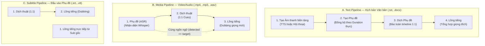
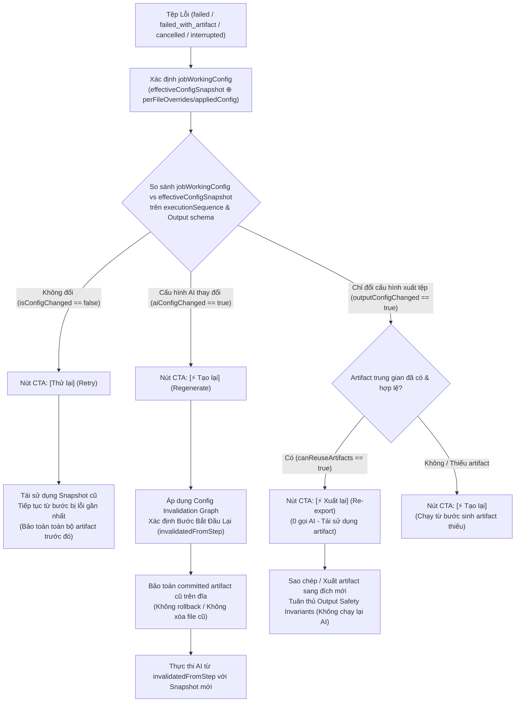

# Specification: Tab "Hàng Loạt" (File-Centric Batch Processing Workspace)

**Document Version**: 3.2.0 (Pre-Build Documentation Sync — 4 Unified Views, Priority Arrow Reorder, Text Subtitle Alignment & Streamlined UI Invariants)  
**CURRENT PHASE**: Phase 6 — UI/UX Design & Prototype COMPLETE  
**CURRENT GATE**: Gate D Final Sign-off  
**NEXT PHASE**: Phase 7 — Build Auto  
**BUILD AUTO**: LOCKED cho tới khi Product Owner phê duyệt Gate D Final  
**Author**: Antigravity & User  
**Target Platform**: VoxLab Desktop (Tauri v2 + React 19 + TypeScript + Vite)  

---

## 1. Goal & Product Vision

Workspace **"Hàng loạt" (`batch`)** là không gian làm việc chuyên biệt trên thanh điều hướng chính (Sidebar) của VoxLab, đóng vai trò là **Tầng Điều Phối Tự Động Hóa Đa Nhiệm Hướng Tệp Tin (File-Centric Multi-Task Batch Orchestrator)**.

### 1.1 Mục tiêu Cốt lõi
1. **Kiến trúc Hướng Tệp Tin (File-Centric Workflow)**: Mỗi tệp tin nạp vào là một **Batch Job độc lập**. Thay vì bắt buộc toàn bộ danh sách phải chạy chung một tác vụ cứng nhắc, mỗi tệp trong cùng một mẻ chạy có thể bật/tắt các tác vụ khác nhau, tùy biến cấu hình riêng và xử lý độc lập.
2. **Quy Trình Chuyển Tiếp Hai Giai Đoạn (Staged Workflow: Danh sách $\rightarrow$ Hàng đợi)**:
   - **Giai đoạn Chuẩn bị (Staging - Tab Danh sách)**: Nạp tệp/thư mục, chọn phạm vi thao tác, cấu hình tác vụ cần chạy (`TTS`, `Hội thoại`, `Phụ đề`, `Dịch`, `Lồng tiếng`), và thực hiện thẩm định/áp dụng cấu hình.
   - **Giai đoạn Hàng đợi (Execution Queue - Tab Hàng đợi)**: Sau khi thẩm định hợp lệ, tệp được chuyển sang Hàng đợi. Tại đây, người dùng có thể **thay đổi thứ tự ưu tiên bằng các nút mũi tên (`↑` / `↓`)** trước khi bấm *[Bắt đầu xử lý]*.
3. **4 Khung Nhìn Thống Nhất (4 Unified Workspace Views)**:
   - **Danh sách (`list`)**: Quản lý tệp chuẩn bị, ma trận tác vụ, cấu hình hàng loạt, chuyển sang hàng đợi.
   - **Hàng đợi (`queued`)**: Các tệp đang chờ và tệp đang xử lý được ghim cố định ở đầu hàng kèm tiến trình thời gian thực (% tiến độ trực tiếp trên từng nút tác vụ và thanh % trạng thái, các nút Tạm dừng/Tiếp tục, Hủy). Các tệp đang chờ được sắp xếp theo thứ tự ưu tiên nguyên dương (`2`, `3`...) và điều chỉnh bằng nút `↑` / `↓` mà không cần accordion dropdown phức tạp.
   - **Hoàn tất (`completed`)**: Xem các tệp xử lý thành công, nghe/xem preview kết quả, mở thư mục lưu trữ.
   - **Lỗi (`failed`)**: Quản lý tệp gặp lỗi, hỗ trợ **Thử lại thông minh (Retry)**, **Tạo lại thích ứng (Regenerate)** hoặc **Xuất lại (Re-export)** dựa trên đồ thị vô hiệu hóa cấu hình.
4. **Phân Định Tuyệt Đối: Chọn Phạm Vi Thao Tác vs Chọn Tác Vụ Thực Thi**:
   - Checkbox đầu dòng chỉ dùng để chọn phạm vi thao tác hàng loạt (Apply Config, Chuyển sang hàng đợi, Xóa).
   - Checkbox từng tác vụ quyết định tác vụ nào thực sự được chạy.
5. **Cơ Chế Chuyển Nút Động Phái Sinh (Derived State): Thử Lại (Retry) $\leftrightarrow$ Tạo Lại (Regenerate)**:
   - Trạng thái thay đổi cấu hình (`configChanged`) là trạng thái phái sinh (**Derived State**) từ phép so sánh sâu (`deepEqual`) giữa cấu hình hiệu lực hiện thời (`resolvedCurrentEffectiveConfig`) và snapshot lúc chạy (`effectiveConfigSnapshot`) trên các tác vụ thuộc execution plan.
   - Nếu trùng khớp: nút hiển thị `[Thử lại]` (tái sử dụng snapshot cũ, tiếp tục từ bước lỗi).
   - Nếu khác biệt: nút tự động chuyển thành `[Tạo lại]` (chạy lại từ bước đầu tiên bị ảnh hưởng bởi thay đổi theo Invalidation Graph, không xóa committed artifact cũ). Khôi phục mặc định nhưng Global Defaults khác snapshot vẫn giữ trạng thái `[Tạo lại]`.
6. **Lưu trữ Cấp bền vững & Zero Binary (Durable Persistence)**: Lưu trữ trạng thái mẻ chạy tại thư mục dữ liệu cục bộ với versioning và atomic write; tuyệt đối không lưu dữ liệu nhị phân (AudioBuffer, PCM, WAV, base64) vào state persistent.

---

## 2. In Scope & Out of Scope

### 2.1 Trong phạm vi (In Scope - MVP)
- **Vị trí UI**: Tab độc lập **"Hàng loạt"** trên sidebar chính của VoxLab.
- **5 Tác vụ Thành phần Tích hợp trong Task Matrix**:
  1. **TTS (Text to Speech)**: Đọc văn bản bằng giọng đọc AI đơn nhất $\rightarrow$ xuất Master `.wav`.
  2. **Hội thoại (Multi-Speaker Dialogue)**: Tự động bóc tách kịch bản phân vai `[Tên]: Lời thoại` $\rightarrow$ gán giọng riêng từng nhân vật $\rightarrow$ ghép audio master `.wav` và xuất phụ đề `.srt` có nhãn người nói.
  3. **Phụ đề (Transcription / ASR)**: Bóc băng media qua faster-whisper $\rightarrow$ remap timeline $\rightarrow$ xuất phụ đề `.srt` hoặc `.vtt`.
  4. **Dịch (Subtitle Translation)**: Dịch phụ đề bảo toàn bất biến 1:1 $\rightarrow$ xuất phụ đề đã dịch `.srt` hoặc `.vtt`.
  5. **Lồng tiếng (Dubbing)**: Tổng hợp audio từng cue theo timeline $\rightarrow$ áp trần WSOLA $1.20\times$ $\rightarrow$ kiểm tra va chạm âm thanh $\rightarrow$ xuất Master audio WAV.
- **Quy tắc Loại trừ lẫn nhau trên Tệp Văn bản (TTS vs Dialogue)**:
  - Trên cùng một file văn bản, **chỉ chọn TTS HOẶC Hội thoại** (Mutually Exclusive). Bật tác vụ này sẽ tự động tắt tác vụ kia. Tuyệt đối không sinh 2 Master WAV từ cùng một file nguồn trong MVP.
- **Quy tắc Tự động Kích hoạt Tác vụ Tiền đề (Auto-Enable Prerequisites)**:
  - Khi bật `Dịch` trên file Media: Tự động bật `Phụ đề` và hiển thị thông báo: *"Đã tự động bật Phụ đề vì Dịch cần dữ liệu phụ đề."*
  - Khi bật `Lồng tiếng` trên file Media: Tự động bật `Phụ đề`. Chỉ tự động bật `Dịch` nếu ngôn ngữ đích khác với ngôn ngữ nguồn.
- **Điều kiện Dịch Thuật Động (Conditional Translation on Source Language Auto)**:
  - Khi `sourceLanguage === "auto"`, bước ASR chạy trước và trả về `detectedSourceLanguage`.
  - Nếu `detectedSourceLanguage !== targetLanguage`: Bước Dịch thuật thực thi bình thường.
  - Nếu `detectedSourceLanguage === targetLanguage`: Bước Dịch thuật chuyển sang trạng thái `skipped` kèm lý do: *"Không cần dịch vì ngôn ngữ nguồn trùng ngôn ngữ đích."*, và bước Lồng tiếng sử dụng trực tiếp phụ đề nguồn.
- **Import & Quét thư mục**: Hỗ trợ chọn tệp lẻ hoặc chọn thư mục (Flat scan non-recursive, chỉ nhận file cấp 1, không quét đệ quy subfolder).
- **Thực thi Tuần tự An toàn (Batch Job Concurrency = 1 Baseline)**: Tại một thời điểm chỉ xử lý duy nhất 1 BatchJob active (`processing`); bên trong tệp chạy lần lượt các tác vụ đã chọn theo thứ tự phụ thuộc. Mọi cơ chế concurrency nội bộ (chunk concurrency, cue concurrency, workers, model scheduling) đều được đánh dấu **TUNING REQUIRED**, tuyệt đối không hard-code trước benchmark.
- **An toàn ASR Cancel**: Job bị hủy khi đang bóc băng Whisper sẽ giữ cờ `isCancelling = true` và status `processing`, chờ inference giải phóng GPU/CPU an toàn trước khi chuyển sang `cancelled`.

### 2.2 Ngoài phạm vi (Out of Scope - Defer/Exclude)
- Dựng kịch bản đồ thị tùy ý dạng Node Graph (Node-based DAG workflow).
- Render video gắn cứng phụ đề (Video Burn-in).
- Chạy song song nhiều BatchJob đồng thời trong MVP (Batch Concurrency > 1 đánh dấu `TUNING REQUIRED`).
- Đồng bộ hóa hàng đợi qua mạng hoặc Cloud.

### 2.3 Đánh giá Phạm vi Tác vụ Voice Clone (Out of Scope / Deferred)
- **Quyết định Sản phẩm**: **KHÔNG đưa Voice Clone vào Batch Task Matrix MVP**.
- **Lý do Kiến trúc**: 
  - Voice Clone trong VoxLab (`VoiceCloneWorkspace.tsx`) là quy trình khởi tạo tài nguyên giọng đọc (Asset Creation/Enrollment Wizard) nhằm bổ sung `VoiceProfile` vào `Voice Library` (localStorage), không phải là File-to-File Processing Pipeline xuất artifact ra đĩa (`outputDirectory`).
  - Toàn bộ 5 tác vụ trong Batch MVP (`TTS`, `Hội thoại`, `Phụ đề`, `Dịch`, `Lồng tiếng`) đều nhận file đầu vào và xuất artifact tệp tin `.wav`/`.srt`/`.vtt` ra đĩa.
  - Không thêm cột "Clone" vào Task Matrix và không thay đổi domain model hiện tại của Batch để phục vụ Voice Clone.
- **Phạm vi Tương lai**: Ý tưởng tạo nhiều `VoiceProfile` từ nhiều file audio được chuyển sang phạm vi tương lai: tính năng *"Batch Voice Enrollment"* chuyên biệt trong workspace Voice Library.

### 2.4 Open Product Decisions: NONE (Đã chốt 100%)
Toàn bộ các quyết định sản phẩm và kiến trúc cho Batch v3.0 đã được chốt đầy đủ:
1. **TTS vs Hội thoại**: Mutually Exclusive (loại trừ lẫn nhau trên cùng 1 file văn bản).
2. **Dịch / Lồng tiếng trên Media**: Auto-Enable Prerequisites (tự động bật Phụ đề; tự động bật Dịch nếu khác ngôn ngữ).
3. **Giao diện Cấu hình Mặc định**: Nút `[Cấu hình chung]` mở Drawer/Modal, giữ Top Bar tối giản.
4. **Điều kiện Hội thoại**: Yêu cầu file văn bản thỏa mãn `DIALOGUE_LINE_REGEX` có cấu trúc phân vai.
5. **Voice Clone trong Batch MVP**: KHÔNG (Out of scope, bảo lưu cho Batch Voice Enrollment trong Voice Library).
6. **Giao diện Giám sát Tối giản (Streamlined Views & Bottom Count Bar)**: Đã lược bỏ hoàn toàn các banner mô tả (FIFO, Invalidation Graph, Danh sách tệp đã xử lý xong...) ở đầu các tab Hàng đợi, Hoàn tất, Lỗi; hiển thị tổng số tệp của tab hiện tại ở thanh trạng thái đáy bảng (`Tổng: X tệp`) đồng nhất với tab Danh sách.

---

## 3. Compatibility Matrix & Input Validation Rules

### 3.1 Ma trận Tương thích Theo Phân Loại Tệp Mới

| Loại tệp đầu vào | Định dạng | TTS (Đơn giọng) | Hội thoại (Phân vai) | Phụ đề (Subtitle) | Dịch (Translation) | Lồng tiếng (Dubbing) |
| :--- | :--- | :---: | :---: | :---: | :---: | :---: |
| **Văn bản thường** | `.txt`, `.docx` | ✅ Trực tiếp | ⛔ Khóa | 🔗 Chuỗi *(Cần TTS)* | 🔗 Chuỗi *(Cần TTS + Sub)* | 🔗 Chuỗi *(Cần TTS + Sub + Dịch)* |
| **Kịch bản hội thoại** | `.txt`, `.docx` | ⛔ Khóa | ✅ Trực tiếp | 🔗 Chuỗi *(Cần Hội thoại)* | 🔗 Chuỗi *(Cần H.Thoại + Sub)* | 🔗 Chuỗi *(Cần H.Thoại + Sub + Dịch)* |
| **Đa phương tiện (Media)** | `.mp4, .mkv, .avi, .mov, .mp3, .wav...` | ⛔ Khóa | ⛔ Khóa | ✅ Trực tiếp (ASR) | 🔗 Chuỗi *(Cần Phụ đề)* | 🔗 Chuỗi *(Cần Phụ đề ± Dịch)* |
| **Phụ đề (Subtitle)** | `.srt`, `.vtt` | ⛔ Khóa | ⛔ Khóa | ℹ️ Không cần ASR | ✅ Trực tiếp | ✅ Trực tiếp (± Dịch) |

*Ghi chú*: Dấu ✅/🔗 nghĩa là tác vụ được hỗ trợ hoặc nằm trong chuỗi phụ thuộc tuần hoàn (Dependency DAG), không được coi mọi tác vụ là bước chạy độc lập.

### 3.2 Nhận diện Kịch bản và Khóa Tuyệt đối TTS / Hội thoại
Khi nạp file `.txt` / `.docx`, hệ thống sử dụng Dialogue Detector (`detectDialogueScript` trong `src/services/dialogue/parser.ts`) để đọc nội dung và phân loại chính xác:

1. **Trường hợp A — Văn bản thông thường (Normal Text)**:
   - Nếu tệp không chứa cấu trúc phân vai hợp lệ:
     - Cho phép tác vụ **TTS**.
     - Khóa cứng checkbox **Hội thoại** kèm tooltip: *"Tệp là văn bản thường, không có cấu trúc phân vai hợp lệ [Tên]: Lời thoại"*.
     - **Không hiển thị bánh răng cấu hình nhân vật** (giữ slot sạch sẽ, tránh gây rối mắt).
2. **Trường hợp B — Kịch bản Hội thoại (Dialogue Script)**:
   - Nếu tệp có cấu trúc phân vai hợp lệ theo cú pháp kịch bản:
     - `[Nam]: Xin chào Lan.`
     - `[Lan]: Chào Nam.`
     - `[Người dẫn chuyện]: Câu chuyện bắt đầu.`
     - Hoặc kịch bản không ngoặc có $\ge 2$ lượt thoại luân phiên của $\ge 2$ nhân vật thực thụ (loại trừ các nhãn đề mục như *Lưu ý:*, *Chương 1:*, *Ghi chú:*...).
   - Hệ thống xử lý:
     - Cho phép tác vụ **Hội thoại**.
     - Khóa cứng checkbox **TTS** kèm tooltip: *"Tệp là kịch bản hội thoại (đã khóa TTS, sử dụng tác vụ Hội thoại)"*.
     - **Hiển thị bánh răng cấu hình nhân vật cạnh checkbox Hội thoại khi tác vụ được bật**.
     - Tự động nhận diện danh sách nhân vật để gán giọng riêng.
3. **Bất biến Bắt buộc (Invariant)**:
   - **TTS và Hội thoại tuyệt đối không bao giờ được bật đồng thời trên cùng một Job**, kể cả khi dùng tính năng "Chọn tất cả cột" hoặc áp dụng cấu hình hàng loạt.
   - Không chỉ dựa vào phần mở rộng tệp hay chuỗi regex ngẫu nhiên đơn lẻ. Nếu nội dung không rõ ràng/nghi vấn, hệ thống giữ an toàn (coi là văn bản thường) kèm cảnh báo Notification rõ ràng cho người dùng.
   - Khi tệp nguồn bị thay đổi bên ngoài (`inputChanged = true`), hệ thống tự động kiểm tra lại tính tương thích trước khi chạy.

---

## 4. Two Main Pipelines & Task Dependency Resolver

### 4.1 Hai Pipeline Xử Lý Chính & Luồng Phụ Đề Trực Tiếp



### 4.2 Chi Tiết Từng Bước Trong Pipeline

1. **Text Pipeline (Kịch bản Văn bản)**:
   - **Tạo âm thanh nền tảng**: TTS (văn bản thường) hoặc Hội thoại (kịch bản phân vai).
   - **Phụ đề**: SRT/VTT được tạo có mốc thời gian hoàn toàn đồng bộ với âm thanh thực tế đã tổng hợp (`ChunkItem.durationSec` cho TTS hoặc `DialogueSegment.durationSec` + `turnPauseSec` cho Hội thoại). Tuyệt đối **không ước lượng tùy tiện**.
   - **Dịch phụ đề**: Dịch phụ đề đã có timeline, giữ nguyên số lượng cue, thứ tự, format và mốc thời gian (bất biến 1:1).
   - **Lồng tiếng**: Tổng hợp âm thanh từ phụ đề nguồn hoặc phụ đề đã dịch. **Giữ riêng audio TTS/Hội thoại ban đầu và audio Lồng tiếng**, không ghi đè artifact.
2. **Media Pipeline (Video / Audio)**:
   - TTS và Hội thoại luôn bị khóa.
   - Phụ đề được tạo qua ASR (Whisper). Nếu nguồn là `auto`, ASR xác định ngôn ngữ trước khi quyết định có cần bước dịch hay không (nếu nguồn trùng đích thì tự động bỏ qua dịch).
   - Lồng tiếng sử dụng phụ đề ASR hoặc phụ đề đã dịch.
3. **Subtitle Pipeline (Đầu vào SRT/VTT)**:
   - Không chạy ASR khi tệp đã là phụ đề hợp lệ.
   - Đi thẳng vào Dịch và/hoặc Lồng tiếng.

### 4.3 Quy Tắc Phụ Thuộc (Dependency Resolver) & Giao Diện Tương Tác

1. **Tự Động Bật Tác Vụ Tiên Quyết (Prerequisite Auto-Enable)**:
   - **Media + Dịch**: Tự động bật `Phụ đề (ASR)`.
   - **Media + Lồng tiếng**: Tự động bật `Phụ đề (ASR)` và `Dịch thuật`.
   - **Text (Thường) + Phụ đề**: Tự động bật `TTS`.
   - **Text (Kịch bản) + Phụ đề**: Tự động bật `Hội thoại` (tuyệt đối không bật TTS).
   - **Text (Thường) + Dịch**: Tự động bật chuỗi `TTS` ➔ `Phụ đề`.
   - **Text (Kịch bản) + Dịch**: Tự động bật chuỗi `Hội thoại` ➔ `Phụ đề`.
   - **Text (Thường) + Lồng tiếng**: Tự động bật chuỗi `TTS` ➔ `Phụ đề` ➔ `Dịch`.
   - **Text (Kịch bản) + Lồng tiếng**: Tự động bật chuỗi `Hội thoại` ➔ `Phụ đề` ➔ `Dịch`.
2. **Bảo Vệ Chặn Tắt Tác Vụ Tiên Quyết (Prerequisite Uncheck Guards)**:
   - Không cho phép tắt riêng một tác vụ nếu có các bước phía sau trong pipeline đang phụ thuộc vào nó.
   - Cụ thể:
     - Tắt `TTS` hoặc `Hội thoại` khi `Phụ đề`, `Dịch`, hoặc `Lồng tiếng` đang bật: **Bị chặn**, hiển thị thông báo/tooltip yêu cầu tắt các bước sau trước.
     - Tắt `Phụ đề` khi `Dịch` hoặc `Lồng tiếng` đang bật: **Bị chặn**.
     - Tắt `Dịch` khi `Lồng tiếng` đang bật: **Bị chặn**.
3. **Thao Tác Chọn Tất Cả Cột (Column Bulk Toggle)**:
   - Khi chọn cột `TTS`: Chỉ áp dụng cho các tệp Văn bản thường. Các tệp Kịch bản và Media hoàn toàn không bị ảnh hưởng.
   - Khi chọn cột `Hội thoại`: Chỉ áp dụng cho các tệp Kịch bản hội thoại.
   - Khi chọn cột `Phụ đề`, `Dịch`, hoặc `Lồng tiếng`: Tự động kích hoạt đúng tác vụ âm thanh tương thích (`TTS` cho thường, `Hội thoại` cho kịch bản).
   - Khi bỏ chọn cột tiên quyết: Thực hiện cascade deselect các bước hạ lưu để đảm bảo đồ thị thực thi luôn hợp lệ.
4. **Thứ Tự Thực Thi Tất Định (Deterministic Execution Sequence DAG)**:
   - Text Pipeline: `["tts" | "dialogue", "transcription", "translation", "dubbing"]`.
   - Media Pipeline: `["transcription", "translation", "dubbing"]`.
   - Subtitle Pipeline: `["translation", "dubbing"]`.

---

## 5. Domain Models & Schemas

### 5.1 Các Loại Tác vụ & Trạng thái Cấp Bước

```typescript
// Định danh các tác vụ trong Task Matrix
export type BatchTaskType = "tts" | "dialogue" | "transcription" | "translation" | "dubbing";

// Trạng thái cấp Bước Tác vụ (Step-Level Status)
export type BatchStepStatus =
  | "waiting"                 // Đang chờ đến lượt trong chuỗi thực thi
  | "processing"              // Đang tích cực chạy bước này
  | "completed"               // Bước này hoàn tất 100%, artifact đã atomic commit
  | "completed_with_warning"  // Bước này hoàn tất có cảnh báo (ví dụ WSOLA collision danger)
  | "failed"                  // Bước này gặp lỗi kỹ thuật
  | "skipped"                 // Bị bỏ qua do bước trước lỗi hoặc conditional step không cần thiết
  | "cancelled"               // Bị người dùng chủ động hủy sau khi worker an toàn thoát
  | "interrupted";            // Bị gián đoạn do app tắt đột ngột/crash khi đang processing

// Trạng thái của toàn bộ Job (Job-Level Status - 9 trạng thái chuẩn)
export type BatchJobStatus =
  | "waiting"
  | "processing"
  | "paused"
  | "completed"
  | "completed_with_warning"
  | "failed_with_artifact"
  | "failed"
  | "cancelled"
  | "interrupted";

// Trạng thái của toàn bộ Hàng đợi (Queue-Level Status - 6 trạng thái chuẩn)
export type BatchQueueStatus =
  | "idle"
  | "running"
  | "pausing"
  | "paused"
  | "cancelling"
  | "blocked";
```

### 5.2 Cấu trúc Kết quả Bước & Snapshot Cấu hình Bất Biến

```typescript
export interface BatchStepResult {
  task: BatchTaskType;
  status: BatchStepStatus;
  progressPct: number;
  stageMessage?: string;
  outputArtifactPaths: string[]; // Các artifact sinh ra bởi riêng bước này
  error?: string;
  warning?: string;
  skipReason?: string;          // Ví dụ: "Không cần dịch vì ngôn ngữ nguồn trùng ngôn ngữ đích."
  startedAt?: number;
  completedAt?: number;
}

export interface BatchTtsSnapshot {
  model: string;
  voiceId: string;
  speed: number;
  pitch: number;
  volume: number;
}

export interface BatchDialogueSnapshot {
  model: string;
  defaultVoiceId: string;
  turnPauseSec: number;
  sameSpeakerPauseSec: number;
  exportSrt: boolean;
}

export interface BatchTranscriptionSnapshot {
  audioLanguage: string;
  whisperModel: string;
  speechSpeed: 1.0 | 0.9 | 0.8;
  outputFormat: "srt" | "vtt";
}

export interface BatchTranslationSnapshot {
  providerId: string;
  sourceLanguage?: string;
  targetLanguage: string;
  style: "default" | "cinema";
  outputFormat: "preserve_input" | "srt" | "vtt";
}

export interface BatchDubbingSnapshot {
  ttsModel: string;
  voiceId: string;
  speedMultiplier: number;
  turnPauseSec: number;
}

export interface BatchTaskConfigMap {
  tts?: BatchTtsSnapshot;
  dialogue?: BatchDialogueSnapshot;
  transcription?: BatchTranscriptionSnapshot;
  translation?: BatchTranslationSnapshot;
  dubbing?: BatchDubbingSnapshot;
}
```

### 5.3 Cấu trúc BatchJob & State Bền vững

```typescript
export interface BatchJobOutputSnapshot {
  resolvedOutputDirectory: string;
  saveInSourceFolder: boolean;
  collisionPolicy: "auto_rename" | "overwrite" | "skip";
}

export interface ArtifactVersionMetadata {
  path: string;
  size: number;
  mtime: number;
  hash?: string;
}

export interface BatchJobOutputArtifacts {
  primaryPath?: string;
  secondaryPath?: string;
  warningMessage?: string;
  ownedArtifactPaths: string[];
  artifactFingerprints?: Record<string, ArtifactVersionMetadata>;
}

export interface BatchJob {
  id: string;
  sourceFilePath: string;
  sourceFileName: string;
  sourceFileSize: number;
  sourceFileMtime: number;
  fileKind: "text" | "media" | "subtitle";

  // Staged Lifecycle Stage & Queue Order
  stage: "staging" | "queued";       // "staging" = Tab Danh sách; "queued" = Tab Hàng đợi / Đang chạy
  queueOrder: number;                // Thứ tự thực thi trong Hàng đợi (điều chỉnh tăng/giảm bằng nút ↑ / ↓)

  // Task Matrix & Sequence
  selectedTasks: BatchTaskType[];
  executionSequence: BatchTaskType[];
  currentStepIndex: number;

  // Cấu hình snapshot: Bất biến trong quá trình chạy
  configOverrides: Partial<BatchTaskConfigMap>;
  hasCustomConfig: boolean;
  // Trạng thái cấu hình phái sinh (Derived State, tuyệt đối không lưu như nguồn sự thật để toggle thủ công)
  configChanged?: boolean;           // Derived: true nếu deepEqual(resolvedCurrentEffectiveConfig, effectiveConfigSnapshot) === false trên executionSequence
  invalidatedFromStep?: BatchTaskType; // Bước đầu tiên cần chạy lại theo Config Invalidation Graph (derived)

  // Trạng thái từng bước: Chỉ chứa các task được chọn (Unselected tasks KHÔNG tồn tại trong map)
  stepResults: Partial<Record<BatchTaskType, BatchStepResult>>;

  // Trạng thái tổng thể
  status: BatchJobStatus;
  progressPct: number;
  isCancelling?: boolean; // Transient runtime/UI flag, tuyệt đối KHÔNG persist

  // Output & Artifacts
  outputSnapshot: BatchJobOutputSnapshot;
  artifacts: BatchJobOutputArtifacts;
  retryFromStep?: BatchTaskType;

  createdAt: number;
  queuedAt?: number;
  startedAt?: number;
  completedAt?: number;
}

export interface BatchSessionSettings {
  outputDirectory: string;
  saveInSourceFolder: boolean;
  collisionPolicy: "auto_rename" | "overwrite" | "skip";
  globalDefaults: BatchTaskConfigMap;
}

export interface BatchQueueDurableState {
  version: 3; // Schema version 3
  queueStatus: BatchQueueStatus;
  settings: BatchSessionSettings;
  jobs: BatchJob[];
  updatedAt: number;
}
```

---

## 6. Staged Queue Workflow, Invalidation Graph & Dynamic Actions

### 6.1 Vòng Đời Cấu Hình Bất Biến (Effective Config Snapshot Freeze)
1. **Mutable Configuration Phase (Giai đoạn Danh sách / Staging & Hàng đợi / Queued Waiting)**:
   - Người dùng có thể tự do thay đổi `Global Defaults` (qua nút *[Cấu hình chung]* trên Top Bar) hoặc chỉnh riêng từng file qua Drawer *[Nâng cao]*.
   - Cả các tệp ở trạng thái `staging` (tab Danh sách) lẫn các tệp ở trạng thái `queued` nhưng đang chờ (khi `status === "waiting"` tại tab Hàng đợi) đều tiếp tục duy trì tính động: có thể được chọn trong phạm vi view, nhận áp dụng Cấu hình chung, hoặc nhận per-file overrides.
2. **Staging to Queue Transition (Chuyển Danh sách sang Hàng đợi)**:
   - Khi bấm *[Chuyển sang hàng đợi]*: Hệ thống thẩm định tính hợp lệ của task (`selectedTasks.length > 0`), giải quyết phụ thuộc (dependency resolution), chuyển tệp thành `stage: "queued"` với `status: "waiting"`.
   - **QUY TẮC CỐT LÕI**: Thao tác chuyển sang Hàng đợi **TUYỆT ĐỐI KHÔNG đóng băng (freeze) final `effectiveConfigSnapshot`**.
3. **Snapshot Resolution & Freeze Timing (Ngay trước khi chuyển waiting $\rightarrow$ processing)**:
   - Chỉ ngay tại thời điểm job thực sự chuẩn bị chuyển từ `waiting` sang `processing` để bắt đầu thực thi:
     $$\text{EffectiveConfig} = \text{Global/Applied Defaults} \oplus \text{PerFileOverrides}$$
   - Cấu hình này mới được resolve và **đóng băng (freeze)** vào `job.effectiveConfigSnapshot` cho execution attempt đó.
4. **Execution & Retry Immutability**:
   - Khi job đã chuyển sang `processing`, hoàn tất (`completed`), thất bại (`failed`), `failed_with_artifact`, bị hủy (`cancelled`), hoặc bị gián đoạn (`interrupted`), `effectiveConfigSnapshot` **hoàn toàn bất biến**.
   - Nếu người dùng thay đổi `Global Defaults` trên Top Bar sau đó, các job đang chạy hoặc đã kết thúc/thất bại **tuyệt đối không bị thay đổi cấu hình**.
   - Khi người dùng bấm **Thử lại (Retry)**: Hệ thống **mặc định và bắt buộc tái sử dụng `effectiveConfigSnapshot` của lần chạy trước**, bảo đảm tính tất định; tuyệt đối không cho phép Retry âm thầm nhận Global Defaults mới.
5. **Bản Chất Của Global Defaults (Preset Template Scope Isolation)**:
   - `Global Defaults` là **bộ cấu hình mẫu (Preset Template)** dùng để áp dụng cho các tệp khi người dùng chủ động yêu cầu, **tuyệt đối KHÔNG phải là trạng thái sống chi phối tự động mọi job trong workspace**.
   - Đối với mọi job đã có snapshot (`effectiveConfigSnapshot`), baseline cấu hình của job là chính snapshot đó (`job.effectiveConfigSnapshot`).
   - Mọi thay đổi trên modal hoặc Top Bar của `Global Defaults` mà chưa bấm Apply, hoặc Apply nhưng job không nằm trong danh sách được chọn: cấu hình của job **hoàn toàn bất biến**, không phát sinh diff, và nút CTA giữ nguyên là `[Thử lại]`.
   - Chỉ các job được người dùng tích chọn và thực hiện `[Áp dụng cho X tệp đã chọn]`, hoặc được chỉnh riêng qua Drawer, mới nhận cấu hình mới.

### 6.2 Mô hình Chọn Phạm Vi vs Chọn Tác Vụ (Row Scope Selection vs Task Selection)
1. **Phân Định Trách Nhiệm Tuyệt Đối**:
   - **Checkbox Đầu Cột (Cột 1)**: Dùng để chọn **phạm vi tác vụ hàng loạt** (Batch Scope Selection). Khi được chọn, tệp này nằm trong tập hợp sẽ nhận lệnh từ các nút hàng loạt: *[Chuyển sang hàng đợi]*, *[Áp dụng cấu hình chung]*, hoặc *[Xóa tệp]*. Checkbox này **KHÔNG** quyết định tệp chạy tác vụ AI nào.
   - **Checkbox Từng Cột Tác Vụ (TTS, Hội thoại, Phụ đề, Dịch, Lồng tiếng)**: Quyết định chính xác tác vụ nào file sẽ thực thi (Task Execution Selection).
2. **Nguyên Tắc Cốt Lõi: Setting $\neq$ Execution**:
   - Việc thiết lập đầy đủ thông số phụ đề/dịch/lồng tiếng trong *[Cấu hình chung]* tuyệt đối không tự động biến một tệp văn bản thành tệp chạy phụ đề hay lồng tiếng.
   - Một tệp chỉ chạy các bước tương ứng với các checkbox tác vụ đã được người dùng tích chọn trên dòng của tệp đó.
3. **Header Checkbox 3 Trạng Thái (Tri-State Header Checkbox)**:
   - Tiêu đề cột chọn phạm vi có checkbox 3 trạng thái:
     - `none`: Không có tệp nào được chọn.
     - `partial` (indeterminate): Một số tệp được chọn.
     - `all`: Toàn bộ tệp hiển thị trong view hiện tại được chọn.
   - Khi có tệp được chọn, giao diện hiển thị nhãn: `"Đã chọn X tệp"`.

### 6.3 Quy Trình Chuyển Giai Đoạn Danh Sách $\rightarrow$ Hàng Đợi (Staged Transition)
1. **Giai đoạn Chuẩn Bị (Tab Danh sách - `stage: "staging"`)**:
   - Sau khi bấm *[Thêm tệp]* hoặc *[Thêm thư mục]*, toàn bộ file hợp lệ xuất hiện tại tab **Danh sách**.
   - Tại đây, người dùng thiết lập ma trận tác vụ (`selectedTasks`), kiểm tra tính tương thích, tùy chỉnh thông số riêng nếu cần.
   - Nút hành động chính trên Top Bar tại tab Danh sách là **`[Chuyển sang hàng đợi]`** (thay vì *[Bắt đầu xử lý]*).
2. **Chuyển sang Hàng Đợi (Stage to Queue)**:
   - Người dùng tích chọn một hoặc nhiều tệp bằng checkbox đầu dòng, sau đó bấm `[Chuyển sang hàng đợi]`.
   - Hệ thống thực hiện thẩm định:
     - Tệp phải có ít nhất 1 tác vụ được chọn (`selectedTasks.length > 0`).
     - Tác vụ phải thỏa mãn ma trận tương thích và phụ thuộc (tự động resolve chuỗi thực thi `executionSequence`).
     - Thao tác này **KHÔNG đóng băng (freeze) `effectiveConfigSnapshot`**.
   - Các tệp hợp lệ được chuyển sang `stage: "queued"` với trạng thái `status: "waiting"`, gán `queueOrder` liên tục và xuất hiện tại tab **Hàng đợi**.
   - **Lưu ý Quan Trọng**: Thao tác này **KHÔNG tự động kích hoạt tiến trình xử lý ngay**. Quyền quyết định thời điểm chạy thuộc về người dùng tại tab Hàng đợi.

### 6.4 Điều Chỉnh Thứ Tự Thực Thi Trong Hàng Đợi (Queue Priority Arrow Reorder)
1. **Giai đoạn Tab Hàng Đợi (`stage: "queued"`)**:
   - Hiển thị danh sách các tệp đã sẵn sàng chạy, sắp xếp theo `queueOrder`.
   - Nút hành động chính trên Top Bar tại tab Hàng đợi là **`[Bắt đầu xử lý]`**.
2. **Điều Chỉnh Thứ Tự Ưu Tiên Bằng Mũi Tên (`ArrowUp` / `ArrowDown`)**:
   - Tệp đang chạy (`processing`) luôn được ghim ở vị trí đầu tiên kèm badge trạng thái và không có nút điều chỉnh thứ tự.
   - Mỗi hàng tệp ở trạng thái chờ (`status === "waiting"`) hiển thị số thứ tự nguyên dương (`2`, `3`,...) — loại bỏ ký tự `#` và biểu tượng kéo thả 6 chấm (`GripVertical`).
   - Cung cấp hai nút bấm điều hướng ưu tiên (`↑` / `↓`) cho phép đẩy tệp lên trước hoặc lùi về sau trong danh sách chờ.
3. **Bảo Toàn Bất Biến Concurrency = 1 & Reorder khi Queue Đang Chạy**:
   - Tệp đang tích cực chạy (`status === "processing"`) luôn bị **khóa cố định** ở đầu danh sách đang chạy; người dùng **tuyệt đối không thể di chuyển tệp đang processing**.
   - Các tệp đang chờ (`status === "waiting"`): **Được phép đổi thứ tự ưu tiên ngay cả khi Queue đang ở trạng thái chạy (`running`)**.
   - Thứ tự mới sau khi điều chỉnh của các waiting jobs sẽ quyết định chính xác job nào được bốc lên chạy tiếp theo ngay khi active job hoàn tất.

### 6.5 Mô Hình Áp Dụng Cấu Hình Cho Tệp Đã Chọn (Apply Config Requires Selection)
1. **Bắt buộc có tệp được chọn (Selection Required)**:
   - **0 tệp được chọn**:
     - Nút `[Áp dụng]` bị **disabled**.
     - Không hiển thị cảnh báo dư thừa trong footer (chỉ bật nút khi có tệp được chọn).
     - Tuyệt đối **KHÔNG dùng cơ chế ngầm: 0 selected => Apply to All**.
   - **1+ tệp được chọn**:
     - Nút hiển thị rõ ràng: `[Áp dụng cho X tệp đã chọn]` (ví dụ: *"Áp dụng cho 3 tệp đã chọn"*).
2. **Quy tắc Chọn Tất Cả (Select All)**:
   - Nếu muốn áp dụng cho toàn bộ tệp, người dùng phải chủ động bấm checkbox Select All ở đầu bảng (Header Checkbox).
   - Select All phải tuân theo view/filter hiện tại và hiển thị chính xác số lượng tệp được chọn trong phạm vi đó.
3. **Phạm vi tác động & Phân lập Tuyệt đối (Strict Scope Isolation)**:
   - Thao tác chỉ ghi đè cấu hình cho các tệp được chọn (`targetIds = selectedJobIds`).
   - Các tệp **KHÔNG được chọn** (kể cả tệp lỗi) giữ nguyên vẹn cấu hình hiện tại và snapshot gốc của chúng.
   - *Ví dụ kiểm chứng*: Có 5 job lỗi. Người dùng chọn 2 job và áp dụng Cấu hình chung mới $\rightarrow$ chỉ 2 job được chọn nhận cấu hình mới và chuyển CTA; 3 job còn lại hoàn toàn không bị ảnh hưởng và giữ nguyên CTA `[Thử lại]`.
4. **Bảo toàn nguyên tắc Setting $\neq$ Execution**:
   - Thao tác này **tuyệt đối KHÔNG tự động bật thêm tác vụ** cho tệp.

### 6.6 Cơ Chế Chuyển Nút Động Phái Sinh (Derived State): Thử Lại (Retry) $\leftrightarrow$ Tạo Lại (Regenerate) $\leftrightarrow$ Xuất Lại (Re-export) & Đồ Thị Vô Hiệu Hóa Cấu Hình (Config Invalidation Graph)

Tại tab **Lỗi (`failed`)**, trạng thái và nút hành động của tệp phục hồi lỗi được điều khiển theo mô hình trạng thái phái sinh (**Derived State**) gồm 3 nhánh phân giải rõ rệt:



1. **Bản Chất Trạng Thái `configChanged` là DERIVED STATE**:
   - `configChanged` **tuyệt đối KHÔNG phải là nguồn sự thật (source of truth)** được toggle hay gán giá trị thủ công (ví dụ: không bao giờ được gán `false` chỉ vì người dùng bấm một nút).
   - Nó là một **trạng thái phái sinh (Derived State)** được tính toán liên tục bằng phép so sánh sâu (normalized `deepEqual`) giữa cấu hình hiệu lực hiện thời của job (`jobWorkingConfig = effectiveConfigSnapshot ⊕ job.configOverrides`) và cấu hình đóng băng khi chạy (`job.effectiveConfigSnapshot`):
     - **Không phụ thuộc live Global Defaults**: Việc người dùng thay đổi các trường trong modal `Global Defaults` mà chưa bấm Apply cho job **tuyệt đối không làm thay đổi `jobWorkingConfig`** của các job không được chọn. Baseline của job đã chạy luôn là snapshot của chính nó.
     - **Phân tách 2 nhóm cấu hình**:
       1. **Cấu hình AI (AI Execution Config)**: Model, voice, speed, pitch, pauses, provider, prompt, languages của các task trong `executionSequence`.
       2. **Cấu hình Xuất Tệp (Output Config)**: `outputPath` (`resolvedOutputDirectory`), `saveInSourceFolder`, `collisionPolicy`, `outputAudioFormat`.
   - **Quy tắc so sánh & phân nhánh CTA**:
     $$\text{if } \text{deepEqual}(\text{jobWorkingConfig}, \text{job.effectiveConfigSnapshot}) \implies \text{isConfigChanged} = \text{false} \implies \text{CTA} = \text{"Thử lại"}$$
     $$\text{else if } \text{aiConfigChanged} \implies \text{CTA} = \text{"⚡ Tạo lại"}$$
     $$\text{else if } \text{outputConfigChanged} \land \text{canReuseArtifacts} \implies \text{CTA} = \text{"⚡ Xuất lại"}$$
     $$\text{else } \implies \text{CTA} = \text{"⚡ Tạo lại" (thực thi từ bước tạo artifact thiếu)}$$
   - **Phạm vi so sánh**: Chỉ so sánh các thông số thực thi AI và thông số xuất file liên quan. Các trường chỉ phục vụ hiển thị UI (UI-only states như âm lượng xem trước, mốc thời gian tua audio player, trạng thái mở đóng dropdown/drawer) tuyệt đối không được tham gia so sánh và không bao giờ làm biến đổi CTA.

2. **Hành Vi 'Khôi Phục Mặc Định' & 'Khôi Phục Snapshot' (Restore Semantics)**:
   - Khi người dùng bấm *[Khôi phục snapshot gốc]* trên Drawer: hệ thống xóa `job.configOverrides = {}`.
   - Khi đó: `jobWorkingConfig` trở lại đúng bằng `job.effectiveConfigSnapshot`.
   - Vì `deepEqual(jobWorkingConfig, job.effectiveConfigSnapshot) === true` $\implies \text{isConfigChanged} = \text{false} \implies \text{CTA tự động hoàn nguyên về [Thử lại]}$.
   - **Lưu ý khi bấm 'Áp dụng Cấu hình chung' (Global Defaults)**:
     - Nếu `Global Defaults` hiện tại khác với snapshot lúc chạy của job:
     - Khi áp dụng vào job, `jobWorkingConfig` nhận giá trị mới khác snapshot $\implies \text{isConfigChanged} = \text{true} \implies \text{CTA chuyển thành [Tạo lại] hoặc [Xuất lại] tùy loại thay đổi}$.
     - Nút CTA **chỉ trở lại [Thử lại]** khi cấu hình thực sự được đưa về khớp hoàn toàn với snapshot gốc lúc chạy.

3. **Phân Biệt Output Config Diff vs AI Config Diff**:
   - **Thay đổi Cấu hình AI (`aiConfigChanged === true`)**:
     - Vô hiệu hóa các bước bị ảnh hưởng theo Config Invalidation Graph.
     - Nút CTA hiển thị: **`[⚡ Tạo lại]`** (icon `Zap`, màu amber/accent).
     - Chạy lại mô hình AI từ bước đầu tiên bị vô hiệu hóa (`invalidatedFromStep`).
   - **Chỉ thay đổi Cấu hình Xuất tệp (`outputConfigChanged === true` và `aiConfigChanged === false`)**:
     - Ví dụ: Người dùng đổi thư mục xuất `outputPath`, đổi `collisionPolicy` hoặc đổi định dạng audio `outputAudioFormat`.
     - Toàn bộ tham số Whisper ASR, Translation LLM và TTS Dubbing hoàn toàn giữ nguyên.
     - **Quy tắc Tái Sử Dụng Artifact (Artifact Reuse Invariant)**:
       - Nếu các artifact trung gian hợp lệ đã tồn tại (ví dụ: đã bóc băng xong `.srt`, đã dịch xong `.srt`): hệ thống **tái sử dụng 100% artifact hợp lệ, tuyệt đối KHÔNG chạy lại AI inference** (0 cuộc gọi Whisper, 0 cuộc gọi LLM dịch, 0 cuộc gọi TTS lồng tiếng).
       - Nút CTA hiển thị: **`[⚡ Xuất lại]`** (icon `FolderOpen` / `Zap`, màu emerald/green).
       - Khi bấm *[Xuất lại]*: hệ thống trực tiếp copy/convert/export các artifact đã có sang thư mục đích mới theo đúng `collisionPolicy`.
       - Nếu artifact trung gian cần thiết chưa tồn tại (hoặc bị hỏng/xóa ngoài đĩa): hệ thống thực thi từ bước cần thiết để sinh artifact còn thiếu đó.
     - Mọi thao tác ghi tệp phải giữ nguyên **Output Safety Invariants** (`External Modification Protection > Global Collision Policy`), bảo đảm an toàn dữ liệu người dùng.

4. **Đồ Thị Vô Hiệu Hóa Cấu Hình (Config Invalidation Graph)**:
   Khi `aiConfigChanged === true`, hệ thống xác định bước đầu tiên bị ảnh hưởng (`invalidatedFromStep`) theo quy tắc phụ thuộc:
   - **Thay đổi thông số Lồng tiếng (Dubbing)** (ví dụ: đổi giọng lồng tiếng, tốc độ WSOLA, âm lượng):
     $$\rightarrow \text{Vô hiệu hóa duy nhất bước Dubbing. Bắt đầu lại từ: Dubbing. Giữ nguyên ASR & Dịch.}$$
   - **Thay đổi thông số Dịch thuật (Translation)** (ví dụ: đổi style cinema, đổi provider, đổi ngôn ngữ đích):
     $$\rightarrow \text{Vô hiệu hóa bước Dịch và các bước hạ nguồn (Dubbing). Bắt đầu lại từ: Translation. Giữ nguyên ASR.}$$
   - **Thay đổi thông số Phụ đề (ASR / Transcription)** (ví dụ: đổi model Whisper, đổi ngôn ngữ bóc băng):
     $$\rightarrow \text{Vô hiệu hóa toàn bộ chuỗi: ASR + Dịch + Dubbing. Bắt đầu lại từ: Transcription.}$$
   - **Thay đổi thông số TTS (Đơn giọng)**:
     $$\rightarrow \text{Bắt đầu lại từ: TTS.}$$
   - **Thay đổi thông số Hội thoại (Dialogue)**:
     $$\rightarrow \text{Bắt đầu lại từ: Dialogue.}$$

5. **Bảo Tồn Tuyệt Đối Committed Artifact**:
   - Khi thực hiện `[Tạo lại]` hoặc `[Xuất lại]`, hệ thống **tuyệt đối KHÔNG tự động xóa hay rollback** các artifact đã commit ở lượt chạy trước trên đĩa.
   - File output mới sinh ra sẽ tuân thủ `collisionPolicy` (ví dụ `auto_rename` tạo phiên bản mới `_001.ext` hoặc `overwrite` nếu người dùng chỉ định) và được bảo vệ bởi `External Modification Protection`.

### 6.7 Tính Bất Biến của Lịch Sử Hoàn Tất (Historical Immutability)
1. Các tệp nằm trong tab **Hoàn tất (`completed`)** là các bản ghi lịch sử xử lý thành công và mang tính **bất biến (Immutable)**.
2. Hệ thống **tuyệt đối không âm thầm chạy lại** các tệp đã hoàn tất khi người dùng thay đổi cấu hình chung.
3. Nếu người dùng muốn chạy lại một tệp đã hoàn tất với thông số mới, thao tác này được ghi nhận như một **ý định tạo mẻ chạy mới (New Run Intent)**: tệp được sao chép/chuyển về tab Danh sách với ID mới hoặc reset rõ ràng dưới sự xác nhận của người dùng.

### 6.8 Mô Hình Preview Kết Quả (Audio Player & Subtitle Viewer)
1. **Preview Tệp Âm Thanh (.wav, .mp3)**:
   - Người dùng có thể nghe thử trực tiếp artifact âm thanh đã sinh ra ngay trong Drawer hoặc Modal Preview.
   - Bộ điều khiển audio tích hợp đầy đủ: Play/Pause, thanh tua thời gian (Seek Bar) có thời lượng hiện tại / tổng thời lượng, thanh điều chỉnh âm lượng (Volume Slider).
2. **Preview Tệp Phụ Đề & Bản Dịch (.srt, .vtt)**:
   - Hiển thị danh sách các cue phụ đề với mốc timeline `[00:01.500 --> 00:04.200]` và văn bản gốc/bản dịch tương ứng.
   - Hỗ trợ đối chiếu nhanh chất lượng dịch thuật hoặc bóc băng mà không cần mở phần mềm ngoài.
3. **Mở Thư Mục Kết Quả (Open Output Folder)**:
   - Mỗi tệp hoàn tất có nút `[Mở thư mục]` (`FolderOpen`) để truy cập ngay vị trí lưu file trên hệ điều hành.
4. **Bảo Toàn Bất Biến Preview Chỉ Đọc (Preview Read-Only Invariant)**:
   - Trình preview (Audio Player & Subtitle Viewer) **chỉ đọc (read-only)** các committed artifact hợp lệ đã được ghi nhận trên đĩa (`primaryPath`, `secondaryPath`, `artifacts`).
   - Thao tác mở và xem preview **tuyệt đối không kích hoạt tiến trình sinh (generate) ngầm**, không gọi AI API, và **không làm thay đổi bất kỳ trạng thái nào của job** (`status`, `progressPct`, `stepResults`).

---

## 7. Output Safety Invariants & Multi-Output Semantics

### 7.1 Thứ Tự Ưu Tiên Tuyệt Đối
$$\text{External Modification Protection} > \text{Global Collision Policy}$$

1. **Bảo vệ Chỉnh sửa Thủ công**:
   - Khi chuẩn bị commit artifact hoặc khi người dùng bấm Thử lại:
   - Hệ thống kiểm tra xem tệp đích trên đĩa có khớp với `artifactFingerprints` (size + mtime) mà VoxLab đã lưu vết trước đó hay không.
   - *Nếu tệp đã bị người dùng hoặc phần mềm khác chỉnh sửa ngoài ứng dụng*: Hệ thống **TUYỆT ĐỐI KHÔNG ghi đè** (kể cả khi `collisionPolicy = "overwrite"`). Hệ thống tự động chuyển sang cơ chế an toàn `auto_rename` (đánh số `_001.ext`) để bảo vệ dữ liệu người dùng.
2. **Chính sách Bỏ qua Theo Từng Artifact (Per-Artifact Skip)**:
   - Trong tác vụ lồng tiếng Dubbing (sinh cả Subtitle `.srt` và Master `.wav`):
   - Nếu `collisionPolicy = "skip"`:
     - Nếu file phụ đề đã tồn tại trên đĩa nhưng file WAV chưa có: Hệ thống **bỏ qua ghi file phụ đề**, nhưng **vẫn tiến hành tổng hợp và ghi file Master WAV**.
     - Nếu file Master WAV đã tồn tại nhưng phụ đề chưa có: Bỏ qua ghi WAV, vẫn xuất phụ đề.
     - Nếu cả hai file đã tồn tại: Bỏ qua toàn bộ bước ghi file.
3. **Nguyên tắc Artifact Đã Commit Bất Biến**:
   - Bất kỳ artifact nào đã qua bước Staging $\rightarrow$ Validation $\rightarrow$ Atomic Commit là tài sản hợp lệ của người dùng trên đĩa.
   - Nếu bước tiếp theo gặp sự cố kỹ thuật hoặc bị người dùng hủy, **artifact đã commit tuyệt đối không bị rollback hay xóa bỏ**.
   - Ngay cả khi file nguồn bị thay đổi bên ngoài (Input Mutation) khiến pipeline phải chạy lại từ Step 1: Hệ thống **tuyệt đối không tự xóa hay rollback committed artifact cũ trên đĩa**; artifact cũ được giữ nguyên và đánh dấu `stale` trong bản ghi metadata. File output mới sinh ra sẽ được phân giải an toàn qua Output Resolver theo `collisionPolicy` (ví dụ: `auto_rename` tạo phiên bản mới `_001.ext` hoặc `overwrite` nếu người dùng chỉ định).

---

## 8. Phân Lập Lỗi (Technical Failure) vs Người Dùng Hủy (User Cancel)

Hệ thống phân biệt rõ ràng hai trường hợp kết thúc có artifact:

1. **Trường hợp Lỗi Kỹ Thuật (Technical Failure)**:
   - Ví dụ: File Media đã chạy ASR xong `.srt`, Dịch xong `.srt`, nhưng bước Dubbing bị crash (OOM hoặc lỗi worker TTS).
   - Bước Dubbing: `stepResults["dubbing"].status = "failed"`.
   - File tạm `.tmp` của Dubbing bị dọn sạch.
   - Các file `.srt` đã commit thành công được giữ nguyên vẹn.
   - **Job Status**: **`failed_with_artifact`**.
2. **Trường hợp Người Dùng Chủ Động Hủy (User Cancellation)**:
   - Ví dụ: File Media đã chạy ASR xong `.srt`, đang chạy Dịch hoặc Dubbing thì người dùng bấm nút Hủy.
   - Sau khi worker an toàn thoát: Bước đang chạy chuyển `stepResults[currentStep].status = "cancelled"`.
   - File tạm `.tmp` đang làm dở bị dọn sạch.
   - Các file `.srt` của bước trước đã commit thành công **vẫn được giữ nguyên vẹn trên đĩa và ghi nhận vào danh sách output**.
   - **Job Status**: **`cancelled`** (KHÔNG ghi nhầm thành `failed_with_artifact`).
3. **Trường hợp Hoàn Tất Có Cảnh Báo (Completed with Warning)**:
   - Ví dụ: Bước Dubbing phát hiện `collision_danger` (WSOLA $1.20\times$ không đủ bù thời lượng) $\rightarrow$ chặn Master WAV để bảo vệ chất lượng audio.
   - Phụ đề dịch đã commit thành công.
   - Bước Dubbing: `stepResults["dubbing"].status = "completed_with_warning"`.
   - **Job Status**: **`completed_with_warning`**.

---

## 9. Thử Lại Từng Phần Thông Minh (Smart Step-Level Retry) & An Toàn File Nguồn

### 9.1 Cơ Chế Thử Lại Từng Phần (Step-Level Resume)
Khi bấm **Thử lại** trên một Job `failed_with_artifact`:
1. Hệ thống kiểm tra tính toàn vẹn của các artifact đầu ra từ các bước đã `completed` trước đó.
2. Nếu các artifact trung gian vẫn tồn tại và nguyên vẹn:
   - Hệ thống **bỏ qua các bước đã hoàn tất** (không bóc băng hay dịch lại từ đầu).
   - Quá trình thực thi bắt đầu chạy tiếp ngay từ bước bị lỗi gần nhất (`retryFromStep`).
   - Tiết kiệm tối đa thời gian tính toán và tài nguyên GPU/CPU.

### 9.2 Kiểm Tra Đột Biến File Nguồn (Input Mutation Safety) vs Bảo Toàn Artifact Đã Commit
Trước khi chạy lần đầu hoặc khi bấm Thử lại:
1. Hệ thống kiểm tra file nguồn `sourceFilePath`:
   - Nếu file nguồn bị xóa hoặc mất quyền đọc: Job chuyển `failed` với lỗi: *"Tệp nguồn không tồn tại hoặc không thể truy cập"*. Hàng đợi tiếp tục xử lý tệp tiếp theo.
2. So sánh `sourceFileSize` và `sourceFileMtime` với lúc enqueue:
   - Nếu file nguồn đã bị chỉnh sửa bên ngoài:
     - Hệ thống cập nhật lại source metadata (`sourceFileSize`, `sourceFileMtime`).
     - Hiển thị badge cảnh báo: `⚠️ Đã sửa ngoài app`.
     - **Vô hiệu hóa tái sử dụng Cache/Artifact (Dependency Invalidation CHỈ VỀ MẶT REUSE)**: Toàn bộ các bước phụ thuộc không được tái sử dụng artifact cũ làm input mà execution phải chạy lại từ Step 1 để bảo đảm tính nhất quán dữ liệu.
     - **Không xóa / Không rollback committed artifact trên đĩa**: Hệ thống **tuyệt đối KHÔNG tự động xóa hoặc rollback** các artifact đã commit ở lượt chạy trước; artifact cũ trên đĩa được giữ nguyên và đánh dấu `stale` trong record.
     - **Xử lý Output Mới qua Output Resolver**: Khi các bước thực thi lại hoàn thành, file output mới được giải quyết qua Output Resolver theo `collisionPolicy` đã cấu hình (ví dụ: `auto_rename` đánh số thứ tự mới hoặc `overwrite` nếu được chỉ định).

---

## 10. ASR Cancellation & Safe Boundary Pausing

Giữ nguyên vẹn Invariant đã được duyệt tại Gate B & C:
1. **Hủy tác vụ ASR (Faster-Whisper)**:
   - Do Faster-Whisper inference là nguyên khối (monolithic) và không hỗ trợ ngắt an toàn giữa chừng:
   - Khi bấm Hủy một job đang bóc băng: `job.status` vẫn giữ `"processing"`, kích hoạt cờ runtime `isCancelling = true`.
   - Giao diện hiển thị nhãn `"Đang hủy..."` với icon xoay và khóa nút tương tác.
   - Hàng đợi cam kết **không dispatch job tiếp theo** cho đến khi worker ASR hiện tại return/thoát an toàn.
   - Sau khi worker thoát an toàn: Dọn dẹp staging $\rightarrow$ chuyển `stepResults["transcription"].status = "cancelled"` $\rightarrow$ `job.status = "cancelled"`.
2. **Tạm dừng Hàng đợi (Queue Pause)**:
   - Nếu bấm *Tạm dừng* khi active job đang chạy: Queue chuyển sang trạng thái `pausing`.
   - Hiển thị banner súc tích: *"Sẽ tạm dừng sau khi file hiện tại xử lý xong."*
   - Sau khi file hiện tại kết thúc an toàn: Queue chuyển sang `paused`.

---

## 11. Emergency Queue Block (ENOSPC / EACCES)

Khi phát hiện lỗi hệ thống trong quá trình ghi đĩa, Queue chuyển sang `blocked` và hiển thị thông điệp phân biệt rõ ràng:
- **Lỗi hết dung lượng đĩa (`ENOSPC`)**:
  - Thông báo: *"Không đủ dung lượng lưu trữ."*
  - Nút hành động: `[Giải phóng dung lượng và thử lại]`
- **Lỗi mất quyền ghi thư mục đích (`EACCES`)**:
  - Thông báo: *"Không có quyền ghi vào thư mục đích."*
  - Nút hành động: `[Kiểm tra quyền truy cập và thử lại]`

---

## 12. Crash Recovery & Durable Persistence

1. **Khôi phục Trạng thái khi Khởi động lại**:
   - Nếu ứng dụng bị đóng đột ngột/crash khi `queueStatus` là `running`, `pausing`, hoặc `cancelling`:
     - Queue phục hồi về trạng thái an toàn: `paused` (không tự động chạy tiếp).
     - Job đang `processing` dở dang chuyển sang: `interrupted`.
     - Bước đang chạy dở dang của job đó chuyển sang: `stepResults[currentStep].status = "interrupted"`.
     - Tiến độ của bước bị gián đoạn được đặt lại an toàn về 0%; các artifact của các bước đã commit thành công trước đó vẫn được bảo toàn.
     - Các job `waiting` vẫn giữ nguyên `waiting`.
2. **Nguyên tắc Lưu trữ Durable**:
   - State lưu tại thư mục cấu hình App Data của VoxLab dạng JSON có `version: 3`.
   - Ghi tệp an toàn qua cơ chế Atomic Write (`write to .tmp` $\rightarrow$ `replace`).
   - Tuyệt đối zero audio binary.

---

## 13. User Interface Specification (5 Unified Workspace Views)

### 13.1 Kiến Trúc 4 Khung Nhìn Thống Nhất (4 Unified Workspace Views)

Giao diện tab **Hàng loạt** được tổ chức thành 4 khung nhìn lọc trên cùng một tập dữ liệu `BatchJob`:

```
┌──────────────────────────────────────────────────────────────────────────────────────────────────┐
│ TOP BAR: [Thêm tệp] [Thêm thư mục]  |  [Cấu hình chung]             |  [Chuyển sang hàng đợi] /   │
│                                                                     │  [Bắt đầu xử lý] (ngữ cảnh)│
├──────────────────────────────────────────────────────────────────────────────────────────────────┤
│ VIEW TABS: [ Danh sách (8) ]  [ Hàng đợi (4) ]  [ Hoàn tất (2) ]  [ Lỗi (1) ]                     │
├──────────────────────────────────────────────────────────────────────────────────────────────────┤
│ SUB-TOOLBAR (Chỉ có ở tab Danh sách): [Tải lên] [Cấu hình hàng loạt]           [Tìm kiếm tệp...] │
├──────────────────────────────────────────────────────────────────────────────────────────────────┤
│ CENTER WORKSPACE: Nội dung thay đổi tương ứng theo từng Tab (Bảng tinh gọn)                      │
├──────────────────────────────────────────────────────────────────────────────────────────────────┤
│ BOTTOM BAR (Đồng nhất h-[39px]): Tổng: X tệp  |  [Tạm dừng] [Hủy mẻ] [Thử lại lỗi]                │
└──────────────────────────────────────────────────────────────────────────────────────────────────┘
```

- **Quy tắc Tối Giản Toolbar & Banner**:
  - Sub-toolbar chứa nút `[Tải Lên]`, `[Cấu hình hàng loạt]` và ô `[Tìm kiếm]` **chỉ hiển thị duy nhất tại tab Danh sách**.
  - Các tab Hàng đợi, Hoàn tất, Lỗi **lược bỏ hoàn toàn sub-toolbar và các banner mô tả** (FIFO, Invalidation Graph, Danh sách hoàn tất...) để không gian bảng rộng thoáng, trực quan.
  - **Thanh trạng thái đáy bảng (Footer Status Bar)**:
    - Token thiết kế: `BATCH_FOOTER_HEIGHT = 39px` (hoặc Tailwind token `h-[39px]`).
    - Quy cách thống nhất: Cùng chiều cao, cùng padding, cùng alignment và layout cấu trúc trên toàn bộ 4 view (`list`, `queued`, `completed`, `failed`), hiển thị số liệu `Tổng: X tệp` của tab hiện tại.
    - Yêu cầu implementation Phase 7: Tạo/reuse một shared component `BatchFooter` (`src/components/batch/BatchFooter.tsx`) dùng chung cho cả 4 tab, không duplicate CSS riêng cho từng tab. Mọi điều chỉnh chiều cao sau này chỉ thay đổi qua design token/component chung.

#### 1. Tab "Danh sách" (Staging / Chuẩn Bị Tác Vụ)
- **Mục đích**: Tiếp nhận file từ Import, lựa chọn phạm vi tệp để thao tác hàng loạt, phân định tác vụ thực thi cho từng file.
- **Top Bar**:
  - `[Thêm tệp]`, `[Thêm thư mục]` (Flat scan, tooltip: *"Không quét thư mục con"*).
  - `[Cấu hình chung]` (Mở Modal cấu hình mặc định).
  - **Nút Hành Động Chính**: **`[Chuyển sang hàng đợi]`** (Primary button, sáng khi có ít nhất 1 tệp được chọn và đã bật ít nhất 1 tác vụ hợp lệ).
- **Bảng Ma Trận Tác Vụ (Task Matrix Table)**:
  - **Cột 1: Checkbox Chọn Phạm Vi**:
    - Tiêu đề cột có Checkbox 3 trạng thái (`none`, `partial`, `all`) kèm số lượng *"Đã chọn X tệp"*.
    - Mỗi dòng có checkbox chọn dòng riêng. Chỉ dùng để gom nhóm tệp cho các thao tác: *[Chuyển sang hàng đợi]*, *[Áp dụng cấu hình chung]*, hoặc *[Xóa tệp]*.
  - **Cột Tên Tệp & Loại File**: Icon phân biệt (Text, Media, Subtitle) kèm tên, kích thước, đường dẫn và badge cảnh báo nếu sửa ngoài app.
  - **5 Cột Tác Vụ (TTS, Hội thoại, Phụ đề, Dịch, Lồng tiếng)**:
    - Checkbox bật/tắt trực tiếp tác vụ thực thi trên file.
    - Checkbox disabled kèm tooltip nếu tệp không tương thích.
    - Tự động bật tác vụ tiền đề (ví dụ: bật Dịch trên media tự bật Phụ đề).
    - Tự động loại trừ TTS vs Hội thoại trên file text.
    - Tiêu đề mỗi cột có checkbox "Tất cả" (Apply All cho các file tương thích).
  - **Cột Cấu Hình ([Nâng cao])**: Nút mở Drawer cấu hình riêng cho tệp.
  - **Cột Trạng Thái Cấu Hình**: Hiển thị *"Kế thừa chung"* hoặc *"Đã tùy chỉnh riêng"*.

#### 2. Tab "Hàng đợi" (Queue / Thứ Tự Thực Thi & Giám Sát Trực Quan Tinh Gọn)
- **Mục đích**: Quản lý thứ tự thực thi của các tệp đã sẵn sàng chạy; giám sát trực tiếp tiến trình theo thời gian thực và thao tác tạm dừng/tiếp tục/hủy ngay trên từng dòng mà không cần dropdown accordion phức tạp.
- **Top Bar**:
  - Nút Hành Động Chính: **`[Bắt đầu xử lý]`** (Kích hoạt hàng đợi).
- **Cấu Trúc Bảng Hàng Đợi (Streamlined Queue Table)**:
  - Hiển thị các tệp ở `stage: "queued"` theo thứ tự `queueOrder`. Tệp đang chạy (`processing`) luôn được ghim ở đầu danh sách kèm badge `🔒 Đang chạy` (hoặc `⏸ Tạm dừng`) và dot nhấp nháy trên tab Hàng đợi.
  - **Cột 1: Thứ tự**: Hiển thị badge trạng thái khóa `🔒 Đang chạy` / `⏸ Tạm dừng` cho tệp đang xử lý; các tệp chờ phía sau hiển thị số thứ tự nguyên dương (`2`, `3`...) và hai nút mũi tên `↑` / `↓` để điều chỉnh ưu tiên. Loại bỏ hoàn toàn GripVertical và ký tự `#`.
  - **Cột 2: Tên tệp**: Hiển thị icon loại tệp, tên tệp, kích thước và đường dẫn đầy đủ.
  - **Cột 3: Cột Chuỗi Tác Vụ (Workflow Buttons & Real-time %)**:
    - Các nút tác vụ trong chuỗi thực thi (`Phụ đề`, `Dịch`, `Lồng tiếng`...) được thiết kế kích thước lớn, nổi bật (`px-3 py-1.5 text-xs font-semibold rounded-lg`).
    - Phản ánh trực tiếp tỷ lệ % thời gian thực và trạng thái trên từng nút tác vụ (`[ ✓ Phụ đề 100% ]` $\rightarrow$ `[ 🔄 Dịch 65% ]` $\rightarrow$ `[ 🎬 Lồng tiếng ]`), kèm vạch fill tiến độ dưới chân nút.
    - Không hiển thị các dòng mô tả text dài dòng bên dưới nút để giữ giao diện luôn gọn gàng và thoáng đãng.
  - **Cột 4: Cột Trạng Thái (Thanh % - Progress Bar)**:
    - Hiển thị dạng thanh tiến độ (%) trực quan kèm nhãn trạng thái (`Đang chạy`, `Tạm dừng`, `Đang chờ`) và con số % chính xác trên 1 dòng duy nhất.
    - Thanh tiến độ có viền bo tròn, fill màu theo trạng thái (Accent xanh dương khi đang chạy, Hổ phách khi tạm dừng, Xám khi đang chờ) với animation xung ánh sáng.
  - **Cột 5: Cột Thao Tác (Actions)**:
    - Nằm gọn trên 1 dòng:
    - Nút **`[Tạm dừng / Tiếp tục]`**: Cho phép tạm dừng tệp đang chạy (chuyển trạng thái sang `paused`) hoặc tiếp tục xử lý (`processing`).
    - Nút **`[Hủy]`**: Cho phép dừng an toàn tệp đang xử lý (giải phóng tài nguyên và đưa sang tab Lỗi/Đã hủy) hoặc bỏ tệp đang chờ khỏi hàng đợi đưa về tab Danh sách.

#### 3. Tab "Hoàn tất" (Completed History & Preview)
- **Mục đích**: Lưu trữ nhật ký các tệp đã hoàn thành thành công, xem và nghe kết quả xuất.
- **Tính Bất Biến (Immutable)**: Tuyệt đối không cho phép chỉnh sửa cấu hình hay âm thầm chạy lại các tệp trong tab này.
- **Thành Phần Giao Diện**:
  - Danh sách tệp đã xong kèm thời gian hoàn tất và danh sách artifact sinh ra (`.wav`, `.srt`).
  - Nút **`[Mở thư mục xuất]`**: Mở thư mục chứa file kết quả trên hệ điều hành.
  - Nút **`[Nghe / Xem preview]`**: Mở Drawer Preview kết quả:
    - Audio Player: Play/Pause, thanh tua Seek Bar, âm lượng Volume, mốc thời lượng.
    - Subtitle Viewer: Danh sách cue timeline và văn bản phụ đề/dịch.

#### 4. Tab "Lỗi" (Failed Jobs & Smart Recovery)
- **Mục đích**: Xử lý các tệp gặp sự cố kỹ thuật hoặc bị người dùng hủy.
- **Cơ Chế Chuyển Nút Động Phái Sinh (Derived State)**:
  - **Khi cấu hình hiệu lực hiện tại khớp snapshot cũ (`deepEqual === true` $\implies$ `configChanged === false`)**:
    - Nút hiển thị: **`[Thử lại]`** (icon `RotateCcw`).
    - Hành vi: Tái sử dụng `effectiveConfigSnapshot` cũ, chạy tiếp từ bước bị lỗi gần nhất (`retryFromStep`), bỏ qua các bước đã hoàn tất.
  - **Khi cấu hình hiệu lực hiện tại khác snapshot cũ (`deepEqual === false` $\implies$ `configChanged === true`)**:
    - Nút tự động chuyển thành: **`[Tạo lại]`** (icon `Sparkles` / `Zap`, màu accent nổi bật).
    - Hành vi: Áp dụng Config Invalidation Graph để xác định bước bắt đầu lại (`invalidatedFromStep`), giữ nguyên committed artifact cũ trên đĩa, chạy lại với snapshot mới.
    - Lưu ý: Bấm Khôi phục mặc định khi Global Defaults hiện tại khác snapshot cũ vẫn giữ CTA là `[Tạo lại]`.

### 13.2 Modal Cấu Hình Chung (Global Defaults Modal)
- Bao gồm 6 tab hoàn chỉnh:
  1. `Xuất & Tệp`: Thư mục xuất, lưu cùng file gốc, quy tắc trùng tên (auto_rename / overwrite / skip), định dạng audio (WAV / MP3), định dạng sub (SRT / VTT).
  2. `TTS`: Model, Voice, Tốc độ, Cao độ, Âm lượng, Cấu hình ngắt nghỉ từng loại dấu câu, Concurrency, Tỉ lệ khung hình, Số dòng phụ đề.
  3. `Hội thoại`: Model, Giọng mặc định, Âm lượng master, Nghỉ đổi lượt, Nghỉ cùng nhân vật, Chi tiết ngắt câu, Đa luồng, Xuất kèm phụ đề phân vai.
  4. `Phụ đề`: Model Whisper, Ngôn ngữ bóc băng, Tốc độ đọc, Tốc độ xử lý, Tỉ lệ khung hình, Số dòng, Định dạng xuất.
  5. `Dịch`: Provider (LM Studio/Local), Ngôn ngữ nguồn, Ngôn ngữ đích, Phong cách dịch (default/cinema), Context-aware translation.
  6. `Lồng tiếng`: Model TTS, Giọng lồng tiếng, Tốc độ tối đa, Nghỉ đổi lượt thoại, Tự động khớp thời lượng, Âm lượng master, Cơ chế bảo vệ WSOLA va chạm âm thanh.
- **Footer**: Nút `[Áp dụng cho X tệp đã chọn]` (chỉ áp dụng cho các tệp được tích checkbox đầu dòng và ở trạng thái waiting/staging).

### 13.3 Per-File Drawer (Drawer Tùy Chỉnh & Preview Từng Tệp)
- **Tab Cấu Hình**: Chỉ hiển thị các tác vụ đang được BẬT trên tệp đó; hỗ trợ chỉnh sửa riêng (lưu vào `configOverrides` và đánh dấu `hasCustomConfig = true`). Trạng thái `configChanged` trên tệp lỗi là Derived State tự động cập nhật khi cấu hình hiệu lực thay đổi so với snapshot cũ.
- **Tab Preview (Đối với tệp Hoàn tất hoặc có artifact)**:
  - Trình phát âm thanh (Audio Player) với Play/Pause, tua thời gian, thanh âm lượng.
  - Trình xem phụ đề (Subtitle Viewer) hiển thị cues timeline và text.

### 13.4 SPEC Delta: Cấu Hình Xuất & Tệp (Batch Output Settings - Gate D)

1. **Cấu Trúc Thư Mục Đầu Ra Bắt Buộc (Mandatory Per-File Subfolder)**:
   - Mỗi tệp nguồn được xử lý hàng loạt bắt buộc phải xuất toàn bộ artifact kết quả (audio master, phụ đề gốc, bản dịch phụ đề) vào một thư mục con riêng biệt mang tên tệp nguồn: `{outputDirectory}/{subfolder}/`.
   - Bỏ hoàn toàn checkbox `Tạo thư mục riêng cho mỗi tệp` trên UI vì đây là hành vi mặc định và bất biến của hệ thống.
   - Thư mục chỉ được tạo khi thực sự cần ghi kết quả ra đĩa.
   - **Quy tắc phân giải chống xung đột tên tệp (Subfolder Disambiguation)**:
     - Trường hợp trùng tên gốc nhưng khác đuôi mở rộng (ví dụ `01.mp4` và `01.wav` trong cùng mẻ): thư mục đầu ra được phân giải thành `01_mp4/` và `01_wav/`.
     - Trường hợp trùng cả tên và đuôi mở rộng từ hai thư mục khác nhau (ví dụ `D:/A/01.mp4` và `D:/B/01.mp4`): thư mục đầu ra được phân giải kèm tên thư mục cha (`01_mp4_A/` vs `01_mp4_B/`) hoặc chỉ số tăng dần (`01_mp4_1/`, `01_mp4_2/`).
     - Bảo vệ tuyệt đối không trộn lẫn hoặc ghi đè artifact giữa các tệp nguồn khác nhau.

2. **Vị Trí Lưu (Save Location)**:
   - Checkbox: `[ ] Lưu cùng thư mục với tệp gốc`.
   - **Khi bật**:
     - Hệ thống tự động xác định thư mục chứa từng tệp nguồn (`sourceFileParentDir`).
     - Tạo thư mục con kết quả riêng ngay cạnh tệp nguồn: `{sourceFileParentDir}/{subfolder}/`.
     - Ô nhập đường dẫn xuất mặc định (`outputPath`) và nút `[Chọn]` bị **vô hiệu hóa (disabled)** để tránh nhầm lẫn.
     - Giữ nguyên chuỗi đường dẫn xuất đã lưu trong cấu hình mà không xóa hay thay đổi giá trị.
   - **Khi tắt**:
     - Cho phép người dùng tùy chọn đường dẫn xuất chung (`outputPath`).
     - Từng tệp nguồn vẫn được tạo thư mục kết quả riêng bên trong đường dẫn này: `{outputPath}/{subfolder}/`.

3. **Xử Lý Trùng Tên & Định Dạng Xuất (Collision Policy & Output Formats)**:
   - Đổi tên trường thành `Xử lý trùng tên` với đúng 3 tùy chọn ngắn gọn:
     - `Tự đổi tên` (mặc định — `"auto_rename"`).
     - `Ghi đè` (`"overwrite"`).
     - `Bỏ qua` (`"skip"`).
   - Bảo toàn bất biến: Bảo vệ tệp đã bị chỉnh sửa ngoài VoxLab (`mtime`/`size` thay đổi), tuyệt đối không bị ghi đè ngay cả khi người dùng chọn `Ghi đè`.
   - Phần `Định dạng xuất` gồm hai trường ngắn gọn, loại bỏ toàn bộ chú thích kỹ thuật dài dòng:
     - `Âm thanh`: `WAV` / `MP3`.
     - `Phụ đề`: `SRT` / `VTT`.
   - Ở tầng xử lý, Master WAV tuân thủ chuẩn VoxLab. Khi chọn MP3 hoặc VTT, hệ thống chuyển đổi định dạng thực sự, không chỉ đổi đuôi tệp.

4. **Ghi Nhớ Cài Đặt (Local Settings Persistence)**:
   - Tự động lưu 5 tham số xuất gần nhất vào Local Storage (`voxlab_batch_output_settings`):
     - `saveInSourceFolder` (boolean)
     - `outputPath` (string)
     - `collisionPolicy` ("auto_rename" | "overwrite" | "skip")
     - `outputAudioFormat` ("wav" | "mp3")
     - `outputSubtitleFormat` ("srt" | "vtt")
   - Khi đóng và mở lại ứng dụng, popup Cấu hình chung tự động khôi phục các giá trị này.
   - Tuyệt đối không lưu token/thông tin nhạy cảm hoặc dữ liệu nhị phân.
   - Cấu hình ghi nhớ chỉ phục vụ làm giá trị mặc định cho các lần sử dụng tiếp theo; **không tự động thay đổi snapshot của job đang chạy, đã hoàn tất hoặc bị lỗi**.
   - Nút `[Áp dụng cho X tệp đã chọn]` chỉ áp dụng cho các file được chọn trong tab hiện tại và không tự động bật thêm tác vụ.

---

## 14. Acceptance Criteria (Tiêu Chí Nghiệm Thu SPEC v3.1)

- **AC-01 (File-Centric Queue)**: Danh sách hàng đợi chấp nhận đồng thời nhiều định dạng tệp khác nhau (`.mp4`, `.wav`, `.txt`, `.srt`) trong cùng một mẻ chạy mà không gây xung đột type.
- **AC-02 (Compatibility Enforcement)**: File Media không thể tích chọn TTS; file Text không thể tích chọn Phụ đề (ASR); file Phụ đề không thể tích chọn ASR. Các checkbox không tương thích bị disabled và có tooltip giải thích rõ lý do.
- **AC-03 (Dialogue Validation)**: File text chỉ có thể bật tác vụ Hội thoại nếu nội dung chứa ít nhất một khai báo người nói hợp lệ `[Tên]:`. File text thông thường không có cấu trúc phân vai sẽ bị khóa ô Hội thoại kèm tooltip.
- **AC-04 (TTS vs Dialogue Exclusion)**: Trên cùng một file text, tích chọn TTS tự động hủy chọn Hội thoại và ngược lại; không bao giờ sinh 2 Master WAV đồng thời từ 1 source text trong MVP.
- **AC-05 (Prerequisite Auto-Enable)**: Tích chọn Dịch trên file Media tự động bật Phụ đề kèm thông báo. Tích chọn Lồng tiếng trên file Media tự động bật Phụ đề (và Dịch nếu khác ngôn ngữ).
- **AC-06 (Apply All Precision)**: Bấm Apply All trên cột Phụ đề chỉ áp dụng cho các tệp Media; các tệp Text và Subtitle trong danh sách hoàn toàn không bị ảnh hưởng.
- **AC-07 (Conditional Translation when Source Auto)**: Khi `sourceLanguage === "auto"`, nếu ASR phát hiện ngôn ngữ nguồn trùng với `targetLanguage`, bước Dịch thuật chuyển sang trạng thái `skipped` với `skipReason = "Không cần dịch vì ngôn ngữ nguồn trùng ngôn ngữ đích."` và bước Dubbing tiêu thụ trực tiếp phụ đề nguồn.
- **AC-08 (Same-Language Dubbing)**: Khi ngôn ngữ nguồn và đích giống nhau, bước Dịch thuật không được tạo hoặc chuyển `skipped`; không thực hiện dịch thuật dư thừa.
- **AC-09 (Step Cancelled vs Interrupted)**:
  - Khi người dùng chủ động hủy một job đang xử lý, bước đang chạy chuyển `stepResults[task].status = "cancelled"` sau khi worker an toàn thoát.
  - Khi ứng dụng bị crash/đóng đột ngột, bước đang chạy dở chuyển `stepResults[task].status = "interrupted"` khi app mở lại.
- **AC-10 (Cancelled Job Preserves Committed Artifacts)**: Khi người dùng bấm Hủy một job sau khi bước Phụ đề đã commit thành công `.srt`, job chuyển sang trạng thái `cancelled`, nhưng tệp `.srt` đã commit được giữ nguyên vẹn trên đĩa và hiển thị trong kết quả xuất.
- **AC-11 (Failed with Artifact on Technical Failure)**: Nếu bước Dubbing gặp sự cố kỹ thuật (crash worker / OOM) sau khi bước Phụ đề đã commit `.srt`, job chuyển sang trạng thái `failed_with_artifact` (tách biệt hoàn toàn với `cancelled`).
- **AC-12 (Smart Step Retry)**: Bấm Thử lại trên Job `failed_with_artifact` sẽ kiểm tra tính toàn vẹn của tệp `.srt` đã có và chỉ thực thi lại bước Dubbing, không chạy lại ASR Whisper.
- **AC-13 (Input Mutation Invalidation & Committed Artifact Preservation)**: Nếu file nguồn bị chỉnh sửa ngoài app (sai lệch `mtime`/`size`), hệ thống cập nhật metadata, hiển thị cảnh báo `⚠️ Đã sửa ngoài app`, vô hiệu hóa tính tái sử dụng artifact/cache cho các bước sau và chạy lại từ Step 1. Hệ thống tuyệt đối không tự xóa hay rollback committed artifact cũ trên đĩa (đánh dấu stale); file output mới của lượt chạy lại được xử lý an toàn qua Output Resolver theo `collisionPolicy`.
- **AC-14 (Effective Config Snapshot Freeze Timing & Preset Template Scope)**: Cấu hình chỉ được resolve và đóng băng vào `effectiveConfigSnapshot` ngay trước khi job chuyển từ `waiting -> processing`. Thao tác chuyển từ Danh sách sang Hàng đợi KHÔNG đóng băng snapshot. Trong tab Hàng đợi, các job `waiting` vẫn có thể nhận Cấu hình chung hoặc per-file override. Khi đã chuyển sang `processing`, snapshot hoàn toàn bất biến. `Global Defaults` là preset template dùng để áp dụng cấu hình; việc thay đổi `Global Defaults` trên Top Bar hay Modal mà chưa bấm Apply tuyệt đối không làm thay đổi cấu hình hay CTA của các job unselected.
- **AC-15 (Retry Reuses Snapshot)**: Retry mặc định và bắt buộc tái sử dụng `effectiveConfigSnapshot` của lần chạy trước, bảo đảm tính tất định; không tự động nhận Global Defaults mới.
- **AC-16 (Apply Defaults Requires Explicit Selection & Strict Scope Isolation)**: Thao tác áp dụng Cấu hình chung bắt buộc phải có ít nhất 1 tệp được chọn trong view hiện tại (0 tệp được chọn $\rightarrow$ nút [Áp dụng] bị disabled kèm cảnh báo; tuyệt đối không dùng fallback ngầm 0 selected => Apply to All). Chỉ áp dụng cho các job nằm trong tập hợp được chọn (`targetIds = selectedJobIds`). Mọi job không được chọn (kể cả job lỗi) hoàn toàn giữ nguyên snapshot và cấu hình riêng của mình. Nguyên tắc Setting $\neq$ Execution được duy trì (không tự động bật task mới).
- **AC-17 (External Modification Protection)**: Nếu artifact đầu ra trên đĩa đã bị sửa đổi bên ngoài ứng dụng (sai lệch fingerprint), hệ thống tuyệt đối không ghi đè (kể cả khi `collisionPolicy = "overwrite"`), tự động fallback sang `auto_rename` (`_001.ext`).
- **AC-18 (Per-Artifact Skip in Dubbing)**: Khi `collisionPolicy = "skip"`, nếu tệp phụ đề đã tồn tại trên đĩa nhưng file WAV chưa có, hệ thống bỏ qua xuất phụ đề và vẫn tạo Master WAV bình thường.
- **AC-19 (Unselected Tasks Omitted)**: Các tác vụ không được người dùng chọn không tồn tại trong `stepResults` (`Partial<Record>`), tuyệt đối không bị đánh dấu nhầm thành `skipped`.
- **AC-20 (Sequential FIFO & Monolithic ASR Safety)**: Hàng đợi thực thi tuần tự (Concurrency = 1). Bấm Hủy khi đang chạy ASR giữ trạng thái job là `processing` kèm nhãn `Đang hủy...`, khóa tương tác, đợi inference kết thúc an toàn mới chuyển `cancelled` và dispatch job kế tiếp.
- **AC-21 (4 Unified Workspace Views)**: 4 khung nhìn (`Danh sách`, `Hàng đợi`, `Hoàn tất`, `Lỗi`) được quản lý chung qua cùng một tập hợp `BatchJob` duy nhất. Trong tab Hàng đợi, tệp đang xử lý (`processing`) luôn được ghim cố định ở đầu hàng kèm tiến trình thời gian thực, % tiến độ trực tiếp trên từng nút tác vụ và thanh % trạng thái, cùng các nút điều khiển trực tiếp (Tạm dừng/Tiếp tục, Hủy); các tệp đang chờ (`waiting`) xếp ngay bên dưới; mọi thay đổi trạng thái hoặc giai đoạn của job lập tức phản ánh chính xác trên từng tab mà không phân mảnh dữ liệu.
- **AC-22 (Row Scope Checkbox vs Task Execution Checkboxes)**: Checkbox đầu dòng chỉ quyết định phạm vi áp dụng thao tác hàng loạt; checkbox từng cột tác vụ quyết định chính xác các bước pipeline sẽ thực thi trên file. Nguyên tắc Setting $\neq$ Execution được bảo toàn tuyệt đối.
- **AC-23 (Tri-State Header Checkbox)**: Header checkbox có 3 trạng thái (`none`, `partial`, `all`) và hiển thị số lượng `"Đã chọn X tệp"` tương ứng khi có tệp được chọn.
- **AC-24 (List to Queue Staging)**: Bấm `[Chuyển sang hàng đợi]` tại tab Danh sách thẩm định tính tương thích, resolve dependency chuỗi thực thi, chuyển tệp sang `stage: "queued"` với trạng thái `waiting` mà KHÔNG đóng băng `effectiveConfigSnapshot`, và không tự động kích hoạt xử lý.
- **AC-25 (Queue Priority Reorder Invariant)**: Tại tab Hàng đợi, các tệp ở trạng thái `waiting` hiển thị số thứ tự nguyên dương (`2`, `3`,...) và các nút điều hướng ưu tiên (`↑` / `↓`), cho phép tăng/giảm vị trí ưu tiên thực thi ngay cả khi hàng đợi đang chạy (`running`); thứ tự mới của waiting jobs quyết định chính xác job tiếp theo được bốc lên chạy; tệp đang `processing` luôn bị khóa cố định ở vị trí đầu tiên (Concurrency = 1). Tuyệt đối loại bỏ thao tác kéo thả và biểu tượng chấm grip rườm rà.
- **AC-26 (Derived Config Change & 3-Way Dynamic CTA Morphing)**: Tại tab Lỗi, trạng thái thay đổi cấu hình (`configChanged`) là một Derived State được tính toán thông qua phép so sánh sâu (normalized `deepEqual`) giữa cấu hình hiệu lực hiện thời của job `jobWorkingConfig` (`effectiveConfigSnapshot ⊕ perFileOverrides`) và snapshot khi chạy `effectiveConfigSnapshot`, phân định rõ cấu hình thực thi AI và cấu hình xuất file, loại trừ toàn bộ UI-only fields. Nếu trùng khớp tuyệt đối $\implies$ `isConfigChanged = false` $\implies$ nút hiển thị `[Thử lại]` (tái sử dụng snapshot cũ, tiếp tục từ bước lỗi). Nếu có thay đổi thông số AI $\implies$ nút hiển thị `[⚡ Tạo lại]` (chạy lại từ bước đầu tiên bị vô hiệu hóa theo Invalidation Graph). Nếu chỉ thay đổi cấu hình xuất tệp và artifact trung gian hợp lệ $\implies$ nút hiển thị `[⚡ Xuất lại]`. Khi cấu hình được đưa trở lại chính xác snapshot cũ, nút tự động hoàn nguyên về `[Thử lại]`.
- **AC-27 (Config Invalidation Graph Execution)**: Khi bấm `[⚡ Tạo lại]`, hệ thống xác định chính xác bước bắt đầu lại (`invalidatedFromStep`) theo quy tắc phụ thuộc (đổi Dubbing $\rightarrow$ chạy lại Dubbing; đổi Dịch $\rightarrow$ chạy lại Dịch + Dubbing; đổi ASR $\rightarrow$ chạy lại từ ASR; đổi TTS $\rightarrow$ chạy lại TTS; đổi Hội thoại $\rightarrow$ chạy lại Hội thoại). Các committed artifact cũ trên đĩa được bảo toàn nguyên vẹn.
- **AC-28 (Historical Immutability & Artifact Preview)**: Các tệp trong tab Hoàn tất là bất biến; người dùng có thể nghe thử audio trực tiếp (Play/Pause, Seek, Volume) và xem danh sách cue phụ đề ngay trong ứng dụng mà không cần cài đặt phần mềm bên ngoài.
- **AC-29 (Preview Read-Only Invariant)**: Trình preview âm thanh và phụ đề chỉ đọc trực tiếp các committed artifact đã ghi nhận trên đĩa (`primaryPath`, `secondaryPath`, `subtitles`); tuyệt đối không kích hoạt tiến trình generate ngầm, không gọi AI API, và không làm thay đổi bất kỳ trạng thái nào của job.
- **AC-30 (Output-Only Config Change Re-export Invariant)**: Khi một job lỗi hoặc có artifact chỉ bị thay đổi các thông số xuất tệp (`outputPath`, `saveInSourceFolder`, `collisionPolicy`, `outputAudioFormat`) mà toàn bộ cấu hình AI giữ nguyên: nếu các artifact trung gian cần thiết đã tồn tại và hợp lệ trên đĩa, hệ thống thực hiện tái sử dụng toàn bộ artifact, tuyệt đối không gọi lại mô hình AI (0 Whisper, 0 Translation LLM, 0 TTS), và cung cấp nút hành động `[⚡ Xuất lại]` để xuất/sao chép trực tiếp sang đích mới theo Output Safety Invariants (`External Modification Protection > Global Collision Policy`). Nếu artifact trung gian cần thiết bị thiếu hoặc không hợp lệ, hệ thống thực thi từ bước cần thiết để sinh artifact đó.
- **AC-31 (Mandatory Per-File Output Subfolder & Disambiguation)**: Mọi tệp xử lý hàng loạt đều có một thư mục đầu ra riêng biệt `{outputDirectory}/{subfolder}/` gom toàn bộ kết quả (.srt, .vtt, master audio). Nếu nhiều tệp trùng tên gốc, hệ thống tự động phân giải hậu tố định danh (`_mp4`, `_wav`, hoặc tên thư mục cha) để tránh trộn lẫn kết quả.
- **AC-32 (Save In Source Folder vs Common Output Path)**: Khi bật `Lưu cùng thư mục với tệp gốc`, thư mục kết quả được tạo ngay cạnh từng file nguồn, ô đường dẫn xuất và nút [Chọn] bị vô hiệu hóa nhưng bảo lưu giá trị. Khi tắt, người dùng có thể chọn đường dẫn xuất chung và các thư mục kết quả nằm trong đường dẫn chung này.
- **AC-33 (Concise Collision Policy & Output Formats)**: Giao diện Cấu hình chung và Drawer hiển thị chính xác tiêu đề `Xử lý trùng tên` với 3 tùy chọn (`Tự đổi tên`, `Ghi đè`, `Bỏ qua`) và hai trường định dạng gọn gàng: `Âm thanh` (WAV / MP3) và `Phụ đề` (SRT / VTT), loại bỏ mọi chú thích kỹ thuật rườm rà.
- **AC-34 (Batch Output Settings Persistence & Snapshot Isolation)**: 5 tham số xuất được lưu vào `voxlab_batch_output_settings` và tự động khôi phục khi mở lại app. Việc thay đổi cài đặt này không bao giờ tự ý làm thay đổi snapshot của các job unselected, in-flight, completed hay failed.
- **AC-35 (TTS Settings Synchronization & Voice Picker Consistency)**: Toàn bộ thiết kế, trường điều khiển và giá trị mặc định của tab `TTS` trong modal Cấu hình chung được đồng bộ hóa chuẩn xác 1:1 với inspector tab Text to Speech bên ngoài (Header `GIỌNG ĐỌC CHÍNH` với card kèm avatar/cờ quốc gia/vùng miền và nút `[Đổi giọng >]` mở `VoiceSelectionModal`; Model `Omni Voice`/`Chatterbox Turbo`/`Qwen 1.7B`; Cài đặt âm thanh phẳng có nút `Đặt lại` với 3 slider Tốc độ, Cao độ [Trầm - Bổng], Âm lượng; Accordion `NGẮT NGHỈ` với 4 trường dấu câu `Dấu phẩy ( , )`, `Dấu chấm ( . )`, `Hỏi / Than ( ? ! )`, `Hai chấm ( : ; )`; Loại bỏ hoàn toàn khối `NÂNG CAO` rườm rà gồm Tốc độ xử lý và Xuất phụ đề SRT để giao diện tối giản, tập trung). Dữ liệu cấu hình tự động kế thừa và đồng bộ với kho lưu trữ `voxlab_tts_settings`.
- **AC-36 (Subtitle Settings Synchronization & Output Format Decoupling)**: Cấu hình tab Phụ đề trong modal Cấu hình hàng loạt được đồng bộ hóa chuẩn xác 1:1 với inspector tab Phụ đề (TranscriptionWorkspace) gồm 2 nhóm card phẳng: Nhóm 1 [NHẬN DIỆN] (Mô hình Whisper gồm Large-V3-Turbo, Large-V3, Medium; Ngôn ngữ từ danh mục WHISPER_AUDIO_LANGUAGES; Tốc độ giọng nói 1.0x, 0.9x, 0.8x; Tốc độ xử lý Tự động, 1x - 8x) và Nhóm 2 [HIỂN THỊ] (Tỷ lệ khung hình segmented control 16:9, 9:16, 1:1; Số dòng tối đa segmented control 1 dòng, 2 dòng). Loại bỏ hoàn toàn trường chọn định dạng tệp phụ đề khỏi tab này để tránh dư thừa với cấu hình định dạng xuất tại tab Xuất & Tệp. Dữ liệu cấu hình tự động kế thừa và đồng bộ với kho lưu trữ `voxlab_subtitle_settings` qua `loadSubtitleSettings()` và `saveSubtitleSettings()`.
- **AC-37 (Dubbing Settings Synchronization & 1:1 Inspector Consistency)**: Toàn bộ thiết kế, trường điều khiển và giá trị mặc định của tab `Lồng tiếng` trong modal Cấu hình hàng loạt được đồng bộ hóa chuẩn xác 1:1 với inspector panel của `DubbingWorkspace` (Dịch & Lồng tiếng) gồm: Header `Volume2` + `LỒNG TIẾNG`; `CHỌN GIỌNG` card tương tác với avatar gradient chữ cái đầu, tên giọng đọc, cờ quốc gia, ngôn ngữ, vùng miền và nút `[Đổi giọng >]` mở `VoiceSelectionModal`; Dropdown `MODEL ĐỌC` (`Omni Voice`, `Chatterbox Turbo`, `Qwen 1.7B`); Nhóm `CÀI ĐẶT` phẳng có nút `Đặt lại` với 3 slider Tốc độ (0.5x–1.5x), Cao độ (`Trầm` – `Bổng`), Âm lượng (0%–200%) kèm công tắc chuyển đổi phẳng `Khớp thời gian file gốc` (icon `Zap`); Accordion `NGẮT NGHỈ` với 4 trường dấu câu (`Dấu phẩy`, `Dấu chấm`, `Hỏi / Than`, `Hai chấm`) kèm đơn vị `giây`; Loại bỏ hoàn toàn khối `NÂNG CAO` (Tốc độ xử lý). Dữ liệu cấu hình tự động kế thừa và đồng bộ 2 chiều với `voxlab_dubbing_selected_voice` và `voxlab_dubbing_voice_settings`.
- **AC-38 (Translation Settings Synchronization & 1:1 Inspector Consistency)**: Toàn bộ thiết kế, trường điều khiển và giá trị mặc định của tab `Dịch` trong modal Cấu hình hàng loạt được đồng bộ hóa chuẩn xác 1:1 với inspector panel Dịch Phụ Đề của `DubbingWorkspace` (Dịch & Lồng tiếng) gồm: Header `Languages` + `DỊCH PHỤ ĐỀ`; `PHONG CÁCH DỊCH` dropdown (`Mặc định`, `Điện ảnh`); `MODEL DỊCH` dropdown (`{displayName} ({badge})`) lọc bỏ Google Translate khi ở phong cách Điện ảnh; `NGÔN NGỮ GỐC` & `NGÔN NGỮ ĐÍCH` hiển thị song song 1 hàng ngang với `SearchableLanguageSelect` kèm tìm kiếm và cờ quốc kỳ; Loại bỏ switch `Dịch có ngữ cảnh` và hộp chú thích rườm rà; Đồng bộ 2 chiều hoàn toàn với `voxlab_translation_settings` qua `loadTranslationSettings()` và `saveTranslationSettings()`.
- **AC-40 (Dialogue Settings Synchronization, Flattened Layout & Unified Styling)**: Toàn bộ thiết kế, trường điều khiển và giá trị mặc định của tab `Hội thoại` trong modal Cấu hình hàng loạt được đồng bộ hóa chuẩn xác và tinh giản phẳng hoàn toàn theo phong cách tab TTS: Nhãn `MODEL` viết hoa ngắn gọn (`Omni Voice`, `Chatterbox Turbo`, `Qwen 1.7B`); Nhóm `CÀI ĐẶT` phẳng trực tiếp trên nền modal (loại bỏ hoàn toàn khung card và hộp tiêu đề `Thiết lập chung`), có nút `↻ Đặt lại` ở góc phải; Slider `Âm lượng` (0% đến 200%, mặc định 100%); Accordion `NGẮT NGHỈ` với 4 trường ngắt dấu câu (`Dấu phẩy ( , )`, `Dấu chấm ( . )`, `Hỏi / Than ( ? ! )`, `Hai chấm ( : ; )`) kèm đơn vị `giây`; Loại bỏ hoàn toàn khối `NÂNG CAO` (Tốc độ xử lý) và switch `Tạo phụ đề SRT` (được cấu hình tập trung tại tab `Phụ đề`). Tuyệt đối không đưa phần tự động nhận diện tên nhân vật hay phân chia giọng đọc từng nhân vật (thuộc phạm vi kịch bản riêng lẻ của từng file) vào cài đặt chung này; loại bỏ giọng đọc dẫn chuyện và khoảng dừng đổi vai ngoài luồng. Dữ liệu cấu hình tự động đồng bộ 2 chiều với kho lưu trữ `voxlab_dialogue_settings`.
- **AC-41 (Tab Dividers & Header Reset Action)**: Thanh điều hướng tab trong modal Cấu hình hàng loạt được trang bị các đường vạch ngăn cách trực quan (`w-px h-3.5 bg-borderDefault/80`) giữa tất cả các tab (`Xuất & Tệp | TTS | Hội thoại | Phụ đề | Dịch | Lồng tiếng`). Tại góc trên bên phải thanh tab bố trí nút `↻ Đặt lại` (`handleResetCurrentTab`), cho phép người dùng khôi phục ngay lập tức toàn bộ thông số của tab đang được chọn về giá trị chuẩn mặc định.
- **AC-42 (Comprehensive Standardized World Languages & Universal Searchable Dropdowns)**: Toàn bộ các vị trí chọn ngôn ngữ trên toàn hệ thống (ngoại trừ bộ chuyển đổi ngôn ngữ giao diện UI tại TopBar) được trang bị danh mục 100+ ngôn ngữ chuẩn quốc tế (đồng bộ hoàn toàn giữa `ALL_STANDARD_LANGUAGES`, `WHISPER_AUDIO_LANGUAGES`, `TRANSLATION_SOURCE_LANGUAGES`, `TRANSLATION_TARGET_LANGUAGES`, và `LANGUAGE_REGISTRY` trong `voiceFilters.ts`), hiển thị badge mã ngôn ngữ quốc tế (ISO code) và thanh tìm kiếm trực tiếp (`Search input`) ở đầu dropdown với khả năng lọc tức thì không phân biệt dấu/hoa thường.
- **AC-43 (Streamlined Views, Toolbar & Unified Footer Bar)**: Thanh công cụ phụ (Sub-toolbar: Tải Lên, Cấu hình hàng loạt, Tìm kiếm) chỉ hiển thị tại tab Danh sách; các tab Hàng đợi, Hoàn tất, Lỗi được lược bỏ sub-toolbar và các banner mô tả để giao diện tối giản. Tiêu đề các cột được căn giữa với đường kẻ phân cách đồng bộ. Footer Status Bar phải có chiều cao, bố cục và alignment nhất quán trên toàn bộ 4 view Batch, hiển thị `Tổng: X tệp` của tab hiện tại.
- **AC-44 (Text-to-Subtitle Real Audio Timing Alignment)**: Đối với chuỗi xử lý Văn bản $\rightarrow$ TTS / Hội thoại $\rightarrow$ Phụ đề, các cue phụ đề được ánh xạ timeline dựa trên độ dài thời lượng thực tế của từng đoạn âm thanh đã tổng hợp (`durationSec`) kết hợp với các khoảng ngắt nghỉ dấu câu, bảo đảm phụ đề khớp chính xác với âm thanh được sinh ra, tuyệt đối không dùng mốc thời gian ước lượng giả định.

### 13.5 SPEC Delta: Đồng Bộ Cấu Hình Tab TTS Với Workspace Text to Speech (Gate D)
1. **Thiết kế giao diện 1:1 với TtsInspector**:
   - Header: `GIỌNG ĐỌC CHÍNH`. Card giọng đọc sử dụng gradient avatar chữ cái đầu, tên giọng đọc, cờ `🇻🇳`, ngôn ngữ, vùng miền chuẩn hóa (`Miền Bắc`/`Miền Nam`/`Miền Trung`), và nút hành động `Đổi giọng >`.
   - Bấm `Đổi giọng >` kích hoạt `VoiceSelectionModal` mở toàn bộ thư viện giọng đọc (hỗ trợ tìm kiếm, lọc theo vùng miền, giới tính, phong cách và nghe thử).
   - Mô hình AI: Hiển thị nhãn `MODEL` với dropdown ngắn gọn không kèm chú thích rườm rà.
   - Nhóm `CÀI ĐẶT`: Bố cục phẳng không đóng khung lồng nhau, nút `Đặt lại` thu gọn trên cùng bên phải. Slider Cao độ hiển thị hai cực `Trầm` - `Bổng`.
   - Nhóm `NGẮT NGHỈ`: Accordion có thể thu gọn/mở rộng, tiêu đề `NGẮT NGHỈ`, lưới 2 cột với nhãn ký hiệu trực quan `( , )`, `( . )`, `( ? ! )`, `( : ; )`.
   - **Loại bỏ khối NÂNG CAO**: Lược bỏ hoàn toàn khối `NÂNG CAO` (gồm dropdown `Tốc độ xử lý` và switch `Xuất phụ đề SRT`) để tinh giản UI; giá trị ngầm định an toàn (`concurrency: 1`, `exportSrt: false`) được bảo lưu ở tầng data model.
2. **Cơ chế đồng bộ dữ liệu (Settings Persistence & Sharing)**:
   - Tab TTS khởi tạo giá trị mặc định trực tiếp từ `loadStoredTtsSettings()` (storage key `voxlab_tts_settings`).
   - Mọi điều chỉnh tham số TTS trong popup Cấu hình chung tự động cập nhật vào `voxlab_tts_settings` để bảo đảm tính thống nhất xuyên suốt các workspace.

### 13.6 SPEC Delta: Đồng Bộ Cấu Hình Tab Phụ Đề & Tối Ưu Bố Cục (Gate D)
1. **Thiết kế giao diện 1:1 với TranscriptionWorkspace SubtitleSettingsPanel**:
   - **Nhóm 1 [NHẬN DIỆN]** (`recognitionGroupTitle`):
     - Biểu tượng `Sparkles` cùng tiêu đề in hoa `NHẬN DIỆN`.
     - `Mô hình Whisper`: Dropdown 3 tùy chọn cô đọng (`Large-V3-Turbo (Cân Bằng)`, `Large-V3 (Chính Xác Cao)`, `Medium (Nhanh, Nhẹ)`).
     - `Ngôn ngữ`: Dropdown toàn bộ ngôn ngữ hỗ trợ chuẩn hóa từ `WHISPER_AUDIO_LANGUAGES`, với tùy chọn đầu tiên là `Tự Động Phát Hiện`.
     - `Tốc độ giọng nói`: Dropdown 3 mức (`1.0x (Chuẩn)`, `0.9x (Nhanh)`, `0.8x (Rất nhanh)`).
     - `Tốc độ xử lý`: Dropdown các mức gia tốc (`Tự động`, `1x`, `2x`, `4x`, `8x`).
   - **Nhóm 2 [HIỂN THỊ]** (`displayGroupTitle`):
     - Biểu tượng `Sliders` cùng tiêu đề in hoa `HIỂN THỊ`.
     - `Tỷ lệ khung hình`: Segmented control 3 nút (`16:9 Ngang`, `9:16 Dọc`, `1:1 Vuông`).
     - `Số dòng tối đa`: Segmented control 2 nút dàn đều toàn chiều rộng (`1 dòng`, `2 dòng`).
   - **Loại bỏ định dạng tệp phụ đề thừa**: Tab Phụ đề không còn hiển thị trường chọn đuôi tệp `.srt` hay `.vtt` vì định dạng file xuất đã được người dùng quản lý tập trung và nhất quán tại tab `Xuất & Tệp`.
2. **Cơ chế đồng bộ dữ liệu và lưu trữ**:
   - Khởi tạo giá trị mặc định cho `transcription` trực tiếp từ `loadSubtitleSettings()` (`voxlab_subtitle_settings`).
   - Khi người dùng điều chỉnh bất kỳ trường nào trong tab Phụ đề của popup Cấu hình hàng loạt, hàm `handleUpdateGlobalTranscription` tự động đồng bộ thay đổi vào `saveSubtitleSettings()`, đảm bảo giá trị luôn được chia sẻ liền mạch giữa workspace Phụ đề và tab Hàng loạt.
   - Khi mở lại ứng dụng hoặc mở lại modal Cấu hình hàng loạt, hệ thống tự động tải lại các thông số mới nhất đã lưu.

### 13.7 SPEC Delta: Đồng Bộ Cấu Hình Tab Lồng Tiếng Với DubbingWorkspace (Gate D)
1. **Thiết kế giao diện 1:1 với Inspector Panel của DubbingWorkspace**:
   - **Header**: Icon `Volume2` + tiêu đề `LỒNG TIẾNG` in hoa chuẩn hóa.
   - **CHỌN GIỌNG**: Card giọng đọc phẳng với avatar chữ cái đầu có gradient, tên giọng đọc, cờ quốc gia `🇻🇳`, ngôn ngữ `Tiếng Việt`, vùng miền chuẩn hóa (`Miền Bắc`/`Miền Nam`/`Miền Trung`), và nút hành động `Đổi giọng >`.
   - Bấm `Đổi giọng >` kích hoạt `VoiceSelectionModal` cho Lồng tiếng (`isDubbingVoiceModalOpen`), cho phép chọn giọng từ toàn bộ thư viện âm thanh.
   - **MODEL ĐỌC**: Dropdown mô hình đọc gồm 3 tùy chọn: `Omni Voice`, `Chatterbox Turbo`, `Qwen 1.7B`.
   - **CÀI ĐẶT**: Bố cục phẳng với nút `Đặt lại` thu gọn ở góc trên bên phải. Gồm 3 slider:
     - `Tốc độ`: 0.5x đến 1.5x (bước 0.05, mặc định 1.00x).
     - `Cao độ`: 0.5 đến 1.5 với nhãn 2 cực `Trầm` - `Bổng` (bước 0.05, mặc định 1.00).
     - `Âm lượng`: 0% đến 200% (bước 0.05, mặc định 100%).
   - **NGẮT NGHỈ**: Accordion có thể mở/gập với biểu tượng đồng hồ `Clock`, tiêu đề `NGẮT NGHỈ`, gồm 4 ô nhập thời gian ngắt câu: `Dấu phẩy ( , )`, `Dấu chấm ( . )`, `Hỏi / Than ( ? ! )`, `Hai chấm ( : ; )` kèm đơn vị `giây`.
   - **Loại bỏ khối NÂNG CAO**: Xóa hoàn toàn accordion `NÂNG CAO` (Tốc độ xử lý); chuyển toggle `Khớp thời gian file gốc` lên nhóm CÀI ĐẶT (dưới slider Âm lượng); bảo lưu giá trị mặc định `concurrency: 1`, `autoFit: true`.
2. **Cơ chế lưu trữ và đồng bộ dữ liệu (2-Way Dubbing Persistence)**:
   - Sử dụng chung 2 key lưu trữ với `DubbingWorkspace.tsx`:
     - `voxlab_dubbing_selected_voice`: Lưu ID giọng đọc đang được chọn.
     - `voxlab_dubbing_voice_settings`: Lưu object JSON chứa `{ ttsModel, speed, pitch, volume, pauses, concurrency, autoFit }`.
   - Hàm `loadStoredDubbingSettings()` tự động đọc và phân giải voice ID thành tên giọng đọc trong danh mục `MOCK_VOICES`.
   - Hàm `saveStoredDubbingSettings()` tự động cập nhật cả ID giọng đọc và cài đặt tham số vào `localStorage`.
   - Khi người dùng điều chỉnh thông số hoặc đổi giọng trong modal Cấu hình hàng loạt, thay đổi lập tức được ghi nhận và đồng bộ sang workspace Dịch & Lồng tiếng ngoài và ngược lại.

### 13.8 SPEC Delta: Đồng Bộ Cấu Hình Tab Dịch Thuật Với DubbingWorkspace (Gate D)
1. **Thiết kế giao diện 1:1 với Inspector Panel Dịch Phụ Đề của DubbingWorkspace**:
   - **Header**: Icon `Languages` + tiêu đề `DỊCH PHỤ ĐỀ` in hoa chuẩn hóa.
   - **Phong Cách Dịch**: Dropdown chọn giữa `Mặc định` và `Điện ảnh`.
     - Tự động lọc danh sách model: Nếu chọn `Điện ảnh`, model Google Translate tự động bị ẩn khỏi danh sách khả dụng, và nếu model hiện tại là Google, hệ thống tự động chuyển sang model LLM khả dụng đầu tiên.
   - **Model Dịch**: Dropdown hiển thị các mô hình dịch khả dụng từ `translationManager.listProviders()`, hiển thị tên và badge rõ ràng (`{p.displayName} ({p.badge})`).
   - **Ngôn Ngữ Gốc & Ngôn Ngữ Đích**: Nằm cạnh nhau trên cùng một hàng ngang (`grid grid-cols-2 gap-3`), sử dụng component `SearchableLanguageSelect` chuẩn hóa:
     - Ô ngôn ngữ gốc hiển thị `TRANSLATION_SOURCE_LANGUAGES` với tùy chọn đầu tiên là `Tự động phát hiện (Auto Detect)`.
     - Ô ngôn ngữ đích hiển thị `TRANSLATION_TARGET_LANGUAGES`.
     - Hỗ trợ lọc nhanh theo từ khóa gõ vào, hiển thị quốc kỳ sắc nét.
   - **Loại bỏ công tắc và chú thích dư thừa**: Không còn nút gạt `Dịch có ngữ cảnh (Context-Aware)` hay các hộp thông tin thừa, đem lại trải nghiệm gọn gàng, đồng bộ tuyệt đối với giao diện dịch thuật bên ngoài.
2. **Cơ chế lưu trữ và đồng bộ dữ liệu (2-Way Translation Persistence)**:
   - Sử dụng chung key lưu trữ `voxlab_translation_settings` với `DubbingWorkspace.tsx`.
   - Hàm `loadTranslationSettings()` nạp các thông số `sourceLanguage`, `targetLanguage`, `translationProviderId`, `translationStyle`.
   - Khi mở modal Cấu hình hàng loạt (`handleOpenGlobalModal`), hệ thống tự động gọi `loadTranslationSettings()` để nạp các thông số mới nhất mà người dùng đã thiết lập ở tab Dịch & Lồng tiếng.
   - Hàm `handleUpdateGlobalTranslation()` tự động ghi các thay đổi vào `saveTranslationSettings()`, giúp các tùy chọn dịch thuật được chia sẻ đồng bộ 100% giữa workspace Dịch & Lồng tiếng và tác vụ Hàng loạt.

### 13.9 SPEC Delta: Đồng Bộ Cấu Hình Tab Hội Thoại & Thanh Điều Hướng Tab (Gate D)
1. **Thiết kế giao diện phẳng và đồng nhất với Tab TTS**:
   - **Thanh điều hướng Tab**:
     - Các vạch ngăn cách trực quan (`w-px h-3.5 bg-borderDefault/80`) được thêm vào giữa mỗi tab: `Xuất & Tệp | TTS | Hội thoại | Phụ đề | Dịch | Lồng tiếng`.
     - Nút `↻ Đặt lại` (`handleResetCurrentTab`) ở góc trên bên phải thanh tab, cho phép khôi phục toàn bộ cài đặt của tab hiện tại về mặc định.
   - **Bố cục Tab Hội thoại phẳng hoàn toàn**:
     - Loại bỏ hoàn toàn khung thẻ bao quanh (`card wrapper`) và hộp tiêu đề `Thiết lập chung`, các thành phần hiển thị trực tiếp trên nền modal như tab TTS.
     - Tiêu đề chọn mô hình được chuẩn hóa thành `MODEL` viết hoa (`uppercase tracking-wider`) kèm dropdown 3 tùy chọn: `Omni Voice`, `Chatterbox Turbo`, `Qwen 1.7B`.
     - Nhóm `CÀI ĐẶT`: Bố cục phẳng với nút `↻ Đặt lại` ở góc trên bên phải (`handleResetGlobalDialogue`), slider `Âm lượng` từ 0% đến 200% (bước 0.05, mặc định 100%).
     - **NGẮT NGHỈ**: Accordion có thể mở/gập (mặc định gập), tiêu đề `NGẮT NGHỈ`, gồm 4 ô nhập thời gian ngắt câu: `Dấu phẩy ( , )`, `Dấu chấm ( . )`, `Hỏi / Than ( ? ! )`, `Hai chấm ( : ; )` kèm đơn vị `giây`.
     - **Loại bỏ khối NÂNG CAO**: Xóa hoàn toàn accordion `NÂNG CAO` (Tốc độ xử lý) và switch `Tạo phụ đề SRT` (được cấu hình tập trung tại tab `Phụ đề`); bảo lưu giá trị mặc định `concurrency: 1`.
   - **Phân tách phạm vi rõ ràng**: Loại bỏ hoàn toàn bộ nhận diện nhân vật, danh sách thẻ nhân vật và gán giọng từng nhân vật khỏi modal cấu hình chung; các tính năng này thuộc về trình soạn kịch bản chi tiết theo từng tệp trong tab Hội thoại.
2. **Cơ chế lưu trữ và đồng bộ dữ liệu (2-Way Dialogue Persistence)**:
   - Sử dụng chung key lưu trữ `voxlab_dialogue_settings` với `DialogueWorkspace.tsx`.
   - Hàm `loadStoredDialogueSettings()` đọc cấu hình `{ model, masterVolume, pauses, concurrency, exportSrt }`.
   - Hàm `saveStoredDialogueSettings()` lưu cấu hình cập nhật vào `localStorage`.
   - Khi mở modal Cấu hình hàng loạt (`handleOpenGlobalModal`), hệ thống tự động tải lại cấu hình mới nhất từ `voxlab_dialogue_settings`.

---

### 13.10 SPEC Delta: Cột Tùy Chỉnh, Drawer Nâng Cao & Bảng Gán Giọng Từng Kịch Bản Hội Thoại (v3.2.0)

Quyết định sản phẩm và kiến trúc bổ sung cho phép tùy biến cấu hình chi tiết theo từng tệp (Per-File Granular Configuration) và phân vai gán giọng nhân vật độc lập cho các kịch bản Hội thoại trong tab Hàng loạt:

#### 1. Bổ sung Cột "Tùy Chỉnh" Trên Bảng Danh Sách & Bố Cục Thống Nhất 4 Tab
- **Vị trí**: Đặt ngay trước cột `TRẠNG THÁI` (hoặc `Khắc phục & Thao tác` tại tab Lỗi).
- **Thành phần mỗi dòng**:
  - Nút `[Nâng cao]` (kèm icon `SlidersHorizontal` / `Sliders`): Nhấn mở Drawer trượt từ bên phải màn hình (`activeDrawerJobId = job.id`).
  - Dấu hiệu trạng thái cấu hình:
    - Nếu file có cấu hình riêng (`isJobCustomConfigured(job) === true`): Hiển thị badge nổi bật **`Đã tùy chỉnh`** (chấm màu accent, viền border tinh tế).
    - Nếu file đang dùng cấu hình kế thừa: Hiển thị nhãn **`Mặc định`** (textMuted).
- **Áp dụng nhất quán trên 4 tab**:
  - **Tab Danh sách (`list`)**: Nút `[Nâng cao]` + Badge `Đã tùy chỉnh` / `Mặc định` trước cột `Trạng thái`.
  - **Tab Hàng đợi (`queued`)**: Chuẩn hóa cột `Cấu hình` thành cột `Tùy chỉnh` với nút `[Nâng cao]` + Badge trạng thái.
  - **Tab Hoàn tất (`completed`)**: Cột `Tùy chỉnh` với nút `[Nâng cao]` cho phép kiểm tra lại snapshot cấu hình đã áp dụng lúc chạy.
  - **Tab Lỗi (`failed`)**: Cột `Tùy chỉnh` với nút `[Nâng cao]` cho phép tinh chỉnh lại cấu hình từng tệp trực tiếp trước khi bấm `[Tạo lại]`.

#### 2. Cấu Hình Chung — Áp Dụng Giọng Hàng Loạt & Bất Biến Bảo Toàn Voice Map
- Giữ popup `[Cấu hình chung]` / `[Cấu hình hàng loạt]` với đầy đủ các tab: `Xuất & Tệp`, `TTS`, `Hội thoại`, `Phụ đề`, `Dịch`, `Lồng tiếng`.
- Cho phép chọn giọng mặc định cho:
  - TTS (`globalDefaults.tts.voice`)
  - Hội thoại (`globalDefaults.dialogue.defaultVoice`)
  - Lồng tiếng (`globalDefaults.dubbing.voice`)
- **Quy tắc Áp Dụng**:
  - **Phạm vi nghiêm ngặt**: Chỉ cập nhật cấu hình cho các file đang được tích chọn checkbox ở đầu dòng (`selectedJobIds`).
  - **Setting ≠ Execution**: Tuyệt đối **không tự động bật tác vụ** trên file chỉ vì đã áp dụng cấu hình (ví dụ: file chỉ chọn `TTS` thì khi áp dụng cấu hình chung sẽ không bị tự động bật thêm `Hội thoại` hay `Lồng tiếng`).
  - **Giọng mặc định Hội thoại**: Được sử dụng làm giọng dự phòng cho các nhân vật chưa được gán giọng riêng trong kịch bản.
  - **Bảo toàn bảng gán giọng nhân vật**: Tuyệt đối **không được tự động xóa hoặc ghi đè bảng gán giọng riêng (`characterVoices`)** của từng kịch bản khi người dùng áp dụng cấu hình chung hàng loạt.

#### 3. Drawer Nâng Cao — Bảng Gán Giọng Từng Kịch Bản Hội Thoại
Khi file đã bật tác vụ Hội thoại (`job.selectedTasks.includes("dialogue")`) và mở Drawer `[Nâng cao]`:
- **Dialogue Parser Tự Động**: Sử dụng hàm `parseDialogueScript()` từ `src/services/dialogue/parser.ts` để phân tích nội dung kịch bản (`job.scriptContent`) và trích xuất danh sách nhân vật theo cú pháp thoại (`[Tên]: Lời thoại`).
- **Hiển thị Bảng Nhân Vật trong Drawer**:
  - Mỗi nhân vật hiển thị thẻ nhận diện: Badge tên nhân vật (`[Nam]`, `[Lan]`, `[Người dẫn chuyện]`), màu sắc từ `CHARACTER_COLOR_PALETTE`, số lượt thoại (`Gồm X câu thoại`).
  - Ô chọn giọng riêng: Cho phép chọn giọng từ Thư viện giọng (`Voice Library` / `MOCK_VOICES`) và lọc nghiêm ngặt theo các giọng mà mô hình hiện tại thực sự hỗ trợ (`modelCompatibility.includes(currentModel)`).
  - Nút nghe thử âm thanh (`Play` / `Volume2`) của từng giọng đã chọn.
  - Thao tác `[Khôi phục]` / `[Đặt lại]`: Cho phép xóa giọng riêng của nhân vật để quay về dùng giọng mặc định có hiệu lực của tệp.
- **Tính độc lập tuyệt đối giữa các tệp**: Mỗi kịch bản có bảng gán giọng `characterVoices` hoàn toàn độc lập lưu trữ trong `configOverrides.dialogue.characterVoices` của job đó; không chia sẻ hay làm lẫn lộn bảng gán giọng giữa các file khác nhau trong cùng mẻ chạy.

#### 4. Thứ Tự Ưu Tiên Cấu Hình Giọng (3-Tier Precedence)
Hệ thống áp dụng thứ tự phân giải giọng nói theo 3 tầng nghiêm ngặt:
$$\mathbf{Giọng\ riêng\ của\ nhân\ vật} > \mathbf{Giọng\ tùy\ chỉnh\ của\ file} > \mathbf{Giọng\ mặc\ định\ từ\ Cấu\ hình\ chung}$$

1. **Tầng 1 (Ưu tiên cao nhất)**: `Giọng riêng của nhân vật` — Nếu nhân vật có khai báo trong `characterVoices[charId]`, giọng này sẽ được dùng để tổng hợp âm thanh cho nhân vật. UI hiển thị tag `[Giọng riêng]` (màu xanh lục).
2. **Tầng 2**: `Giọng tùy chỉnh của file` — Nếu nhân vật chưa có giọng riêng (hoặc người dùng bấm Khôi phục), hệ thống sử dụng `defaultVoice` tùy chỉnh của chính tệp tin đó (`job.configOverrides.dialogue.defaultVoice`). UI hiển thị tag `[Mặc định tệp]` (màu xanh dương).
3. **Tầng 3 (Dự phòng cơ sở)**: `Giọng mặc định từ Cấu hình chung` — Nếu tệp không có tùy chỉnh `defaultVoice`, hệ thống sử dụng `globalDefaults.dialogue.defaultVoice`. UI hiển thị tag `[Mặc định chung]` (màu trung tính).

Các thay đổi từ modal Cấu hình chung chỉ tác động vào Tầng 3 và không bao giờ ghi đè Tầng 1 (bảng gán giọng nhân vật đã thiết lập).

#### 5. Đồng Bộ Kịch Bản & Khóa Cấu Hình An Toàn
- **Khi nội dung kịch bản thay đổi hoặc người dùng bấm `[Đồng bộ kịch bản]`**:
  - Hệ thống phân tích lại danh sách nhân vật qua `parseDialogueScript()`.
  - Giữ nguyên bảng gán giọng của các nhân vật vẫn còn tồn tại trong kịch bản mới nếu giọng vẫn hợp lệ.
  - Các nhân vật mới xuất hiện tự động thừa hưởng giọng mặc định có hiệu lực của file (theo thứ tự ưu tiên 3 tầng).
  - Cảnh báo trực quan (`⚠️ Giọng không tương thích`) nếu giọng đã gán không còn hỗ trợ bởi mô hình hiện tại hoặc không tìm thấy trong thư viện.
- **Khóa an toàn khi đang xử lý (Execution Lock)**:
  - Khi job ở trạng thái `processing`, toàn bộ trường nhập liệu và nút bấm trong Drawer bị vô hiệu hóa (`disabled`) để bảo vệ tính nhất quán dữ liệu.
  - Cấu hình giọng riêng của từng nhân vật cùng toàn bộ thông số AI được đóng băng vào `effectiveConfigSnapshot` ngay khi job chuyển từ `waiting` sang `processing`.

#### 6. Quy Tắc Lọc Hiển Thị Tác Vụ Trong Drawer Nâng Cao
- **Nguyên tắc cốt lõi**: **Chỉ hiển thị cấu hình của các tác vụ đã được bật trên file đó** (`activeDrawerJob.selectedTasks.includes(task)`).
- **Tuyệt đối không hiển thị cấu hình của tác vụ chưa được bật**:
  - Nếu file chỉ chọn `TTS`, Drawer chỉ hiển thị thẻ cấu hình `TTS` (Voice, Model, Speed, Pitch, Volume) và thẻ `Xuất tệp & Lưu trữ`.
  - Nếu file chỉ chọn `Phụ đề` (ASR), Drawer chỉ hiển thị thẻ `Phụ đề` (Whisper model, Audio language, Processing speed).
  - Nếu file chọn `Hội thoại`, Drawer hiển thị thẻ `Hội thoại` kèm Bảng phân vai & Gán giọng nhân vật độc lập của kịch bản đó.

---

### 13.11 SPEC Delta: Thiết Kế Tùy Chỉnh Hội Thoại Mới — Loại Bỏ Cột Tùy Chỉnh, Biểu Tượng Bánh Răng & Drawer Cấu Hình Giọng Nhân Vật (v3.3.0)

Bản cập nhật giao diện và quy tắc nghiệp vụ theo yêu cầu UI Change Request mới cho tab **Hàng loạt** trong VoxLab:

#### 1. Loại Bỏ Cột Tùy Chỉnh & Tái Phân Bổ Độ Rộng Bảng
- **Loại bỏ**: Xóa hoàn toàn cột `TÙY CHỈNH` và các nút `[Nâng cao]` trong từng dòng trên toàn bộ 4 khung nhìn (`Danh sách`, `Hàng đợi`, `Hoàn tất`, `Lỗi`).
- **Phân bổ lại độ rộng bảng**:
  - `Tên tệp`: Mở rộng lên `28%` (tăng không gian hiển thị tên tệp dài và đường dẫn).
  - Tác vụ `TTS`: `11%`.
  - Tác vụ `Hội thoại`: `11%` (đảm bảo không gian chứa checkbox và biểu tượng bánh răng cạnh nhau).
  - Tác vụ `Phụ đề`: `9%`.
  - Tác vụ `Dịch`: `9%`.
  - Tác vụ `Lồng tiếng`: `10%`.
  - `Trạng thái`: `10%`.
  - `Thao tác`: `5%`.
- Giữ nguyên các cột tác vụ, Trạng thái và Thao tác.

#### 2. Biểu Tượng Bánh Răng & Căn Thẳng Hàng Cột Hội Thoại
- Trong cột `HỘI THOẠI`, bố trí checkbox và biểu tượng bánh răng (`Settings`) cạnh nhau theo cấu trúc 2 slot cố định (`w-4 h-4` cho checkbox + `gap-1.5` + `w-6 h-6` cho icon setting).
- **Căn thẳng hàng tuyệt đối (Vertical Alignment)**: Tất cả checkbox của các dòng, biểu tượng `⊘` (Ban) và checkbox master trên Header đều nằm trên cùng một trục thẳng đứng tuyệt đối, không bị lệch hàng.
- **Quy tắc hiển thị và trạng thái**:
  1. *Tất cả các hàng đều có icon Setting*: Mọi dòng đều hiển thị icon bánh răng bên cạnh checkbox/biểu tượng trạng thái.
  2. *Tệp bị block (`⊘`)*: Icon bánh răng tự động bị vô hiệu hóa (`disabled`, `cursor-not-allowed`, mờ `text-textMuted/25`) kèm tooltip giải thích chi tiết lý do không khả dụng.
  3. *Tệp tương thích với Hội thoại*:
     - *Chưa có tùy chỉnh riêng*: Bánh răng màu xám (`text-textMuted hover:text-textSecondary hover:bg-surface2`), tooltip `Cấu hình giọng nhân vật`.
     - *Đã gán giọng riêng hoặc tinh chỉnh*: Bánh răng màu tím (`text-purple-400 bg-purple-500/10 hover:bg-purple-500/20`), tooltip `Đã tùy chỉnh giọng nhân vật`.
- **Độc lập tương tác**: Checkbox Hội thoại vẫn chỉ có chức năng bật/tắt tác vụ. Nhấn bánh răng mở Drawer và tuyệt đối **không được làm thay đổi trạng thái checkbox** (`e.stopPropagation()`).

#### 3. Drawer Cấu Hình Giọng Nhân Vật (Đồng Bộ 1:1 Với Tab Hội Thoại)
- Khi nhấn bánh răng, mở Drawer bên phải màn hình (`w-[420px] lg:w-[460px]`) với tiêu đề:
  **Cấu hình giọng nhân vật**
- **Đồng bộ UI với Tab Hội thoại**:
  - Tái sử dụng trực tiếp cấu trúc và thành phần `CharacterCard` từ tab Hội thoại.
  - Loại bỏ hoàn toàn các khung giải thích rườm rà (xóa khung hiển thị giọng mặc định trên đầu và banner quy tắc ưu tiên màu vàng gây rối mắt).
  - Tiêu đề danh sách: `Tùy chỉnh giọng đọc ({số_nhân_vật})` bên trái, `{số_câu} câu thoại` và nút `[🔄 Đồng bộ]` bên phải.
- **Cấu trúc thẻ nhân vật (CharacterCard)**:
  - Viền thẻ mang màu sắc đặc trưng của nhân vật (`borderLeftColor: colorTheme.rawHex`, viền mờ `colorTheme.rawHex + 35`).
  - Dòng tiêu đề:
    - Badge tên nhân vật: `[{Tên}]` mang theme màu riêng (`purple`, `sky`, `emerald`, v.v.).
    - Đếm lượt thoại: `Gồm {X} câu thoại`.
    - Nút `[🔄 Đặt lại]`: Xuất hiện khi nhân vật có tùy chỉnh (giọng riêng hoặc tốc độ/cao độ khác 1.0), bấm vào đưa nhân vật về mặc định.
    - Nút `[🎤]` (hoặc nghe thử): Phát mẫu thử giọng nói.
  - Ô chọn giọng nói:
    - Button kích thước đầy đủ với icon loa (`Volume2`), hiển thị rõ ràng tên giọng được gán (hoặc giọng mặc định có hiệu lực).
    - Có badge nhỏ `[Giọng riêng]` (tím) khi đã được gán giọng riêng.
    - Bấm vào mở `VoiceSelectionModal` để tìm kiếm và lọc giọng nói chuyên sâu.
  - Cụm điều khiển Tốc độ & Cao độ (Sliders):
    - `Tốc độ`: Slider từ `0.5x` đến `1.5x` (bước 0.05), hiển thị giá trị thời gian thực (ví dụ `1x`, `1.2x`).
    - `Cao độ`: Slider từ `0.5` đến `1.5` (bước 0.05), hiển thị giá trị thời gian thực (ví dụ `1.00`).
- **Phạm vi phân định rõ ràng**:
  - Drawer chỉ tập trung vào: Bắt tên nhân vật từ kịch bản, gán giọng, chỉnh tốc độ và cao độ cho từng nhân vật.
  - Các thông số kỹ thuật khác (Mô hình TTS, Âm lượng tổng, Ngắt nghỉ dấu câu, Tốc độ xử lý đa luồng, Tạo phụ đề SRT) nằm trong **Cấu hình hàng loạt** (`[Cấu hình chung]`), không trùng lặp trong Drawer.

#### 4. Quy Tắc Ưu Tiên Giọng (Precedence Rule)
Thứ tự ưu tiên phân giải giọng nói kịch bản Hội thoại:
$$\mathbf{Giọng\ riêng\ của\ nhân\ vật} > \mathbf{Giọng\ Hội\ thoại\ mặc\ định\ trong\ Cấu\ hình\ chung}$$

- Nhân vật chưa được gán giọng riêng sẽ tự động sử dụng giọng Hội thoại mặc định (`globalDefaults.dialogue.defaultVoice`).
- Khi áp dụng Cấu hình chung cho nhiều file, hệ thống tuyệt đối **không được tự động xóa bảng gán giọng nhân vật đã thiết lập**.
- Mỗi file Hội thoại sở hữu bảng gán giọng hoàn toàn độc lập (`job.configOverrides.dialogue.characterVoices`, `characterSpeeds`, `characterPitches`).

#### 5. Lưu Và Khôi Phục Tùy Chỉnh
Drawer trang bị thanh thao tác gắn dưới đáy:
- `[Khôi phục mặc định]`: Xóa toàn bộ tùy chỉnh giọng riêng, tốc độ, cao độ của file đang chỉnh, các nhân vật lập tức trở về mặc định chung, màu bánh răng chuyển về xám.
- `[Hủy]`: Đóng Drawer và loại bỏ các thay đổi nháp chưa áp dụng.
- `[Áp dụng]`: Lưu bảng gán giọng riêng, tốc độ, cao độ vào `job.configOverrides.dialogue`, cập nhật màu bánh răng theo trạng thái thực tế (tím nếu có tùy chỉnh; xám nếu mặc định).
- **Đồng bộ kịch bản nguồn**: Khi tệp nguồn thay đổi hoặc bấm `[Đồng bộ]`, hệ thống phân tích lại danh sách nhân vật; giữ các phép gán còn hợp lệ và xử lý nhân vật mới bằng giọng mặc định.
- **Bảo toàn tính bất biến**: Không thay đổi cấu hình đã đóng băng của job đang xử lý (`processing` $\rightarrow$ khóa chỉ đọc) hoặc lịch sử các lần chạy trước trong tab Hoàn tất.

#### 6. Giữ Nguyên Cấu Hình Chung & Tinh Gọn Tab Hội Thoại
- Popup `[Cấu hình chung]` / `[Cấu hình hàng loạt]` tiếp tục quản lý toàn bộ thông số chung của `TTS`, `Hội thoại`, `Phụ đề`, `Dịch` và `Lồng tiếng`.
- **Loại bỏ cấu hình giọng nói trong tab Hội thoại của Cấu hình hàng loạt**:
  - Không hiển thị khối chọn `GIỌNG MẶC ĐỊNH CHO NHÂN VẬT` trong modal Cấu hình hàng loạt.
  - Tab Hội thoại được tinh gọn hoàn toàn, đồng bộ với khối "Thiết lập chung" của tab Hội thoại: chỉ quản lý các thông số chung gồm **Mô hình (Model)**, **Cài đặt (Âm lượng - Volume)**, **Ngắt nghỉ (Pauses: Dấu phẩy, Dấu chấm, Hỏi/Than, Hai chấm)** và **Nâng cao (Tốc độ xử lý - Concurrency)**.
  - Toàn bộ việc gán giọng, tốc độ và cao độ của từng nhân vật được chuyển giao hoàn toàn sang Drawer cấu hình giọng nhân vật (mở từ icon bánh răng trong cột Hội thoại).
- Người dùng chọn một hoặc nhiều file rồi áp dụng cấu hình cho các file được chọn mà không lo lắng về việc vô tình ghi đè phân vai nhân vật.

---

### 13.13 Tab "Văn bản" (Chuẩn hóa văn bản & Thư viện phát âm chung) trong Cấu hình hàng loạt

#### 1. Bối Cảnh & Mục Tiêu Thiết Kế
Nhằm thống nhất trải nghiệm xử lý văn bản đầu vào trên toàn bộ ứng dụng và bảo đảm tính đồng bộ dữ liệu giữa các workspace (TTS Đơn lẻ, Kịch bản Hội thoại và Xử lý Hàng loạt), modal `[Cấu hình hàng loạt]` (`Cấu hình chung`) được bổ sung tab **"Văn bản"** (`[📝 Văn bản]`).

Tab này giữ vị trí thứ 2 trong hệ thống tab cấu hình:
$$\text{[📁 Xuất \& Tệp]} \rightarrow \mathbf{[📝\ Văn\ bản]} \rightarrow \text{[🎤 TTS]} \rightarrow \text{[💬 Hội thoại]} \rightarrow \text{[🔤 Phụ đề]} \rightarrow \text{[🌐 Dịch]} \rightarrow \text{[🎬 Lồng tiếng]}$$

#### 2. Phân Hệ Chuẩn Hóa Văn Bản (Text Normalization)
Đồng bộ cấu trúc và tùy chọn 1:1 với `TextNormalizationModal` tại các trình soạn thảo:
- **Công tắc Master**: `Tự động chuẩn hóa văn bản trước khi tổng hợp` (`autoNormalize: boolean`). Khi tắt, văn bản gốc được gửi trực tiếp đến TTS mà không qua tiền xử lý.
- **4 Nhóm quy tắc chuẩn hóa chi tiết**:
  1. `whitespace` (**Khoảng trắng**): Loại bỏ khoảng trắng thừa đầu/cuối dòng, gom nhóm nhiều dấu cách liên tiếp thành 1 dấu cách đơn, dọn dẹp các ký tự xuống dòng rỗng.
  2. `punctuation` (**Dấu câu**): Chuẩn hóa khoảng cách trước và sau dấu phẩy, chấm, chấm lửng; chuyển đổi dấu ngoặc đơn/kép chuẩn typography; sửa lỗi lặp dấu câu vô nghĩa.
  3. `unicode` (**Bảng mã Unicode**): Chuẩn hóa định dạng Unicode NFC dựng sẵn, khắc phục lỗi bảng mã Tổ hợp, chuẩn hóa dấu thanh tiếng Việt kiểu mới/cũ theo chuẩn phát âm.
  4. `numbers` (**Số & Đơn vị**): Chuyển đổi số tự nhiên, số thập phân, phần trăm (`%`), ngày tháng năm và ký hiệu tiền tệ (`VNĐ`, `$`, `€`) thành từ ngữ phát âm tiếng Việt hoàn chỉnh.
- **Lưu trữ & Khôi phục**:
  - Trạng thái các nhóm quy tắc được tải và ghi nhớ vào LocalStorage qua service `loadSavedGroupIds` / `saveGroupIds` (`voxlab_normalization_enabled_groups`).
  - Nút `[Khôi phục tab này]` đưa 4 nhóm về trạng thái kích hoạt mặc định theo chuẩn khuyến nghị.

#### 3. Thiết Kế UI Đồng Bộ 1:1 Với Trình Chuẩn Hóa TextNormalizationModal
Giao diện tab Văn bản đồng bộ nguyên bản typography, cấu trúc chú thích và phong cách indicator với thanh công cụ của `TextNormalizationModal`:
- **Đèn chỉ báo trạng thái (Circular Toggle Indicator)**:
  - Khi kích hoạt (`isChecked`): Chấm tròn tím/indigo (`bg-indigo-600`) với tâm trắng tròn nhỏ (`w-1.5 h-1.5 rounded-full bg-white`).
  - Khi vô hiệu (`!isChecked`): Vòng tròn rỗng viền mờ (`border-2 border-borderDefault bg-transparent`).
- **Khối 1: Chuẩn hóa văn bản (Lưới 2 cột với Chú thích & Ví dụ)**:
  - Master Switch trên cùng: `Tự động chuẩn hóa văn bản`.
  - 4 thẻ quy tắc chuẩn hóa (`whitespace`, `punctuation`, `unicode`, `numbers`):
    - Dòng 1: Tên quy tắc chuẩn (`group.name`, `font-semibold text-xs sm:text-[13px]`).
    - Dòng 2 (**Chú thích / Description**): Giải thích súc tích mục đích chuẩn hóa (`group.description`, `text-[11.5px] text-textMuted leading-snug`).
    - Dòng 3 (**Ví dụ / Example**): Nhãn `Ví dụ:` font sans và khối code minh họa kết quả `group.example` (`"Xin chào" → "Xin chào"`, `"chào .bạn" → "chào. Bạn"`, v.v.).
- **Khối 2: Thư viện phát âm chung (Thẻ Điều Khiển Chú Thích - Action Card)**:
  - Đồng bộ cấu trúc thẻ Phát âm tùy chỉnh:
    - Tiêu đề: `Phát âm tùy chỉnh` (`font-semibold text-xs sm:text-[13px]`).
    - Nút thao tác: Badge pill nhỏ `[Quản lý]` (`bg-accent/10 text-accent hover:underline`) mở trực tiếp `PronunciationManagerModal`.
    - **Chú thích**: *"Áp dụng các cách đọc tùy chỉnh đã thiết lập cho từ, cụm từ và ký hiệu trong kịch bản."*
    - **Trạng thái**: Chấm xanh/tím + `● X quy tắc đang hoạt động`.
- Nhờ tối ưu bố cục dạng lưới 2 cột, toàn bộ nội dung hiển thị vừa vặn 100% trong khung nhìn modal, không làm xuất hiện thanh cuộn dọc.

#### 4. Kế Thừa Cấu Hình Cho Quy Trình Batch Processing
- Cấu hình văn bản được lưu trữ trong đối tượng `globalDefaults.text` và snapshot tương ứng của từng job (`job.configOverrides.text`).
- Khi tiến trình hàng loạt thực thi (cho cả tệp văn bản đơn và tệp kịch bản hội thoại), engine tiền xử lý văn bản sẽ:
  1. Kiểm tra cờ `autoNormalize` $\rightarrow$ Áp dụng các nhóm normalizer được bật.
  2. Kiểm tra cờ `applyPronunciation` $\rightarrow$ Áp dụng các quy tắc phát âm toàn cục đang `enabled: true`.
  3. Đảm bảo âm thanh sinh ra chuẩn xác ngữ âm và danh xưng riêng biệt của từng dự án.

---

### 13.13 SPEC Delta: Loại Bỏ Khối "Nâng Cao" & Tối Giản Hóa Các Tab Cấu Hình (v3.4.0)

Nhằm tinh gọn giao diện modal **Cấu hình hàng loạt**, loại bỏ các thành phần điều khiển dư thừa hoặc gây quá tải thị giác cho người dùng:

1. **Tab TTS (`tts`)**:
   - Loại bỏ hoàn toàn accordion `NÂNG CAO` (chứa `Tốc độ xử lý` và switch `Xuất phụ đề SRT` kèm tỉ lệ khung hình và số dòng).
   - Định dạng xuất và phụ đề được quản lý tập trung và chuẩn xác tại tab `Xuất & Tệp` và tab `Phụ đề`.
   - Giá trị mặc định `concurrency: 1` và `exportSrt: false` được bảo lưu ngầm định trong data model để duy trì tính toàn vẹn của engine hàng đợi.

2. **Tab Hội thoại (`dialogue`)**:
   - Loại bỏ hoàn toàn accordion `NÂNG CAO` (chứa dropdown `Tốc độ xử lý`).
   - Giao diện tab Hội thoại chỉ còn: `MÔ HÌNH` $\rightarrow$ `CÀI ĐẶT` (Âm lượng) $\rightarrow$ `NGẮT NGHỈ` (Dấu câu).
   - Bảo lưu giá trị ngầm định `concurrency: 1`.

3. **Tab Lồng tiếng (`dubbing`)**:
   - Chuyển công tắc toggle `Khớp thời gian file gốc` (`autoFit`) kèm icon `Zap` lên nhóm **`CÀI ĐẶT`** (ngay dưới slider Âm lượng).
   - Loại bỏ hoàn toàn accordion `NÂNG CAO` (chứa dropdown `Tốc độ xử lý`).
   - Bảo lưu giá trị ngầm định `concurrency: 1`, `autoFit: true`.

4. **Đảm bảo tính tương thích và toàn vẹn**:
   - Không phá vỡ bất kỳ logic backend nào: Snapshot cấu hình, FIFO queue execution, và cơ chế phục hồi snapshot vẫn hoạt động chính xác.
   - Toàn bộ 36/36 unit tests kiểm thử trạng thái cấu hình và quy trình thực thi tiếp tục đạt tỉ lệ vượt qua 100%.

5. **Tập trung Tốc độ xử lý về Tab Xuất & Tệp (`general`)**:
   - Tốc độ xử lý đa luồng (`concurrency`: `1x · Mặc định`, `2x · Nhanh`, `3x · Rất nhanh`, `4x · Tối đa`) là tham số vận hành chung của toàn bộ phiên chạy hàng loạt thay vì thuộc về từng tác vụ âm thanh riêng biệt.
   - Được bố trí dạng thẻ card phẳng chuẩn hóa ngay dưới lưới chọn định dạng Âm thanh / Phụ đề tại tab `Xuất & Tệp`.
   - Giá trị được lưu trữ và tự động phục hồi bền vững qua `voxlab_batch_output_settings` (`saveBatchOutputSettings` / `loadBatchOutputSettings`), đồng bộ nhất quán tới toàn bộ tác vụ TTS, Hội thoại và Lồng tiếng.

---

### 13.14 SPEC Delta: Tái Cấu Trúc Toàn Diện Ma Trận Tương Thích, Hai Pipeline Xử Lý Chính & Dependency Resolver (v3.5.0 Approved Gate D)

Cập nhật kiến trúc theo Architecture Change Request cho tab **Hàng loạt**:

#### 1. Ma trận Tương thích Mới (Phân Loại 4 Dòng Tệp Nguồn)
- **Văn bản thường (`.txt`, `.docx`)**:
  - TTS: ✅ Trực tiếp.
  - Hội thoại: ⛔ Khóa cứng kèm tooltip. Bánh răng nhân vật bị ẩn hoàn toàn.
  - Phụ đề, Dịch, Lồng tiếng: ✅ Cho phép trong chuỗi phụ thuộc tuần tự (Text Pipeline).
- **Kịch bản hội thoại (`.txt`, `.docx`)**:
  - TTS: ⛔ Khóa cứng kèm tooltip.
  - Hội thoại: ✅ Trực tiếp. Hiển thị bánh răng nhân vật khi tác vụ được bật. Tự động nhận diện nhân vật để gán giọng riêng.
  - Phụ đề, Dịch, Lồng tiếng: ✅ Cho phép trong chuỗi phụ thuộc tuần tự (Text Pipeline).
- **Đa phương tiện (`.mp4`, `.mp3`, `.wav`...)**:
  - TTS: ⛔ Khóa.
  - Hội thoại: ⛔ Khóa.
  - Phụ đề (ASR), Dịch, Lồng tiếng: ✅ Cho phép theo Media Pipeline.
- **Phụ đề trực tiếp (`.srt`, `.vtt`)**:
  - TTS & Hội thoại: ⛔ Khóa.
  - Phụ đề (ASR): ℹ️ Bỏ qua (không cần ASR).
  - Dịch & Lồng tiếng: ✅ Cho phép.

#### 2. Nhận Diện Cấu Trúc Kịch Bản An Toàn (`detectDialogueScript`)
- Sử dụng hàm thẩm định `detectDialogueScript` quét nội dung tệp:
  - Khớp cấu trúc có ngoặc `[Tên]: Lời thoại` hoặc `[Tên] Lời thoại`: Phân loại là Kịch bản hội thoại với độ tin cậy cao.
  - Khớp cú pháp không ngoặc `Tên: Lời thoại`: Lọc bỏ danh sách tiêu đề/đề mục thông dụng (*Lưu ý:*, *Chương 1:*, *Ghi chú:*, *Mục lục:*...). Yêu cầu $\ge 2$ lượt thoại luân phiên của $\ge 2$ nhân vật thực thụ.
  - Các tệp có dòng hai chấm đơn lẻ không rõ ràng: Hệ thống giữ an toàn (coi là Văn bản thường), phát cảnh báo Notification thay vì phân loại sai.
- Bất biến: TTS và Hội thoại tuyệt đối không bao giờ được kích hoạt đồng thời trên cùng một Job.

#### 3. Hai Pipeline Xử Lý Chính & Invariant Timeline Phụ Đề
- **Text Pipeline**: `TXT/DOCX ➔ TTS/Hội thoại ➔ Phụ đề ➔ Dịch ➔ Lồng tiếng`.
  - Phụ đề được tạo có mốc thời gian hoàn toàn đồng bộ với audio đã tổng hợp (`ChunkItem.durationSec` cho TTS hoặc `DialogueSegment.durationSec` + `turnPauseSec` cho Hội thoại). Tuyệt đối không dùng mốc thời gian ước lượng tùy tiện.
  - Dịch bảo toàn 1:1 timeline.
  - Lồng tiếng xuất audio riêng biệt, không ghi đè audio gốc của bước TTS/Hội thoại.
- **Media Pipeline**: `Media ➔ Phụ đề (ASR) ➔ Dịch ➔ Lồng tiếng`.
  - Hỗ trợ auto language detection; bỏ qua dịch nếu phát hiện trùng ngôn ngữ đích.

#### 4. Dependency Resolver & Prerequisite Uncheck Guards
- **Tự động kích hoạt tiền đề**:
  - Chọn Phụ đề trên Text ➔ Tự động bật TTS (văn bản thường) hoặc Hội thoại (kịch bản).
  - Chọn Dịch trên Text ➔ Tự động bật chuỗi TTS/Hội thoại ➔ Phụ đề.
  - Chọn Lồng tiếng trên Text ➔ Tự động bật chuỗi TTS/Hội thoại ➔ Phụ đề ➔ Dịch.
  - Chọn Dịch/Lồng tiếng trên Media ➔ Tự động bật Phụ đề (ASR).
- **Chặn tắt tác vụ tiên quyết (Uncheck Guards)**:
  - Chặn tắt TTS/Hội thoại khi Phụ đề, Dịch hoặc Lồng tiếng đang bật.
  - Chặn tắt Phụ đề khi Dịch hoặc Lồng tiếng đang bật.
  - Chặn tắt Dịch khi Lồng tiếng đang dùng bản dịch phụ đề.
- **Chọn tất cả cột (Bulk Toggle)**:
  - Đảm bảo TTS chỉ bật trên Văn bản thường; Hội thoại chỉ bật trên Kịch bản. Tuyệt đối không tạo ra tổ hợp không hợp lệ.

---

### 13.15 SPEC Delta: Nâng Cấp Tab Lịch Sử (History Workspace) — Gom Lịch Sử Theo Công Việc, Tìm Kiếm, Bộ Lọc & Xem Kết Quả (v3.6.0 Approved Gate D)

Thực hiện theo yêu cầu kiến trúc và giao diện người dùng **UI CHANGE REQUEST — NÂNG CẤP TAB LỊCH SỬ VOXLAB**:

#### 1. Gom Lịch Sử Theo Công Việc (Job-Centric Grouping)
- **Tác vụ đơn lẻ**: Lưu 1 bản ghi duy nhất chứa metadata phiên làm việc và artifact kết quả.
- **Quy trình Hàng loạt (Batch)**:
  - Mỗi tệp nguồn tương ứng với **1 bản ghi lịch sử thống nhất**, gom toàn bộ các tệp kết quả (WAV master, SRT bóc băng, SRT dịch, WAV lồng tiếng) phát sinh từ tệp nguồn đó.
  - Tuyệt đối không tạo nhiều bản ghi rời rạc phân mảnh cho từng tác vụ con thuộc cùng một tệp trong mẻ chạy.
  - Sử dụng giao diện **Thẻ mở rộng (Expandable Card)**:
    - *Khung tóm tắt*: Icon loại tệp nguồn (Video, Audio, Docx, Text), Tên tệp, Huy hiệu Hàng loạt, Huy hiệu các tác vụ thực hiện (`TTS`, `Hội thoại`, `Phụ đề`, `Dịch`, `Lồng tiếng`), Huy hiệu trạng thái (`Hoàn tất`, `Cảnh báo`, `Lỗi (Bảo toàn artifact)`), Thời gian khởi tạo, Thời lượng xử lý, và Số lượng tệp kết quả.
    - *Khung chi tiết khi mở rộng*: Đường dẫn tệp nguồn & dung lượng, Thư mục lưu kết quả, Cảnh báo lưu ý xử lý (nếu có, ví dụ WSOLA speed adjustment), và Cây tệp kết quả thực tế (`├── file_sub.srt`, `├── file_vi.srt`, `└── file_dub.wav`).

#### 2. Tìm Kiếm Thông Minh & Hệ Thống 7 Bộ Lọc Tác Vụ
- **Ô tìm kiếm tức thì**: Tra cứu theo tên tệp nguồn, đường dẫn lưu trữ, hoặc tên tệp kết quả/nhãn artifact.
- **Hệ thống 7 Filter Pills**:
  - `Tất cả`: Hiển thị toàn bộ công việc.
  - `TTS`: Công việc có thực hiện tác vụ Đọc văn bản đơn.
  - `Hội thoại`: Công việc có phân vai đa nhân vật.
  - `Phụ đề`: Công việc có bóc băng ASR hoặc tạo phụ đề đồng bộ.
  - `Dịch`: Công việc có dịch phụ đề.
  - `Lồng tiếng`: Công việc có lồng tiếng khớp thời gian.
  - `Hàng loạt`: Toàn bộ các công việc xuất phát từ tab Hàng loạt.
- **Quy tắc Khớp Đa Thẻ (Multi-Tag Matching)**:
  - Một bản ghi Batch xử lý chuỗi tác vụ `[Phụ đề, Dịch, Lồng tiếng]` sẽ được tìm thấy chính xác khi người dùng chọn tab `Phụ đề`, `Dịch`, hoặc `Lồng tiếng`, cũng như khi chọn `Hàng loạt` hoặc `Tất cả`.
- **Thứ tự sắp xếp**: Luôn sắp xếp bản ghi mới nhất lên đầu dựa trên timestamp epoch (`timestamp` giảm dần).

#### 3. Trình Xem Kết Quả & Nghe Thử Trực Tiếp (Slide-over Preview Drawer)
- **Trình phát Âm thanh (WAV/MP3)**:
  - Nút Phát/Tạm dừng, tua về đầu (`RotateCcw`).
  - Thanh sóng âm trực quan (Animated Waveform simulation).
  - Thanh trượt thời gian (Scrubber Range Slider) và nhãn thời lượng thực `00:32 / 03:15`.
  - Điều chỉnh âm lượng từ 0% đến 100% kèm nút Bật/Tắt tiếng (`Volume2` / `VolumeX`).
- **Trình xem Phụ đề (SRT/VTT)**:
  - Bộ chuyển tab phụ đề nếu công việc có nhiều bản phụ đề (ví dụ: Phụ đề gốc vs Bản dịch tiếng Việt).
  - Danh sách từng câu phụ đề hiển thị đầy đủ: Số thứ tự `#cue`, Mốc thời gian bắt đầu $\rightarrow$ kết thúc (`00:00:00,500 --> 00:00:03,200`), và Nội dung lời thoại.
- **Bất biến Preview**:
  - **Chỉ đọc (Read-only Preview)**: Chỉ đọc các artifact đã được ghi thành công trên đĩa. Tuyệt đối không tự ý gọi lại API/mô hình AI và không làm thay đổi trạng thái công việc.
  - **Xử lý tệp bị thiếu**: Nếu tệp bị xóa hoặc di chuyển khỏi đĩa (`existsOnDisk === false`), hệ thống hiển thị cảnh báo nổi bật màu hổ phách, giải thích rõ ràng và ngăn lỗi runtime.

#### 4. Chuẩn Hóa Các Nút Thao Tác & An Toàn Dữ Liệu
- `[Xem kết quả]`: Mở ngăn kéo Preview Drawer và danh sách artifact.
- `[Mở thư mục]`: Mở thư mục chứa kết quả xuất trên đĩa.
- `[Xóa lịch sử]`: Xóa bản ghi lịch sử khỏi VoxLab.
  - **Bất biến An toàn**: Chỉ xóa bản ghi metadata trong bộ nhớ lưu trữ `localStorage`, tuyệt đối **không xóa tệp nguồn và không xóa các tệp artifact trên đĩa**.
  - Hiển thị hộp thoại xác nhận (Confirmation Modal) khi xóa sạch toàn bộ lịch sử hoặc xóa công việc.
  - Tuyệt đối không dùng nút tên chung chung như `[Hành động]`.

#### 5. Đồng Bộ Hàng Loạt & Hiệu Năng Lưu Trữ
- **Đồng bộ trạng thái**:
  - BatchJob `completed` $\rightarrow$ ghi nhận lịch sử đầy đủ.
  - BatchJob `completed_with_warning` $\rightarrow$ ghi nhận lịch sử kèm `statusWarning`.
  - BatchJob `failed_with_artifact` $\rightarrow$ bảo toàn thông tin các artifact đã commit thành công trước khi gặp lỗi.
  - Các công việc đang xử lý, chờ xử lý hoặc gián đoạn tiếp tục thuộc quyền quản lý của tab Hàng loạt.
- **Thử lại / Tạo lại / Xuất lại**: Sử dụng `runId` và timestamp phân biệt các lần chạy để không ghi đè hoặc làm mất lịch sử các lần chạy trước.
- **Zero Binary & Lazy Loading**: Chỉ lưu metadata nhẹ trong `voxlab_history_records_v2`. Tuyệt đối không nhúng AudioBuffer hay chuỗi Base64 vào bản ghi lịch sử. Nội dung cue và audio chỉ được nạp khi người dùng mở Drawer xem kết quả.

---

### 13.16 SPEC Delta: Tối Ưu Xem Kết Quả & Nghe Thử (Result Preview Drawer Optimization) (v3.7.0 Approved Gate D)

Thực hiện theo yêu cầu kiến trúc và trải nghiệm người dùng **UI CHANGE REQUEST — TỐI ƯU XEM KẾT QUẢ & NGHE THỬ VOXLAB**:

#### 1. Thống Nhất Bộ Chọn Kết Quả (Unified Result Selector)
- **Loại bỏ hoàn toàn cơ chế chọn tệp hai tầng**: Thay thế danh sách tệp lồng nhau và thanh chọn phụ đề trùng lặp bằng **một thanh chọn kết quả duy nhất** (Segmented Tabs / Pills) đặt ở đỉnh thân Drawer.
- **Nhãn ngắn gọn & Cân đối**: Sử dụng nhãn tác vụ cô đọng theo loại artifact thay vì chuỗi tên tệp dài:
  - `Lồng tiếng` (Dubbing Audio)
  - `Giọng đọc (TTS)` / `Hội thoại` (Speech/Dialogue Audio)
  - `Phụ đề gốc` (Source Subtitles)
  - `Bản dịch` (Translated Subtitles)
- **Tên tệp đầy đủ**: Được hiển thị chi tiết trong phần Thẻ thông tin tệp (File Info) hoặc tooltip khi rê chuột.
- **Chuyển đổi giao diện tức thì**: Khi chọn kết quả âm thanh, hiển thị trình phát Audio Player. Khi chọn kết quả phụ đề, hiển thị trình duyệt phụ đề Subtitle Viewer.

#### 2. Hai Chế Độ Xem Âm Thanh & Bất Biến Đồng Bộ Timeline (Two Audio Modes & Timeline Invariant)
- **Chế độ Nghe tập trung (Focused View - Mặc định)**:
  - Khi chọn tệp WAV/MP3, giao diện mặc định chỉ hiển thị Trình phát âm thanh tinh gọn và thẻ thông tin tệp, loại bỏ toàn bộ các chi tiết thừa gây phân tán.
- **Chế độ Nghe kèm phụ đề đồng bộ (Synced Subtitles Mode)**:
  - Bổ sung tùy chọn checkbox: `[ ] Nghe kèm phụ đề đồng bộ`.
  - Khi kích hoạt: Mở rộng danh sách phụ đề ngay bên dưới audio player.
  - Nếu tồn tại cả Phụ đề gốc và Bản dịch: Hệ thống tự động ưu tiên bản dịch phụ đề khi đang nghe audio lồng tiếng (Dubbing), hoặc cho phép người dùng chọn bản phụ đề phù hợp.
  - **Tô sáng câu phát hành hiện tại**: Tự động đánh dấu (highlight) câu phụ đề tương ứng với mốc thời gian phát hiện thời của audio (`currentTime >= cue.startSec && currentTime <= cue.endSec`).
  - **Tua âm thanh theo câu**: Người dùng nhấp vào bất kỳ câu phụ đề nào để lập tức tua audio đến thời điểm bắt đầu câu đó.
- **Bất biến Khắt khe về Đồng Bộ Thời Gian (Timeline Sync Invariant)**:
  - Tính năng tô sáng và tua theo câu **CHỈ ĐƯỢC PHÉP HOẠT ĐỘNG** khi mốc thời gian của phụ đề và audio đã được xác thực tính tương thích (`isTimelineSynced !== false`).
  - Với Audio Lồng tiếng (Dubbing): Phải có timeline căn khớp đáng tin cậy. Nếu chưa có dữ liệu đồng bộ hoặc phát hiện độ lệch (timeline disparity):
    - Hệ thống vẫn cho phép nghe audio độc lập và xem nội dung phụ đề.
    - **Vô hiệu hóa tính năng tô sáng tự động và tua theo câu**.
    - Hiển thị thông báo ghi nhận **Khoảng trống kỹ thuật (Technical Gap Notice)** rõ ràng trên UI thay vì giả lập hoặc ước lượng timeline tùy tiện.

#### 3. Tối Ưu Trình Phát Âm Thanh (Optimized Audio Player)
- **Bộ điều khiển toàn diện & Trực quan**:
  - Nút Phát / Tạm dừng (`Play` / `Pause`).
  - Nút tua lùi 5 giây (`-5s` / `RotateCcw`) và tua tới 5 giây (`+5s` / `RotateCw`).
  - Thanh trượt tiến độ (Scrubber Range Slider) cho phép kéo tua chính xác đến từng mili-giây.
  - Hiển thị thời lượng kép: `Thời gian hiện tại / Tổng thời lượng` (ví dụ: `00:15 / 02:40`).
  - Thanh điều chỉnh âm lượng từ 0% đến 100% kèm nút tắt tiếng tức thì (`Volume2` / `VolumeX`).
  - Bộ chọn tốc độ phát kiểm âm (Playback Speed): `1.0x`, `1.25x`, `1.5x`, `2.0x`.
- **Bất biến Tốc độ phát**: Tốc độ phát chỉ áp dụng cho Audio Player trong Preview, tuyệt đối không chỉnh sửa tệp âm thanh gốc hoặc kết quả đã xuất.
- **Loại bỏ sóng âm giả lập**: Loại bỏ các hiệu ứng đồ họa sóng âm ngẫu nhiên gây hiểu lầm. Chỉ hiển thị biểu đồ sóng âm khi backend cung cấp dữ liệu biên độ âm thanh thực tế.

#### 4. Tối Ưu Trình Xem Phụ Đề (Optimized Subtitle Viewer)
- **Tìm kiếm từ khóa tức thì**: Ô nhập liệu `Tìm từ khóa trong phụ đề...` hỗ trợ lọc nhanh các câu chứa từ khóa và hiển thị số lượng kết quả trùng khớp (ví dụ: `Tìm thấy 3 câu`).
- **Sao chép toàn bộ lời thoại (Pure Dialogue Copy)**: Nút `[Sao chép toàn bộ lời thoại]` trích xuất nội dung văn bản thuần túy của toàn bộ các câu phụ đề (đã loại bỏ số thứ tự cue và chuỗi mốc thời gian) vào Clipboard máy chủ.
- **Cuộn độc lập mượt mà**: Khu vực danh sách phụ đề có thanh cuộn riêng biệt, tối ưu hiển thị danh sách dài mà không làm xô lệch bố cục thanh công cụ phía trên.

#### 5. Thẻ Thông Tin Tệp Thu Gọn & Huy Hiệu Chỉ Đọc (Compact File Info & Read-Only Badge)
- **Thẻ thông tin tệp dạng Accordion (Collapsible Card)**: Thu gọn các trường thông số (Định dạng, Dung lượng tệp, Thời lượng, Đường dẫn tệp trên đĩa, Trạng thái đĩa) vào một thẻ có thể gập/mở.
- **Nút Sao chép đường dẫn (`[Sao chép]` Copy Path)**: Đặt cạnh đường dẫn tệp để sao chép nhanh đường dẫn tuyệt đối mà không cần chọn tay.
- **Huy hiệu Chế độ Chỉ đọc (`Chỉ đọc` Badge)**: Hiển thị huy hiệu bảo vệ thanh lịch trên thanh tiêu đề của Drawer, kèm thông điệp tooltip giải thích cam kết an toàn dữ liệu. Loại bỏ khối hộp cảnh báo lớn ở chân trang nhằm tiết kiệm không gian màn hình.

#### 6. Chuẩn Hóa Thanh Thao Tác & Kích Thước Ngăn Kéo (Standardized Footer Actions & Drawer Layout)
- **Độ rộng ngăn kéo**: Chuẩn hóa chiều rộng ngăn kéo trượt trong khoảng `480px – 520px` (được thiết kế `w-[500px]`), cân đối hoàn hảo trên màn hình Desktop.
- **Thanh thao tác cố định dưới chân (Sticky Footer)**:
  - `[Mở tệp]`: Mở tệp kết quả bằng trình mở mặc định của hệ điều hành.
  - `[Mở thư mục]`: Mở thư mục chứa kết quả trên Explorer/Finder.
  - `[Đóng]`: Đóng ngăn kéo xem trước.

#### 7. Bất Biến Khắt Khe Về Chế Độ Chỉ Đọc & Dọn Dẹp Tài Nguyên (Strict Read-Only & Resource Disposal)
- **Zero AI Re-triggering**: Việc mở xem kết quả tuyệt đối không kích hoạt lại bất kỳ tiến trình mô hình nào (TTS, Whisper, Dịch, Dubbing).
- **Zero File Mutation**: Không thực hiện bất kỳ thao tác ghi đè hoặc thay đổi nội dung file kết quả.
- **Zero Job Status Mutation**: Không làm thay đổi trạng thái của bản ghi công việc (job status).
- **Clean Resource Disposal**: Khi chuyển đổi giữa các tab kết quả hoặc đóng Drawer, đối tượng `Audio` HTML5 phải được tạm dừng (`pause()`), đặt lại thời gian (`currentTime = 0`), và dọn dẹp các timer/listener nhằm giải phóng hoàn toàn bộ nhớ RAM và audio channel.

#### 8. Tái Sử Dụng Thành Phần Dùng Chung (Component Reusability)
- Thành phần `ResultPreviewDrawer` (`src/components/preview/ResultPreviewDrawer.tsx`) được chuẩn hóa thành UI Component độc lập, tái sử dụng toàn diện cho cả hai workspace:
  - **Tab Lịch Sử (History Workspace)**: Xem lại toàn bộ kết quả các phiên làm việc trước.
  - **Tab Hàng Loạt (Batch Workspace)**: Xem trước kết quả trực tiếp của các tệp trong khung nhìn `Hoàn tất (Completed)` và `Lỗi có artifact (Failed with artifacts)`.


