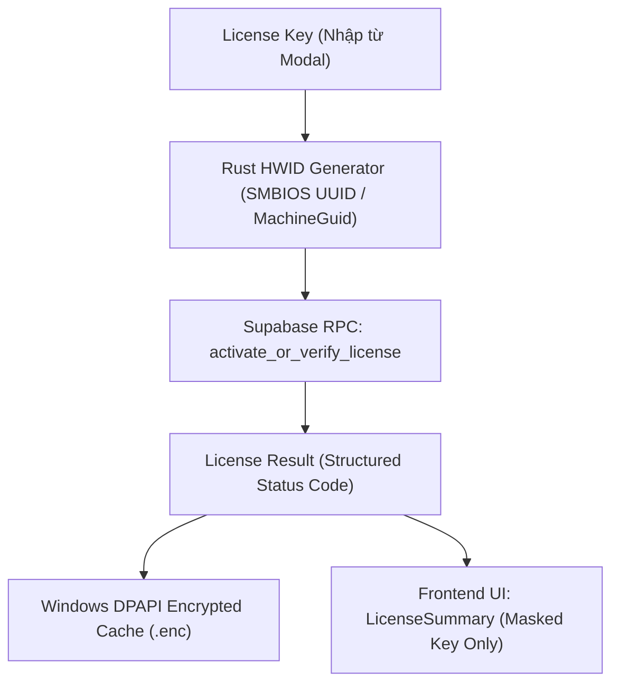

# SPEC-settings: Cấu Trúc Tổng Thể & Điều Hướng Tab Cài Đặt (Settings Workspace)

**Phiên bản**: 1.2.0 (Gate D Final Sign-off — Strict 3-Tab Structure & License Security Architecture)  
**CURRENT PHASE**: Phase 6 — UI/UX Design & Prototype COMPLETE  
**CURRENT GATE**: Gate D Final Sign-off  
**NEXT PHASE**: Phase 7 — Build Auto  
**BUILD AUTO**: LOCKED cho tới khi Product Owner phê duyệt Gate D Final  
**Tài liệu liên quan**: [`AGENT_WORKFLOW.txt`](file:///f:/Source%20Code%20Tool/Voxlab/AGENT_WORKFLOW.txt) · [`CONSTRAINTS.md`](file:///f:/Source%20Code%20Tool/Voxlab/CONSTRAINTS.md) · [`SPEC.md`](file:///f:/Source%20Code%20Tool/Voxlab/SPEC.md) · [`SPEC-batch.md`](file:///f:/Source%20Code%20Tool/Voxlab/SPEC-batch.md)

---

## 1. Mục Tiêu & Ranh Giới Kiến Trúc

### 1.1 Mục Tiêu Giai Đoạn Này
- Tối ưu hóa cấu trúc thanh điều hướng Settings theo phương án chốt cuối cùng: **Thu gọn thành đúng 3 tab** (`Nhà cung cấp AI`, `Mô hình`, `Chung`).
- Gom toàn bộ các thiết lập hệ thống còn lại (`Lưu trữ & Dữ liệu`, `Phần cứng & Thiết bị AI`, `Thông tin`) vào tab **Chung**.
- Không dùng Accordion hoặc Collapsible Section trong tab Chung; hiển thị trực tiếp và liên tục 3 section theo chiều dọc.
- Loại bỏ hoàn toàn các card chẩn đoán kỹ thuật sâu (AVX, Driver CUDA, Compute Capability, Tensor Cores, FFmpeg, runtime libs) khỏi màn hình UI. Thay vào đó, tích hợp chúng vào nội dung sao chép của nút `[Sao chép thông tin hệ thống]`.
- Giữ nguyên các invariant an toàn dữ liệu, mô hình và hàng đợi đã được phê duyệt.
- Chưa triển khai logic backend mới hoặc thay đổi cơ chế phần cứng/storage ở giai đoạn này.

### 1.2 Ranh Giới Cấu Hình (Configuration Boundary)
- **Settings là nơi duy nhất quản lý**:
  - Nhà cung cấp AI (AI Providers: Cloud API, Local Services, Custom Proxy).
  - Khóa bảo mật (API Keys), Địa chỉ dịch vụ (Endpoints), Tên mô hình (Model IDs).
  - Thư mục lưu trữ mô hình AI cục bộ (TTS models, ASR/Whisper models).
  - Quản lý hạ tầng dữ liệu (App Data Root, Cache, Logs, Database History).
  - Phần cứng & thiết bị xử lý AI (CPU, GPU, RAM, VRAM, Device selection).
  - Thông tin ứng dụng, tác giả và bản quyền (App Info, License, Update check).
- **Tuyệt đối không đưa vào Settings**:
  - Các thông số nghiệp vụ theo tác vụ (giọng đọc, tốc độ, cao độ, kiểu ngắt nghỉ, ngôn ngữ đích, định dạng xuất `.wav`/`.mp3`/`.srt`).
  - Các thông số này nằm trực tiếp trong Inspector của từng Workspace nghiệp vụ (TTS, Dialogue, Subtitles, Dubbing) hoặc trong Cấu hình chung của tab Hàng loạt (Batch Defaults).

---

## 2. Hệ Thống 3 Nhóm Chức Năng (Strict 3-Tab Navigation)

Hệ thống điều hướng sidebar chỉ bao gồm đúng 3 nhóm theo thứ tự cố định:

| STT | Mã nhóm (`id`) | Tiêu đề hiển thị | Biểu tượng |
| :--- | :--- | :--- | :--- |
| **1** | `general` | **Chung** | `Sliders` / `Settings` |
| **2** | `providers` | **Nhà cung cấp AI** | `Globe` |
| **3** | `models` | **Mô hình** | `Layers` |

*Ghi chú*: Sidebar cài đặt được tối giản hóa tối đa, hiển thị dạng 1 dòng ngang cân đối gồm `[Biểu tượng] + [Tên mục]`, loại bỏ toàn bộ các dòng mô tả phụ dài dòng để giao diện thanh thoát và trực quan.*

*Lưu ý tương thích*: Các mã nhóm cũ (`storage`, `hardware`, `about`, `general`, `translation`, `ai_text`, `tts`) đều được tự động chuẩn hóa chuyển tiếp về 3 nhóm trên mà không gây lỗi ứng dụng.

---

## 3. Đặc Tả Chi Tiết Giao Diện Từng Tab

### 3.1 Tab 1: Chung (General)
Hiển thị trực tiếp các khối Card theo thứ tự trên cùng một trang, loại bỏ hoàn toàn các tiêu đề phân mục cồng kềnh và đường kẻ ngang nền thừa để giao diện thoáng sạch, liền mạch:

#### A. Khối Lưu Trữ & Dữ Liệu
- Gom toàn bộ vào **1 vùng (Card) duy nhất**, gồm:
  - **Phần trên — Thư mục dữ liệu VoxLab**:
    - Input hiển thị đường dẫn hiện tại (`C:\Users\Admin\AppData\Local\VoxLab`).
    - Badge dung lượng thực tế (`1.2 GB`).
    - Nút `[Thay đổi thư mục...]` kích hoạt pop-up tối giản (tiêu đề: `Thay Đổi Thư Mục Dữ Liệu`, hiển thị thư mục nguồn và ô nhập/duyệt thư mục mới, loại bỏ toàn bộ đoạn văn giải thích dài dòng).
  - **Đường phân cách mảnh**.
  - **Phần dưới — Bộ 3 thẻ dọn dẹp bộ nhớ**:
    - **Bộ nhớ tạm**: Dung lượng (`245 MB`), nút `[Dọn bộ nhớ tạm]`.
    - **Nhật ký**: Dung lượng (`12.4 MB`), nút `[Mở thư mục]` và `[Xóa nhật ký]`.
    - **Lịch sử**: Số bản ghi (`38 bản ghi`), nút `[Dọn lịch sử]`.
- **Các invariant an toàn dữ liệu**:
  - Không bao giờ xóa mô hình AI đã tải, preset giọng, tệp nguồn hoặc kết quả xuất trên đĩa.
  - Bảo toàn artifact trung gian cần thiết cho Retry/Regenerate và tệp tạm thuộc công việc đang chạy.
  - Khóa thay đổi hoặc dọn dẹp khi có công việc đang sử dụng dữ liệu liên quan.
  - Modal xác nhận an toàn trước khi dọn dẹp và Toast thông báo hoàn tất tự biến mất sau 4 giây.

#### B. Khối Phần Cứng & Thiết Bị AI
- Gom toàn bộ vào **1 vùng (Card) duy nhất**, gồm:
  - **Phần trên — Thông tin phần cứng**:
    - Trạng thái ngắn: `CUDA: Khả dụng` và nút nhỏ `[Quét lại]`.
    - 4 thẻ thông tin cơ bản: **CPU** (`Intel Core Ultra 7 270K Plus`), **GPU** (`NVIDIA GeForce RTX 5070 Ti`), **RAM** (`32 GB`), **VRAM** (`16 GB`).
    - Nút `[Sao chép thông tin hệ thống]` tích hợp thông tin chẩn đoán kỹ thuật sâu (driver, compute capability, FFmpeg, runtime libs) vào clipboard mà không làm rối UI.
  - **Đường phân cách mảnh**.
  - **Phần dưới — Thiết bị xử lý AI**:
    - Đúng 3 lựa chọn thẻ radio tối giản: **Tự động**, **GPU**, **CPU**.
    - Dòng khuyến nghị ngắn: `Khuyến nghị: GPU · 16 GB VRAM`.
    - Không hiển thị câu cảnh báo thường trực khi máy ở trạng thái bình thường.

#### C. Khối Thông Tin & Quản Lý Bản Quyền (App Info & License)
- **Header**: Tên ứng dụng và phiên bản: `VoxLab - V1.0.0` (loại bỏ huy hiệu `MVP RELEASE`). Tên tác giả / đơn vị phát triển. Góc phải tích hợp nút `[Kiểm tra cập nhật]`.
- **Khối Key bản quyền**:
  - Nhãn: `Key bản quyền`.
  - Thanh hiển thị key:
    - Khi **chưa có key**: Hiển thị placeholder mờ: `xxx-xxx-xxx-xxx`.
    - Khi **đã có key**: Hiển thị key ẩn một phần (masked key): `VOX-****-****-89AF`.
  - Nút thao tác: `[Đổi key]` (hoặc `[Nhập key]`). Khi bấm nút `[Đổi key]` (hoặc bấm vào thanh khi chưa có key), **Pop-up (Modal) Key Bản Quyền** mở ra ở giữa màn hình (tiêu đề: `Key Bản Quyền`, nhãn: `Mã bản quyền`, không có chữ tiếng Anh trong ngoặc, không có chú thích thừa). Khi đã có key, thanh nhập là read-only và chỉ có thể đổi qua nút `[Đổi key]`.
  - Vị trí Thời hạn & Trạng thái: Đặt ở dưới thanh key (Hiển thị `Thời hạn: Tạm hoãn (Không giới hạn tính năng)` kèm huy hiệu `Tạm vô hiệu hóa`).
  - **Tình trạng Kích hoạt (Product Owner Decision)**: Toàn bộ quy trình kích hoạt/khóa bản quyền tạm thời **VÔ HIỆU HÓA** trong quá trình phát triển tính năng cốt lõi và sẽ được xử lý/kích hoạt lại sau khi hoàn thành toàn bộ ứng dụng. Ứng dụng không tự động bật pop-up bản quyền khi khởi động; không giới hạn bất kỳ tính năng nào.
  - **Lưu trữ Cấp Bền Vững & Bảo Mật (Secure Rust DPAPI Storage — Sẽ kích hoạt sau)**: Khi hoàn thiện toàn bộ app, hệ thống mã hóa và lưu trữ an toàn qua Windows DPAPI trong Rust backend (tuyệt đối KHÔNG lưu trong `localStorage`).
  - Nguyên tắc bảo mật: Tuyệt đối không lưu vết hay hiển thị lộ key gốc ở bất kỳ đâu trên giao diện hay log/diagnostics.

#### D. Hàng Đặt Lại Cài Đặt (Footer Action)
- Rút gọn thành một hàng nhỏ ở cuối: nhãn `Đặt lại cài đặt` và nút `[Đặt lại]`.
- Hộp thoại xác nhận an toàn khi bấm: chỉ khôi phục cấu hình app, bảo toàn tuyệt đối mô hình AI, lịch sử, âm thanh đầu ra và Voice Library.

---

### 3.2 Tab 2: Nhà cung cấp AI (AI Providers)
- **Cấu hình AI dùng chung toàn ứng dụng (Global AI Configuration)**: Cấu hình provider hiện tại là cấu hình AI mặc định cho toàn bộ các chức năng AI văn bản / dịch thuật trong VoxLab.
- **Cấu trúc 7 nhà cung cấp**:
  1. *API Đám Mây (Cloud API)*: Google Gemini, OpenAI GPT, DeepSeek, Alibaba Qwen.
  2. *Dịch vụ Nội bộ (Local Services)*: Ollama (Local), LM Studio.
  3. *API Tùy chỉnh (Custom API)*: API tùy chỉnh tương thích chuẩn OpenAI (`OpenAI-compatible`).
- **Thẻ lựa chọn nhà cung cấp (Minimalist Cards)**:
  - Chỉ hiển thị: Tên nhà cung cấp, nhãn nhỏ loại kết nối (`API đám mây`, `Nội bộ`, `Tùy chỉnh`), và trạng thái active.
  - Loại bỏ hoàn toàn mô tả dài, text giải thích marketing, dòng model mặc định thừa.
- **Khung cấu hình ngữ cảnh (Contextual Minimalist Form)**:
  - Hiển thị linh hoạt theo loại nhà cung cấp:
    - **Cloud API**: API Key, Tên mô hình, Thời gian chờ (Timeout ms), Giới hạn token (Max Tokens kèm tùy chọn *Không giới hạn* - Unlimited), nút `[Kiểm tra]`.
    - **Local Services**: Endpoint URL, Tên mô hình, Thời gian chờ, Giới hạn token (kèm tùy chọn *Không giới hạn*), nút `[Kiểm tra]`.
    - **Custom API**: Endpoint URL (OpenAI-compatible), API Key, Tên mô hình, Thời gian chờ, Giới hạn token (kèm tùy chọn *Không giới hạn*), nút `[Kiểm tra]`.
  - Placeholder ngắn gọn, sạch sẽ, không có text chú thích rườm rà.

---

### 3.3 Tab 3: Mô hình (Models)
- Quản lý tập trung mô hình AI cục bộ cho TTS và ASR (Whisper), độc lập khỏi tab Chung.
- **Thư mục lưu trữ mô hình**:
  - Thư mục Mô hình Giọng nói (TTS): đường dẫn, nút `[Chọn thư mục...]`, nút `[Quét lại]`.
  - Thư mục Mô hình Bóc băng (ASR/Whisper): đường dẫn, nút `[Chọn thư mục...]`, nút `[Quét lại]`.
- **Bảng danh mục mô hình & Ngữ nghĩa Quét / Cài đặt / Gỡ bỏ (Models Inventory Semantics)**:
  - Quét thư mục (`Scan`): Duyệt đường dẫn chỉ định để nhận diện các mô hình hợp lệ đã hiện diện trên đĩa.
  - Tên mô hình & Phiên bản: `OmniVoice v1.2`, `Chatterbox Turbo`, `faster-whisper Large V3`, `faster-whisper Medium`.
  - Phân loại: TTS / ASR.
  - Dung lượng trên đĩa thực tế: `2.1 GB`, `1.4 GB`, v.v.
  - Trạng thái: `ĐÃ CÀI ĐẶT` (Xanh lá) hoặc `CHƯA TẢI` (Cam).
  - Thao tác: `[Tải về]` (Download/Install vào thư mục chỉ định) hoặc `[Gỡ cài đặt]` (Uninstall/Delete khỏi đĩa an toàn kèm hộp thoại xác nhận).

---

## 4. Acceptance Criteria Cho Settings Workspace

- **AC-SET-01 (Strict 3-Tab Structure)**: Thanh điều hướng sidebar Settings chỉ bao gồm đúng 3 tab theo thứ tự: 1. Chung (`general`), 2. Nhà cung cấp AI (`providers`), 3. Mô hình (`models`).
- **AC-SET-02 (General Flat Layout & No Accordion)**: Tab Chung hiển thị 3 khối Card phẳng liên tục theo chiều dọc (Lưu trữ & Dữ liệu, Phần cứng & Thiết bị AI, Thông tin & Bản quyền); tuyệt đối không dùng Accordion hay gập mở section.
- **AC-SET-03 (License Modal & Masked Key Invariant)**: Key bản quyền hiển thị dạng masked `VOX-****-****-XXXX`; bấm Đổi key mở pop-up giữa màn hình; kích hoạt qua Tauri IPC kết nối Rust DPAPI backend; tuyệt đối không lưu full key trong `localStorage` và không bao giờ hiển thị lộ key gốc ra UI.
- **AC-SET-04 (Global AI Provider Configuration)**: Tab Nhà cung cấp AI đóng vai trò là cấu hình dùng chung toàn ứng dụng; hỗ trợ 7 nhà cung cấp (Gemini, OpenAI, DeepSeek, Qwen, Ollama, LM Studio, Custom API); Custom API hỗ trợ đầy đủ Endpoint chuẩn OpenAI + API Key + Model ID; hỗ trợ tùy chọn token *Không giới hạn* (Unlimited).
- **AC-SET-05 (Local Model Management Boundary)**: Tab Mô hình quản lý riêng biệt thư mục và trạng thái quét/tải/gỡ cài đặt của các mô hình TTS và ASR, bảo đảm an toàn dữ liệu và không can thiệp vào các tệp artifact nghiệp vụ.
- **AC-SET-06 (Backward-Compatible Route Normalization)**: Mọi yêu cầu điều hướng cũ tới các mã nhóm (`storage`, `hardware`, `about`) tự động chuẩn hóa về tab `general`.

---

## 5. Đặc Tả Kiến Trúc Bảo Mật Bản Quyền (License Security Architecture)

Tham chiếu chuẩn kiến trúc từ `Audio-Factory` (`core/license_client.py`, `core/device_identity.py`, `core/dpapi_storage.py`) và `Video-Cutter` (`mmo_security_core.py`), được chuyển giao sang tầng native Rust / Tauri của VoxLab.



### 5.1 Định Danh Thiết Bị (Device Identity / HWID v1)
- **Nguồn định danh phần cứng ổn định (Primary vs Fallback Single Anchor)**:
  1. *Primary anchor*: SMBIOS / Motherboard UUID (`Win32_ComputerSystemProduct.UUID` qua CIM/WMI hoặc native Win32 API).
  2. *Fallback anchor*: Windows Registry `HKLM\SOFTWARE\Microsoft\Cryptography\MachineGuid` (chỉ sử dụng khi SMBIOS UUID không khả dụng, rỗng hoặc không hợp lệ).
  - Tuyệt đối không kết hợp cả hai thành composite HWID bắt buộc.
- **Chuẩn hóa (Normalization)**: Chuyển toàn bộ ký tự của anchor được chọn thành chữ in hoa (`uppercase`), loại bỏ dấu gạch ngang (`-`), dấu ngoặc nhọn `{}` và khoảng trắng thừa.
- **Băm bảo mật có Namespace (Namespaced Hashing)**:
  - HWID được sinh ra bằng hàm băm SHA-256 trên chuỗi kết hợp: `VoxLab-HWID-v1:{normalized_anchor}`.
  - Định dạng chuỗi HWID hoàn chỉnh: `v1:{sha256_hex_lowercase}`.
- **Nguyên tắc an toàn**: Tuyệt đối không dùng MAC address (thay đổi khi đổi mạng/VPN), CPU serial (không ổn định trên các nền tảng ảo hóa/CPU modern), hoặc disk serial làm primary anchor. HWID mang phiên bản (`v1:`) để phục vụ nâng cấp/migration sau này.

### 5.2 Cơ Chế Xác Thực Trực Tuyến (Online Verification via Supabase RPC)
- Desktop client kết nối trực tiếp đến endpoint RPC của Supabase:
  `POST /rest/v1/rpc/activate_or_verify_license`
- Payload tham số:
  ```json
  {
    "p_license_key": "VOX-XXXX-XXXX-XXXX",
    "p_hwid": "v1:a1b2c3d4...",
    "p_app_version": "1.0.0"
  }
  ```
- **Ranh giới bảo mật tối cao**:
  - Desktop client **tuyệt đối KHÔNG** truy cập trực tiếp vào bảng cơ sở dữ liệu (`licenses`, `devices`, v.v.).
  - Desktop client **tuyệt đối KHÔNG** thực thi câu lệnh SQL trực tiếp, không update HWID trực tiếp, không reset device trực tiếp.
  - Desktop client **tuyệt đối KHÔNG** chứa `service-role key` hoặc `admin secret`. Chỉ nhúng public `anon_key` với quyền truy cập RPC đã được khóa chặt ở phía backend Supabase (Row Level Security / RPC Definer).

### 5.3 Lưu Trữ Cục Bộ Mã Hóa An Toàn (Secure Local DPAPI Cache)
- Tuyệt đối không lưu trữ khóa bản quyền hoặc kết quả xác thực trong `localStorage` hay cookie của trình duyệt.
- Triển khai trong tầng backend native Rust (`src-tauri/src/security/license_storage.rs`).
- Trên nền tảng Windows, sử dụng **Windows DPAPI** (`CryptProtectData` / `CryptUnprotectData`).
- **Quyền lưu trữ của Backend Rust**: Backend Rust được phép lưu trữ raw License Key trong DPAPI-encrypted secure storage (`license.enc`) phục vụ cơ chế tự động xác thực lại khi khởi động (startup re-verification) qua RPC mà không bắt người dùng nhập lại key.
- Cơ chế ghi tệp bền vững và nguyên tử (**Atomic Persistence**):
  `Ghi vào license.tmp -> fsync / flush -> rename / replace thành license.enc`.
- Cấu trúc dữ liệu trong License Cache (được mã hóa toàn vẹn bằng Windows DPAPI):
  ```json
  {
    "schemaVersion": 1,
    "licenseKey": "VOX-ABCD-EFGH-89AF",
    "licenseKeyMasked": "VOX-****-****-89AF",
    "licenseType": "pro",
    "hwidVersion": 1,
    "hwid": "v1:a1b2c3d4...",
    "status": "VALID",
    "savedAt": "2026-10-06T00:00:00Z",
    "lastVerifiedAt": "2026-10-06T00:00:00Z",
    "expiresAt": "2027-10-05T00:00:00Z",
    "lastServerStatus": "VALID"
  }
  ```
  *(Ghi chú: Nếu license là Vĩnh viễn, `expiresAt = null`)*.
- **Ranh giới cô lập raw key**: Raw License Key tuyệt đối KHÔNG bao giờ xuất hiện trong:
  - React state lâu dài
  - `localStorage` / `sessionStorage`
  - Nhật ký (logs) console / file
  - Báo cáo chẩn đoán (diagnostics)
  - Báo cáo sự cố (crash reports)
- Frontend UI chỉ nhận `LicenseSummary` chứa `licenseKeyMasked` (`VOX-****-****-89AF`).

### 5.4 Mã Trạng Thái Miền Nghiệp Vụ (Structured Domain Status Enum)
Hệ thống sử dụng enum cấu trúc định danh rõ ràng, tuyệt đối không suy đoán trạng thái dựa trên phân tích chuỗi văn bản (text parsing):
- `VALID`: Bản quyền hợp lệ, đã kích hoạt đúng thiết bị và còn hạn sử dụng.
- `ACTIVATED`: Vừa kích hoạt thành công trên thiết bị hiện tại.
- `EXPIRED`: Khóa bản quyền đã hết hạn sử dụng.
- `DISABLED`: Khóa bản quyền đã bị thu hồi hoặc khóa bởi quản trị viên.
- `NOT_FOUND`: Mã bản quyền không tồn tại trong hệ thống.
- `DEVICE_MISMATCH`: Mã bản quyền đã bị liên kết với thiết bị phần cứng khác.
- `DEVICE_LIMIT`: Đã đạt giới hạn số lượng thiết bị kích hoạt cho phép.
- `NETWORK_ERROR`: Lỗi mất kết nối mạng hoặc timeout khi gọi RPC.
- `SERVER_ERROR`: Lỗi dịch vụ từ phía máy chủ Supabase.
- `NO_KEY`: Người dùng chưa nhập hoặc chưa kích hoạt mã bản quyền.
- `OFFLINE_GRACE`: Đang hoạt động trong thời gian ân hạn ngoại tuyến (Offline Grace).

### 5.5 Cơ Chế Ân Hạn Ngoại Tuyến (Offline Grace Policy)
Cho phép kích hoạt chế độ **Offline Grace** ngắn hạn khi và chỉ khi thỏa mãn đồng thời toàn bộ 5 điều kiện sau:
1. Bản quyền đã từng được xác thực trực tuyến thành công trước đó (`VALID` hoặc `ACTIVATED`).
2. Tệp bộ nhớ tạm mã hóa DPAPI tại máy cục bộ còn nguyên vẹn và giải mã thành công.
3. HWID hiện tại của máy tính trùng khớp 100% với `cached_hwid` đã lưu trong cache.
4. Lỗi kích hoạt hiện tại là lỗi tạm thời (`NETWORK_ERROR` hoặc `SERVER_ERROR`).
5. Khoảng thời gian từ `lastVerifiedAt` đến thời điểm hiện tại chưa vượt quá thời hạn ân hạn cho phép:
   `OFFLINE_GRACE_DAYS = TUNING REQUIRED`
   *(Baseline phát triển tạm thời: 7 ngày [PROVISIONAL / NOT PRODUCT-FROZEN], cấu hình qua domain constant `DEFAULT_OFFLINE_GRACE_DAYS`, tuyệt đối không hard-code trên UI)*.

**Quy tắc Khóa Vĩnh Viễn Không Ân Hạn**:
- Tuyệt đối **KHÔNG** kích hoạt Offline Grace nếu máy chủ đã từng trả về trạng thái từ chối xác định: `EXPIRED`, `DISABLED`, `DEVICE_MISMATCH`, `DEVICE_LIMIT`, `NOT_FOUND`.
- Một khi server đã từ chối xác định, cache bị đánh dấu vô hiệu và không được dùng cache cũ để khôi phục quyền sử dụng.
- Thời hạn ân hạn là hằng số cấu hình thuộc miền nghiệp vụ (`domain constant`), không hard-code trên UI. Khi chạy ở chế độ Offline Grace, app hiển thị thanh thông báo cảnh báo ngoại tuyến kèm số ngày ân hạn còn lại.

### 5.6 Ranh Giới Bảo Mật Rust / Tauri IPC
Frontend TypeScript chỉ được tương tác với hệ thống bản quyền thông qua các hàm IPC chính thức:
- `get_license_summary() -> LicenseSummary`: Trả về thông tin tóm tắt cho giao diện UI (`licenseType`, `maskedKey`, `status`, `expiresAtFormatted`, `isOfflineGrace`).
- `activate_license(key: String) -> LicenseResult`: Nhận key người dùng nhập, thực thi xác thực RPC và mã hóa cache tại Rust.
- `change_license_key(key: String) -> LicenseResult`: Thực hiện quy trình thay đổi key bản quyền an toàn.
- `verify_license() -> LicenseResult`: Kiểm tra lại trạng thái bản quyền hiện tại.
- `clear_local_license_if_allowed() -> LicenseResult`: Dọn dẹp cache cục bộ khi người dùng gỡ bản quyền.

**Nguyên tắc Bất biến Tầng Frontend**: Frontend KHÔNG tự sinh HWID, KHÔNG gọi Windows DPAPI, KHÔNG nắm giữ server secrets, KHÔNG tự quyết định logic Offline Grace. Sau khi hoàn tất kích hoạt, Frontend lập tức hủy raw key khỏi bộ nhớ React state.

---

## 6. Tiêu Chí Nghiệm Thu Bản Quyền (License Acceptance Criteria)

- **LICENSE-AC-01 (No Plain Key in Storage)**: Khóa bản quyền đầy đủ (Full raw license key) tuyệt đối không tồn tại trong `localStorage`, `sessionStorage`, hay bất kỳ tệp cấu hình văn bản thuần nào trên đĩa.
- **LICENSE-AC-02 (DPAPI Encryption)**: Dữ liệu bộ nhớ tạm bản quyền cục bộ được mã hóa an toàn bằng Windows DPAPI (`CryptProtectData`) trên nền tảng Windows; cho phép Rust backend giải mã an toàn raw key để thực hiện online re-verification.
- **LICENSE-AC-03 (HWID Deterministic Stability)**: Mã định danh phần cứng (HWID) cho kết quả đồng nhất 100% qua các lần khởi động lại ứng dụng trên cùng một máy tính.
- **LICENSE-AC-04 (Stable Hardware Anchor & Versioned Hash)**: HWID được sinh từ một stable Windows anchor: ưu tiên SMBIOS UUID; fallback sang MachineGuid nếu UUID không khả dụng; anchor được normalize, namespace và SHA-256 hash theo version.
- **LICENSE-AC-05 (Successful Activation Flow)**: Khóa bản quyền hợp lệ kết hợp đúng HWID kích hoạt thành công, mở khóa đầy đủ chức năng ứng dụng.
- **LICENSE-AC-06 (Expired Rejection)**: Khóa bản quyền đã hết hạn (`EXPIRED`) bị hệ thống từ chối dứt khoát và hiển thị đúng thông báo hết hạn.
- **LICENSE-AC-07 (Disabled Rejection)**: Khóa bản quyền bị thu hồi (`DISABLED`) bị hệ thống từ chối dứt khoát và vô hiệu hóa mọi quyền năng AI.
- **LICENSE-AC-08 (Device Mismatch Rejection)**: Khóa bản quyền đã gắn với máy tính khác (`DEVICE_MISMATCH`) bị từ chối dứt khoát trên máy tính hiện tại.
- **LICENSE-AC-09 (Offline Grace on Transient Error)**: Khi mất kết nối mạng hoặc lỗi server tạm thời, nếu máy đã từng kích hoạt hợp lệ và còn trong thời hạn ân hạn (`OFFLINE_GRACE_DAYS`), ứng dụng chuyển sang `OFFLINE_GRACE` cho phép người dùng tiếp tục làm việc ngoại tuyến.
- **LICENSE-AC-10 (No Grace on Definitive Rejection)**: Không bao giờ cấp quyền Offline Grace nếu server trả về các lỗi từ chối xác định (`EXPIRED`, `DISABLED`, `DEVICE_MISMATCH`, `NOT_FOUND`).
- **LICENSE-AC-11 (Masked Key Display)**: Giao diện người dùng chỉ hiển thị key ở dạng che giấu (`VOX-****-****-XXXX`), không bao giờ để lộ key gốc sau khi kích hoạt.
- **LICENSE-AC-12 (Masked Logs & Diagnostics)**: Toàn bộ nhật ký (logs), chẩn đoán hệ thống và báo cáo sự cố (crash reports) tuyệt đối không ghi lại full key hoặc client secrets.
- **LICENSE-AC-13 (Change Key Flow)**: Thao tác đổi mã bản quyền (`change_license_key`) qua Modal cập nhật thành công loại bản quyền mới, ngày hết hạn mới và masked key mới mà không làm rò rỉ dữ liệu nhạy cảm.
- **LICENSE-AC-14 (No Service-Role Key in Client)**: Desktop build tuyệt đối không chứa `service-role key`, `admin token`, hay quyền ghi trực tiếp vào cơ sở dữ liệu Supabase.
