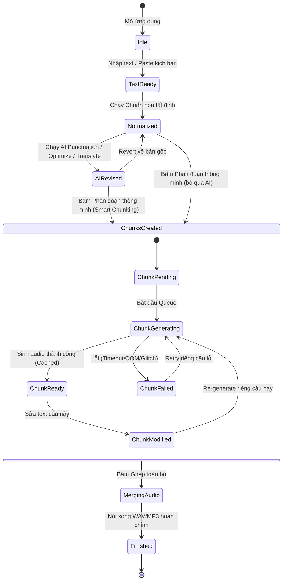

# VoxLab — Product & Technical Specification (SPEC.md)

**Document Version**: 1.0.0  
**Phase**: Phase 3 — Specification (GATE B)  
**Status**: Pending User Approval  
**Target Platform**: Windows 10/11 64-bit (x64)  
**Core Stack**: Tauri v2 (Rust) + React 19 + TypeScript + Vite  

---

## 1. Goal & Objectives

VoxLab là ứng dụng desktop Windows local-first, chuyên biệt cho việc tạo giọng đọc kịch bản dài (Long-form TTS) với khả năng kiểm soát chất lượng chi tiết từng câu và bóc băng âm thanh/video (ASR) độc lập, hoạt động 100% trên phần cứng máy tính người dùng mà không phụ thuộc vào cloud hay dịch vụ bên ngoài.

Mục tiêu cốt lõi của phiên bản MVP:
1. **Long-form TTS Studio**: Cung cấp quy trình khép kín: Nhập kịch bản $\rightarrow$ Chuẩn hóa tất định $\rightarrow$ Tùy chọn AI hỗ trợ (sửa dấu câu, tối ưu, dịch có kiểm soát và đảo ngược) $\rightarrow$ Chia chunk thông minh theo profile model $\rightarrow$ Sinh giọng nói có cache từng câu $\rightarrow$ Ghép audio thành phẩm (WAV/MP3).
2. **Standalone Transcription**: Nhập media $\rightarrow$ Bóc băng bằng Whisper-family local engine $\rightarrow$ Xem plain text và timestamped segments $\rightarrow$ Xuất file `.txt` và `.srt` $\rightarrow$ Cung cấp cầu nối *"Chuyển sang TTS"* để tạo voiceover mới mà không làm thay đổi transcript gốc.
3. **An toàn, Ổn định & Riêng tư**: Strict Local-Only (không cloud fallback, không telemetry); Worker crash không làm sập giao diện; thu hồi tài nguyên (VRAM/RAM) sạch sẽ khi hủy; bảo toàn văn bản gốc (Original Text Safety).

---

## 2. Target User & Use Cases

### 2.1 Đối tượng người dùng
- **Content Creators / Video Makers**: Cần tạo giọng đọc voiceover chất lượng cao từ kịch bản dài, cần chỉnh sửa lại các câu bị đọc vấp mà không phải sinh lại toàn bộ bài.
- **Audiobook Creators / Podcasters**: Cần đọc sách, truyện, tài liệu dài với giọng đọc tự nhiên, có khoảng lặng phù hợp giữa các đoạn và hỗ trợ voice cloning.
- **Researchers / Transcribers**: Cần bóc băng phỏng vấn, bài giảng, video ghi âm nội bộ để trích xuất text/subtitle hoàn toàn bảo mật tại máy.

### 2.2 Các kịch bản sử dụng chính (Use Cases)
- **UC-01 (Tạo Voiceover kịch bản dài)**: Người dùng dán văn bản 2.000 từ $\rightarrow$ Bấm Chuẩn hóa text $\rightarrow$ Bấm Chia chunk $\rightarrow$ Chọn Model & Giọng $\rightarrow$ Bấm Sinh toàn bộ $\rightarrow$ Nghe thử phát hiện câu #15 đọc vấp $\rightarrow$ Sửa lại chữ ở câu #15 $\rightarrow$ Bấm Retry riêng câu #15 $\rightarrow$ Bấm Ghép & Xuất file audio tổng.
- **UC-02 (AI Hỗ trợ sửa dấu câu an toàn)**: Người dùng có đoạn text không dấu chấm phẩy $\rightarrow$ Bấm "AI Punctuation" $\rightarrow$ Hệ thống gửi prompt tới LM Studio $\rightarrow$ Hiện màn hình so sánh Before/After Diff $\rightarrow$ Người dùng xem rõ các dấu câu được thêm/sửa $\rightarrow$ Bấm "Chấp nhận" để cập nhật vào working text.
- **UC-03 (Bóc băng & Lồng tiếng lại - Re-voice)**: Người dùng nạp video bài giảng tiếng Anh $\rightarrow$ Whisper bóc băng ra text $\rightarrow$ Bấm "Chuyển sang TTS" $\rightarrow$ Văn bản được nạp sang TTS Studio làm kịch bản mới $\rightarrow$ (Tùy chọn dịch sang tiếng Việt) $\rightarrow$ Tạo giọng đọc tiếng Việt mới.

---

## 3. High-Level Architecture & Boundaries

```
┌─────────────────────────────────────────────────────────────────────────────────┐
│                               REACT FRONTEND                                    │
│  - Presentation, UI State, Web Audio API Playback & Visualizer In-Memory       │
│  - Zero shell calls, Zero direct model runtime calls, Zero raw FS operations   │
└──────────────────────────────────────┬──────────────────────────────────────────┘
                                       │ Tauri IPC (Commands & Events)
┌──────────────────────────────────────▼──────────────────────────────────────────┐
│                           TAURI / RUST BACKEND LAYER                            │
│  - Process Supervisor & Worker Lifecycle Management (Start / Kill / Health)    │
│  - Hardware Detection (NVIDIA NVML / CUDA / VRAM / CPU cores / RAM)            │
│  - Job Queue Orchestrator (Safe-by-default, Concurrency = 1 in MVP)            │
│  - Local File I/O (Safe path resolution, Staging, Audio stitching via FFmpeg)  │
│  - SQLite Database Manager (Settings, Recent History, Session metadata)        │
└───────────────────┬─────────────────────────────────────────┬───────────────────┘
                    │ Versioned IPC / JSON-RPC                │ HTTP Local Client
┌───────────────────▼─────────────────────┐ ┌─────────────────▼───────────────────┐
│       ISOLATED MODEL WORKERS            │ │        LOCAL LLM ENDPOINT           │
│  - Python Subprocess (Isolated venv)   │ │  - LM Studio / Local OpenAI API      │
│  - TTS Engine Adapter (OmniVoice, etc.) │ │  - Configurable URL (127.0.0.1:1234) │
│  - Whisper Engine Adapter (faster-wh.)  │ │  - Punctuation, Polish, Translation  │
│  - Capability & Version Handshake       │ │                                     │
└─────────────────────────────────────────┘ └─────────────────────────────────────┘
```

---

## 4. Screens & User Interface Specification

Ứng dụng tuân thủ nghiêm ngặt mô hình kiến trúc **Navigation $\rightarrow$ Workspace $\rightarrow$ Inspector + Bottom Job Bar**.

```text
┌─────────────────────────────────────────────────────────────────────────────────┐
│ [Logo] VoxLab   Session: Kịch bản video #01   ● Licensed [VI] [☾] [⚙] [ — □ ✕ ] │
├──────────┬────────────────────────────────────────────────────────┬─────────────┤
│          │ STEPPER: 1. INPUT → 2. PREPARE → 3. CHUNKS → 4. EXPORT │             │
│ [▶] TTS  ├────────────────────────────────────────────────────────┤ INSPECTOR   │
│          │ [MAIN WORKSPACE - ADAPTIVE VIEW]                       │             │
│ [▤] Trans│                                                        │ Model       │
│          │  State 1: [Original Text]  vs  [Working Text]          │ Voice       │
│ [◷] Hist │  (Text editor, Actions: Normalize, AI Punctuation...)  │ Reference   │
│          │                                                        │ Language    │
│ [⚙] Sett │  State 2: [Chunk Studio]                               │ Speed       │
│          │  (Danh sách thẻ chunk, trạng thái, nghe thử, retry)    │ Pause       │
│          │                                                        │ Emotion     │
│          │  State 3: [Transcription Studio]                       │ Advanced    │
│          │  (Media dropzone, Segments list, Export TXT/SRT)       │             │
├──────────┴────────────────────────────────────────────────────────┴─────────────┤
│ Model: Qwen TTS · Generating chunk 23/84 (27%)   [ ⏸ Pause ] [ ✕ Cancel ] [📂]  │
└─────────────────────────────────────────────────────────────────────────────────┘
```

### 4.1 Top Bar (Header — Cao 48px – 56px)
- **Góc trái**: Logo ứng dụng + Tên phiên làm việc hiện tại (`Session: Tên kịch bản`).
- **Khu vực bản quyền**: Badge trạng thái ngắn gọn: `● Licensed` (kèm số ngày còn lại nếu có thời hạn) hoặc `● Trial`. *Bấm vào sẽ mở modal Settings $\rightarrow$ License*.
- **Góc phải**:
  - Nút chuyển ngôn ngữ giao diện: `[VN]` / `[EN]`.
  - Nút chuyển chủ đề màu: `[☾ Tối]` / `[☼ Sáng]`.
  - Nút mở cài đặt: `[⚙]`.
  - Các nút điều khiển cửa sổ chuẩn của Windows: `[Thu nhỏ] [Phóng to] [Đóng]`.

### 4.2 Left Sidebar (Điều hướng tác vụ — Rộng 180px – 200px, có nút thu gọn)
- Các mục điều hướng với Icon + Nhãn rõ ràng:
  - `[🎙️ Text to Speech]` (Active indicator nổi bật).
  - `[📝 Transcription]`.
  - `[🕒 History]` (Lịch sử các phiên xử lý gần đây).
  - `[⚙️ Settings]`.
- Nút bấm thu gọn sidebar (`[⟷]`) để mở rộng không gian cho Workspace khi cần tập trung.

### 4.3 Center Main Workspace (Vùng làm việc thích ứng theo trạng thái)

#### A. Tab TTS — Giai đoạn 1: Chuẩn bị Text (Text Preparation View)
- Bố cục chia đôi có thể kéo giãn:
  - Cột trái: `ORIGINAL TEXT` (Chỉ đọc hoặc chỉnh sửa nguồn, luôn được bảo toàn).
  - Cột phải: `WORKING TEXT` (Văn bản đang xử lý, sẽ đưa vào TTS).
- Thanh công cụ hành động phía trên/dưới:
  - `[Chuẩn hóa Text]` (Code tất định: Unicode, khoảng trắng, dấu câu cơ bản).
  - `[AI Sửa dấu câu]` (Mở modal so sánh Diff Before/After, nút Accept/Reject).
  - `[AI Tối ưu cho TTS]` (Mở modal Diff Before/After).
  - `[AI Dịch văn bản]` (Dịch sang ngôn ngữ đích, hiển thị Diff).
  - `[Khôi phục về bản gốc (Revert)]`.
  - `[Nút chính: Phân đoạn & Mở Chunk Studio ➔]`.

#### B. Tab TTS — Giai đoạn 2: Chunk Studio View
- Sau khi bấm chia chunk, khu vực giữa chuyển sang danh sách thẻ câu (Chunk Cards):
  - Thanh công cụ trên đầu: Tổng số chunk, tổng số từ/ký tự, nút `[▶ Sinh toàn bộ (Generate All)]`, `[Ghép & Xuất file tổng]`.
  - Mỗi Chunk Card hiển thị:
    - Số thứ tự (`#001`, `#002`), số ký tự.
    - Huy hiệu trạng thái (Badge): `Pending` (Chờ sinh), `Generating` (Đang sinh), `Ready` (Đã có audio), `Failed` (Lỗi), `Modified` (Đã sửa text, cần sinh lại).
    - Khung text của chunk (cho phép click đúp để chỉnh sửa nhanh).
    - Bộ điều khiển audio nhỏ: Nút `[▶ Nghe thử (Preview)]`, thanh waveform nhỏ hoặc thanh trượt thời gian.
    - Nút `[↻ Tạo lại riêng câu này]`.
    - Thông số kế thừa: Tên giọng đọc, Khoảng lặng sau câu (`Pause after: 400ms`).

#### C. Tab Transcription — Workspace
- Khu vực trên: Dropzone kéo thả file media (`.mp3`, `.wav`, `.m4a`, `.mp4`, `.mkv`), hiển thị tên file, thời lượng, dung lượng.
- Khu vực dưới: Chia 2 chế độ hiển thị qua nút chuyển Tab con:
  - `[Xem Plain Text]`: Khung văn bản thuần liên tục, dễ sao chép.
  - `[Xem Timestamped Segments]`: Danh sách từng câu kèm `Start Time - End Time` (ví dụ `00:01:12 --> 00:01:16`).
- Thanh nút xuất file:
  - `[Xuất file .TXT]`.
  - `[Xuất file .SRT]`.
  - `[Nút tiện ích: Chuyển sang TTS ➔]` (Đẩy plain text sang tab TTS làm working document mới, giữ nguyên transcript gốc).

### 4.4 Right Inspector (Bảng tham số ngữ cảnh — Rộng 260px – 300px, có nút thu gọn)
Tự động thay đổi nội dung tùy theo đối tượng đang được chọn ở Workspace:

#### Ngữ cảnh 1: Global Generation (Khi không chọn riêng chunk nào ở TTS)
- **Model**: Dropdown chọn model AI TTS (dựa trên các model được cài đặt và tương thích với phần cứng).
- **Chọn giọng (Voice)**:
  - Dropdown danh sách giọng mẫu có sẵn (Preset Voices).
  - Khu vực nạp giọng mẫu (Reference Audio Dropzone): Tải file `.wav` mẫu để Clone giọng, hiển thị tên file mẫu và nút nghe thử mẫu.
- **Ngôn ngữ (Language)**: Dropdown chọn Tiếng Việt, Tiếng Anh...
- **Tốc độ đọc (Speed)**: Slider điều chỉnh từ `0.5x` đến `2.0x` (Mặc định `1.0x`).
- **Sắc thái biểu cảm (Expression/Emotion)**: Dropdown chọn `Neutral`, `Happy`, `Sad`, `Serious`, `Excited`... (Nếu model không hỗ trợ, hiển thị mờ kèm dòng chữ *"Not supported by selected model"*).
- **Khoảng lặng mặc định (Default Pause)**: Ô nhập mili-giây giữa các chunk (Mặc định: *TUNING REQUIRED* ~400ms).

#### Ngữ cảnh 2: Chunk Selection (Khi người dùng click chọn Chunk #17)
- Header: `CẤU HÌNH CHUNK #017`.
- **Giọng đọc**: Dropdown với lựa chọn mặc định `[Kế thừa Global: Minh]` hoặc chọn giọng khác riêng cho câu này.
- **Sắc thái**: Dropdown `[Kế thừa Global]` hoặc ghi đè riêng cho câu này (`Happy`).
- **Khoảng lặng trước/sau**: Chỉnh mili-giây riêng cho câu #17.
- Nút `[Khôi phục về mặc định Global]`.

#### Ngữ cảnh 3: Transcription Settings (Khi đang ở tab Transcribe)
- **Whisper Model**: Dropdown chọn kích thước (`tiny`, `base`, `small`, `medium`, `large-v3`) kèm ghi chú mức VRAM yêu cầu.
- **Ngôn ngữ nguồn**: Dropdown với tùy chọn mặc định `[Tự động nhận diện (Auto Detect)]`, Tiếng Việt, Tiếng Anh...
- **Thiết bị chạy (Device)**: Tự động chọn `CUDA (NVIDIA GPU)` nếu có, hoặc `CPU`.

### 4.5 Bottom Job Bar (Thanh trạng thái tiến độ dưới đáy — Cao 40px – 48px)
- Luôn hiển thị cố định ở chân ứng dụng:
  - Bên trái: Tên model đang chạy + Tiến độ chunk: `Qwen TTS · Đang sinh chunk 23/84 (27%)`.
  - Ở giữa: Thanh tiến độ trực quan (Progress Bar).
  - Bên phải:
    - Nút `[⏸ Tạm dừng (Pause)]`.
    - Nút `[✕ Hủy bỏ (Cancel)]`.
    - Nút `[📂 Mở thư mục thành phẩm]`.
    - Trạng thái khi hoàn tất: `✓ Đã sinh xong toàn bộ 84 chunks trong 1m42s`.

---

## 5. User Workflow & State Model

### 5.1 Luồng trạng thái kịch bản TTS (TTS State Lifecycle)



### 5.2 Luồng Transcription (Transcription State Lifecycle)
`Empty` $\rightarrow$ `MediaLoaded` $\rightarrow$ `Transcribing` (Hiện progress bar & ETA) $\rightarrow$ `Completed` (Hiển thị văn bản) $\rightarrow$ `Exported` / `SentToTTS`.

---

## 6. Detailed Functional Specifications

### 6.1 Deterministic Text Normalization
- **Phạm vi bắt buộc**:
  1. Unicode Normalization Form C (NFC) chuẩn cho tiếng Việt và tiếng Anh.
  2. Xóa các khoảng trắng thừa liên tiếp, chuẩn hóa dấu cách đầu dòng/cuối dòng.
  3. Chuẩn hóa khoảng cách quanh dấu câu: Không có dấu cách trước dấu chấm, phẩy, hỏi, chấm than; bắt buộc có 1 dấu cách sau dấu câu (ngoại trừ ký tự số thập phân như `3.14`).
  4. Chuẩn hóa ngoặc kép chuẩn `""`, dấu gạch ngang chuẩn `-`.
  5. Chuẩn hóa xuống dòng liên tục (tối đa 2 dấu ngắt dòng liên tiếp).
- **Ranh giới an toàn**: Tuyệt đối không tự ý thêm dấu chấm/phẩy mới vào giữa câu, không tự thay đổi từ ngữ.

### 6.2 AI Text Assistance & Guardrails
- **Cơ chế kết nối**: Gửi yêu cầu HTTP POST tới OpenAI-compatible local endpoint (LM Studio) qua endpoint `/chat/completions` do Rust layer gọi trung gian, frontend không gọi trực tiếp.
- **AI Punctuation Contract**:
  - Prompt hệ thống chỉ thị rõ: *"Chỉ thêm/sửa dấu câu và ngắt dòng cho câu văn tự nhiên, TUYỆT ĐỐI không thay đổi, không thêm và không xóa bất kỳ từ ngữ nào"*.
  - **Lexical Guardrail Validation**: Sau khi LLM trả về, hệ thống thực hiện phép kiểm tra từ vựng (so sánh danh sách token từ đã bỏ dấu câu giữa bản gốc và bản AI sửa). Nếu phát hiện AI bịa thêm từ hoặc xóa từ $\rightarrow$ Gắn cờ cảnh báo `[Phát hiện thay đổi từ ngữ]`, hiển thị highlight đỏ trên Diff view và không cho phép tự động áp dụng.
- **Before / After Diff View**:
  - Giao diện dạng 2 cột so sánh hoặc inline diff (xanh lá cho phần thêm, đỏ cho phần bỏ/thay).
  - Có nút `[Chấp nhận (Accept)]` để ghi đè vào Working Text, hoặc `[Từ chối (Reject)]` để hủy bỏ.
- **Bảo toàn nguồn (Original Text Safety)**: Bản text gốc luôn được lưu nguyên vẹn trong state, người dùng bấm `[Revert]` bất kỳ lúc nào cũng lấy lại được 100% văn bản ban đầu.

### 6.3 Smart Chunking (Phân đoạn thông minh)
- Thuật toán phân đoạn câu dựa trên:
  1. Dấu câu kết thúc (`.`, `!`, `?`, `\n`).
  2. Dấu ngắt phụ khi câu quá dài (`,`, `;`, `:`, `—`).
  3. Ngưỡng độ dài ký tự tối đa được quy định theo **Model Profile** (Ví dụ: Model A tối ưu 150-250 ký tự; Model B tối ưu 300-400 ký tự).
- *Lưu ý*: Kích thước phân đoạn chính xác được đánh dấu `TUNING REQUIRED` theo từng model.

### 6.4 Audio Caching, Recovery & Final Stitching
- **Chunk Caching**: Mỗi chunk khi sinh xong được lưu ngay thành file audio trung gian (ví dụ `chunk_001.wav`) trong thư mục làm việc tạm của phiên: `%APPDATA%/VoxLab/cache/sessions/<session_id>/chunks/`.
- **Chunk Resilience**: Khi một chunk bị lỗi hoặc người dùng bấm Cancel, các chunk trước đó vẫn tồn tại nguyên vẹn trên đĩa và trong state.
- **Basic Interrupted-Session Recovery**:
  - Metadata của phiên (danh sách chunk, hash nội dung text, file audio tương ứng) được ghi vào SQLite local.
  - Khi người dùng tắt app và mở lại, ứng dụng kiểm tra session gần nhất: Nếu các file chunk audio khớp với hash của text $\rightarrow$ Đánh dấu trạng thái `Ready` cho các câu đó, cho phép người dùng sinh tiếp các câu dở dang hoặc bấm ghép ngay mà không mất công sinh lại.
- **Audio Stitching (Ghép âm thanh)**:
  - Sử dụng FFmpeg cục bộ (đã xác thực trong môi trường) để ghép nối các file chunk theo đúng thứ tự.
  - Tự động chèn khoảng lặng (silence buffer tính bằng mili-giây) giữa các câu theo cấu hình (mặc định ~400ms).
  - Xuất ra file thành phẩm cuối cùng: `.wav` (PCM 16-bit 44.1kHz/24kHz theo model) hoặc `.mp3` (192kbps/320kbps).

### 6.5 Standalone Transcription & Bridge sang TTS
- Nạp file media $\rightarrow$ Kiểm tra FFmpeg trích xuất audio $\rightarrow$ Đưa qua Whisper local engine.
- Bóc băng hỗ trợ Tiếng Việt & Tiếng Anh với tính năng **Automatic Language Detection**.
- Lưu trữ cấu trúc segment: `[{ id: 1, start: 0.0, end: 4.2, text: "Xin chào..." }, ...]`.
- Xuất file `.txt` (gộp toàn bộ text) và `.srt` (phụ đề chuẩn kèm timestamp).
- **Nút "Chuyển sang TTS"**:
  - Lấy toàn bộ plain text (loại bỏ toàn bộ timestamp và mã định dạng).
  - Khởi tạo một phiên TTS mới ở tab Text to Speech với working text này.
  - Transcript gốc ở tab Transcribe giữ nguyên không đổi.

---

## 7. Error Handling, Cancellation & Resilience

| Tình huống lỗi | Hành vi ứng xử của hệ thống | Khắc phục cho người dùng |
| :--- | :--- | :--- |
| **Model Worker bị Crash (OOM / C++ exception)** | Tiến trình worker bị ngắt; Rust supervisor phát hiện exit code $\neq 0$; **UI window hoàn toàn không bị ảnh hưởng/không crash**. | Chunk đang chạy chuyển trạng thái `Failed`; hiển thị thông báo lỗi rõ ràng; Worker tự khởi động lại ở trạng thái sạch; cho phép bấm `Retry`. |
| **Bấm Cancel giữa lúc sinh bài dài** | Gửi tín hiệu ngắt ngay tới worker; dừng hàng đợi; giải phóng VRAM/RAM; dọn dẹp các tiến trình con. | Toàn bộ các chunk đã sinh xong trước đó được giữ nguyên trạng thái `Ready`; người dùng có thể nghe thử hoặc bấm ghép các câu đã xong. |
| **LM Studio chưa bật khi bấm AI Punctuation** | Rust kiểm tra HTTP connection timeout (sau 3s); bắt lỗi `Connection Refused`. | Hiển thị thông báo thân thiện: *"Không thể kết nối tới LM Studio tại 127.0.0.1:1234. Vui lòng bật LM Studio Server và thử lại"*; không làm gián đoạn TTS. |
| **File âm thanh mẫu clone bị lỗi / quá ngắn** | Kiểm tra file trước khi nạp: định dạng hỗ trợ, độ dài tối thiểu (ví dụ >1s). | Báo lỗi ngay tại Inspector: *"File âm thanh mẫu không hợp lệ hoặc quá ngắn"*; nút sinh bị vô hiệu hóa đến khi chọn file đúng. |
| **Đĩa cứng bị đầy khi đang tải model / sinh audio** | Kiểm tra dung lượng đĩa trống trước khi ghi file. | Báo lỗi `Disk Full`; dọn dẹp file dở dang; không làm hỏng model hoặc session hiện có. |

---

## 8. Persistence, Settings & Data Lifecycle

- **SQLite Database cục bộ**:
  - File database lưu tại `%APPDATA%/VoxLab/voxlab.db`.
  - Bắt buộc có bảng quản lý phiên bản: `schema_version`. Mọi thay đổi cấu trúc dữ liệu phải có migration script an toàn.
  - Lưu bảng `settings`: endpoint LM Studio, thư mục output mặc định, ngôn ngữ UI, theme màu, license key.
  - Lưu bảng `sessions`: metadata kịch bản gần đây, cấu hình model/voice đã dùng.
- **Quy tắc dọn dẹp Cache**:
  - Các file chunk tạm thời được lưu trong `%APPDATA%/VoxLab/cache/`.
  - Trong Settings có nút `[Dọn dẹp bộ nhớ đệm (Clear Cache)]` hiển thị dung lượng đang chiếm dụng, cho phép người dùng xóa nhanh các file tạm cũ.
- **Tính di động của đường dẫn (Path Portability)**:
  - Dữ liệu lưu trong SQLite sử dụng đường dẫn tương đối trong AppData hoặc định danh session; không gắn chết đường dẫn tuyệt đối của máy phát triển.

---

## 9. Security, Privacy & Platform Compliance

- **Strict Local-First**: 100% các thao tác sinh giọng, bóc băng, chuẩn hóa văn bản diễn ra cục bộ trên máy tính.
- **Zero Outbound Telemetry**: Không gửi bất kỳ dữ liệu telemetry, thống kê sử dụng hay nội dung văn bản nào ra internet.
- **IPC Sanitization**: Mọi tham số truyền qua Tauri IPC (tên file, đường dẫn, text) đều được kiểm tra độ dài và chuẩn hóa đường dẫn (Path Traversal Protection) ở tầng Rust trước khi xử lý file.
- **Shell Injection Prevention**: Không truyền text người dùng trực tiếp vào chuỗi lệnh shell; mọi tương tác với FFmpeg hoặc subprocess đều sử dụng mảng tham số rời rạc (`std::process::Command::args`).

---

## 10. TUNING REQUIRED (Các tham số chưa chốt bằng lý thuyết)

Bắt buộc phải qua benchmark thực tế sau bước Model Feasibility mới được cố định giá trị:

| Tham số | Giá trị thử nghiệm ban đầu (Dev Baseline) | Tiêu chí benchmark để chốt |
| :--- | :--- | :--- |
| **Text Chunk Size (Độ dài phân đoạn)** | ~150 – 300 ký tự (tùy model profile) | Đo độ tự nhiên của giọng, tỷ lệ đọc vấp và thời gian sinh của từng model |
| **Model Unload Idle Timeout** | ~120 giây sau khi hàng đợi rảnh | Cân đối giữa thời gian giữ VRAM và độ trễ khi người dùng bấm sinh tiếp |
| **Silence / Pause Duration giữa các câu** | ~400 mili-giây | Đánh giá độ tự nhiên của file audio ghép hoàn chỉnh |
| **Queue Concurrency (Số luồng sinh song song)** | 1 (Safe Sequential) | Thử nghiệm trên phần cứng máy mạnh xem có thể tăng lên 2 mà không nghẽn VRAM không |
| **Inference Parameters (Nhiệt độ, Top_p)** | Giá trị mặc định của từng model candidate | Đo chất lượng phát âm tiếng Việt và tiếng Anh |

---

## 11. Acceptance Criteria (Tiêu chí nghiệm thu có thể kiểm chứng)

### AC-01: Giao diện & Điều hướng
- [ ] Giao diện khởi động hiển thị đúng bố cục 3 cột (Sidebar - Adaptive Workspace - Right Inspector) kèm Top Bar thu gọn và Bottom Job Bar.
- [ ] Bấm chuyển đổi giữa `Text to speech`, `Transcribe`, `History`, `Settings` mượt mà, không giật lag.
- [ ] Chuyển đổi ngôn ngữ giao diện `VN / EN` và chế độ `Sáng / Tối` hoạt động tức thì.

### AC-02: Chuẩn hóa & AI Text
- [ ] Dán văn bản tiếng Việt lộn xộn Unicode/khoảng trắng $\rightarrow$ Bấm Chuẩn hóa $\rightarrow$ Văn bản trở về NFC chuẩn, khoảng cách dấu câu chuẩn xác 100%.
- [ ] Chạy AI Punctuation $\rightarrow$ Hiển thị modal Diff Before/After; nếu LLM thay đổi từ ngữ thì guardrail báo cảnh báo; bấm Revert khôi phục 100% bản gốc.
- [ ] Bấm nút "Generate Audio" mà chưa bật AI $\rightarrow$ Hệ thống sử dụng trực tiếp text hiện tại, không âm thầm gọi LLM.

### AC-03: Long-form TTS & Chunk Studio
- [ ] Kịch bản dài (>1000 từ) được chia thành danh sách chunk hợp lý theo ranh giới câu.
- [ ] Bấm sinh audio $\rightarrow$ Bottom Job Bar cập nhật tiến độ theo từng chunk hoàn thành; các chunk sinh xong có nút nghe thử ngay.
- [ ] Giả lập lỗi ở 1 chunk (hoặc bấm Cancel) $\rightarrow$ Các chunk trước đó không bị mất; sửa text câu lỗi và bấm Retry riêng câu đó thành công.
- [ ] Bấm "Ghép audio" $\rightarrow$ Xuất ra file `.wav` hoặc `.mp3` hoàn chỉnh, nghe mượt mà có khoảng lặng giữa các câu.

### AC-04: Standalone Transcription
- [ ] Kéo thả file audio/video $\rightarrow$ Whisper bóc băng hiển thị cả Plain Text và Timestamped Segments.
- [ ] Xuất file `.txt` và `.srt` đúng định dạng chuẩn.
- [ ] Bấm "Chuyển sang TTS" $\rightarrow$ Nạp toàn bộ plain text sang tab TTS làm văn bản mới, transcript gốc không bị sửa đổi.

### AC-05: An toàn & Ổn định hệ thống
- [ ] Tắt tiến trình worker bằng Task Manager trong khi đang sinh audio $\rightarrow$ Ứng dụng VoxLab không bị crash; UI hiển thị lỗi và đưa về trạng thái sẵn sàng thử lại.
- [ ] Bấm Cancel $\rightarrow$ RAM và VRAM được giải phóng ngay lập tức.

---

### KẾT LUẬN & DỪNG GATE B

Tài liệu `SPEC.md` đã hoàn thành chi tiết, kiểm chứng được và bao phủ trọn vẹn 27 mục theo quy chuẩn của `AGENT_WORKFLOW.txt`.

**STOPPING AT GATE B — PENDING USER APPROVAL.**  
*(Xin mời bạn xem xét và phê duyệt bản Đặc tả SPEC.md này trước khi chuyển sang bước tiếp theo).*
