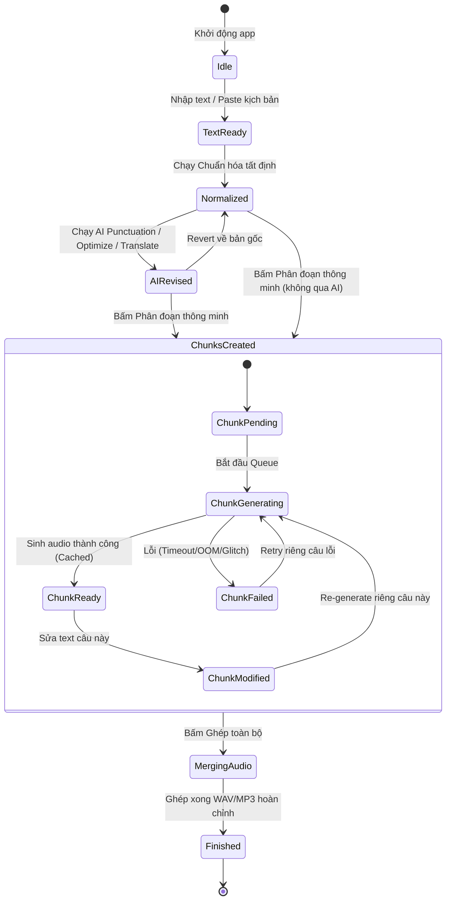

# VoxLab — Product & Technical Specification (SPEC.md)

**Document Version**: 2.0.0 (Rewritten per Updated Workflow)  
**Phase**: Phase 3 — Specification (GATE B)  
**Status**: Pending User Approval  
**Target Platform**: Windows 10/11 64-bit (x64)  
**Core Stack**: Tauri v2 (Rust) + React 19 + TypeScript + Vite  

---

## 1. Goal & Product Vision

VoxLab là ứng dụng desktop Windows cục bộ (local-first) phục vụ việc tạo giọng đọc kịch bản dài (Long-form TTS) với khả năng kiểm soát chất lượng chi tiết từng câu và bóc băng âm thanh/video (ASR) độc lập, hoạt động 100% trên phần cứng máy tính người dùng mà không phụ thuộc vào cloud hay dịch vụ bên ngoài.

### Mục tiêu cốt lõi của phiên bản MVP:
1. **Long-form TTS Studio**: Cung cấp quy trình khép kín: Nhập kịch bản $\rightarrow$ Chuẩn hóa tất định an toàn $\rightarrow$ Tùy chọn AI hỗ trợ (sửa dấu câu, tối ưu, dịch có kiểm soát và đảo ngược được) $\rightarrow$ Phân đoạn thông minh theo profile model $\rightarrow$ Sinh giọng nói có cache từng câu $\rightarrow$ Ghép audio thành phẩm (WAV/MP3).
2. **Standalone Transcription**: Nhập media $\rightarrow$ Bóc băng bằng Whisper-family local engine $\rightarrow$ Xem plain text và timestamped segments $\rightarrow$ Xuất file `.txt` và `.srt` $\rightarrow$ Cầu nối *"Chuyển sang TTS"* để tạo voiceover mới mà không làm thay đổi transcript gốc.
3. **An toàn, Ổn định & Riêng tư**: Strict Local-Only (không cloud fallback, không telemetry); Worker crash không làm sập giao diện; thu hồi tài nguyên (VRAM/RAM) sạch sẽ khi hủy; bảo toàn văn bản gốc (Original Text Safety).

---

## 2. Target User & Use Cases

### 2.1 Đối tượng người dùng
- **Content Creators / Video Makers**: Cần tạo voiceover kịch bản dài, chất lượng cao, cần sửa lại các câu bị đọc vấp mà không phải sinh lại toàn bộ bài.
- **Audiobook Creators / Podcasters**: Cần đọc sách, truyện, tài liệu dài với giọng đọc tự nhiên, có khoảng lặng phù hợp giữa các đoạn và hỗ trợ voice cloning.
- **Researchers / Transcribers**: Cần bóc băng phỏng vấn, bài giảng, video ghi âm nội bộ để trích xuất text/subtitle hoàn toàn bảo mật tại máy.

### 2.2 Các kịch bản sử dụng chính (Use Cases)
- **UC-01 (Tạo Voiceover kịch bản dài)**: Người dùng nhập văn bản dài $\rightarrow$ Bấm Chuẩn hóa text $\rightarrow$ Bấm Chia chunk $\rightarrow$ Chọn Model & Giọng $\rightarrow$ Bấm Sinh toàn bộ $\rightarrow$ Nghe thử phát hiện câu #15 đọc vấp $\rightarrow$ Sửa lại chữ ở câu #15 $\rightarrow$ Bấm Retry riêng câu #15 $\rightarrow$ Bấm Ghép & Xuất file audio tổng.
- **UC-02 (AI Hỗ trợ sửa dấu câu an toàn)**: Người dùng có đoạn text thiếu dấu câu $\rightarrow$ Bấm "AI Punctuation" $\rightarrow$ Hệ thống gửi prompt tới Local LLM $\rightarrow$ Hiện màn hình so sánh Before/After Diff $\rightarrow$ Người dùng xem rõ các dấu câu được thêm/sửa $\rightarrow$ Bấm "Chấp nhận" để cập nhật vào working text.
- **UC-03 (Bóc băng & Lồng tiếng lại - Re-voice)**: Người dùng nạp video bài giảng tiếng Anh $\rightarrow$ Whisper tự động nhận diện ngôn ngữ và bóc băng ra text $\rightarrow$ Bấm "Chuyển sang TTS" $\rightarrow$ Văn bản được nạp sang TTS Studio làm kịch bản mới $\rightarrow$ (Tùy chọn dịch sang tiếng Việt) $\rightarrow$ Tạo giọng đọc tiếng Việt mới.

---

## 3. High-Level Architecture & Boundaries

```
┌─────────────────────────────────────────────────────────────────────────────────┐
│                               REACT FRONTEND                                    │
│  - Presentation, UI State, Web Audio API Playback & Waveform Data In-Memory    │
│  - Zero shell calls, Zero direct model runtime calls, Zero raw FS operations   │
└──────────────────────────────────────┬──────────────────────────────────────────┘
                                       │ Tauri IPC (Typed Commands & Events)
┌──────────────────────────────────────▼──────────────────────────────────────────┐
│                           TAURI / RUST BACKEND LAYER                            │
│  - Process Supervisor & Worker Lifecycle Management (Start / Kill / Health)    │
│  - Hardware Detection (NVIDIA NVML / CUDA / VRAM / CPU cores / RAM)            │
│  - Job Queue Orchestrator (Safe-by-default, Concurrency = 1 in MVP)            │
│  - Local File I/O (Safe path resolution, Staging, Audio stitching via FFmpeg)  │
│  - SQLite Database Manager (Settings, Recent History, Session metadata)        │
└───────────────────┬─────────────────────────────────────────┬───────────────────┘
                    │ Versioned IPC / JSON-RPC                │ HTTP Local Client
┌───────────────────▼─────────────────────┐ ┌─────────────────▼───────────────────┐
│       ISOLATED MODEL WORKERS            │ │        LOCAL LLM ENDPOINT           │
│  - Python Subprocess (Isolated runtime) │ │  - LM Studio / Local OpenAI API      │
│  - TTS Engine Adapter (Candidate set)   │ │  - Configurable URL (e.g. 127.0.0.1) │
│  - Whisper Engine Adapter (faster-wh.)  │ │  - Punctuation, Polish, Translation  │
│  - Capability & Version Handshake       │ │                                     │
└─────────────────────────────────────────┘ └─────────────────────────────────────┘
```

### Ranh giới kiến trúc:
- **Frontend (React)**: Giữ vai trò giao diện và trải nghiệm người dùng in-memory (audio preview, waveform data, UI state, drag-drop). Tuyệt đối không gọi shell, không trực tiếp lái tiến trình Python/C++, không truy cập trực tiếp file system.
- **Backend (Tauri / Rust)**: Giữ toàn quyền điều phối tiến trình (process supervision), kiểm tra phần cứng, quản lý hàng đợi, truy xuất hệ thống file an toàn (đã sanitize), và làm cầu nối IPC.
- **Model Workers**: Chạy tách biệt trong các tiến trình con do Rust quản lý; worker crash không làm sập giao diện chính; giao tiếp qua documented & versioned interface.

---

## 4. Screens, UI Architecture & Functional States

*(Lưu ý: Mục này quy định cấu trúc thông tin, các màn hình, phân vùng chức năng và trạng thái tương tác. Visual styling chi tiết như màu sắc, font chữ, độ bo góc, tokens sẽ do Phase 6 UI/UX Gate với Stitch đảm nhiệm).*

### 4.1 Bố cục tổng thể (Navigation $\rightarrow$ Workspace $\rightarrow$ Inspector + Job Bar)
Giao diện ứng dụng được tổ chức thành 4 phân vùng chức năng:
1. **Top Utility Bar**: Thanh tiện ích trên cùng chứa Logo/Branding, Tên phiên hiện tại, Badge trạng thái bản quyền (`Licensed` / `Trial`), Nút chuyển ngôn ngữ giao diện (`VN` / `EN`), Nút chuyển chủ đề (`Sáng` / `Tối`), Nút mở Cài đặt, và các nút điều khiển cửa sổ.
2. **Left Navigation Sidebar**: Điều hướng chuyển đổi giữa các không gian làm việc:
   - `Text to Speech` (Không gian TTS chính)
   - `Transcription` (Không gian bóc băng)
   - `History` (Lịch sử các phiên xử lý)
   - `Settings` (Cài đặt hệ thống)
   - *Hỗ trợ thu gọn (collapsible) để tối ưu không gian làm việc khi cần tập trung.*
3. **Center Main Workspace (Adaptive Workspace)**: Vùng làm việc trung tâm tự động thích ứng theo tác vụ và giai đoạn làm việc (chi tiết tại mục 4.2).
4. **Right Contextual Inspector**: Cột cấu hình tham số nhanh bên phải, tự động đổi nội dung theo đối tượng đang được chọn ở Workspace (chi tiết tại mục 4.3).
5. **Bottom Job Bar**: Thanh tiến độ và điều khiển tác vụ cố định dưới đáy màn hình (chi tiết tại mục 4.4).

### 4.2 Chi tiết các trạng thái của Center Main Workspace

#### Trạng thái A1: TTS — Chuẩn bị Text (Text Preparation View)
- Dành cho khâu nạp văn bản và tinh chỉnh nội dung trước khi phân đoạn.
- **Phân vùng hiển thị**:
  - `Original Text Area`: Lưu trữ văn bản gốc đưa vào ban đầu (luôn được bảo toàn, làm mốc đối chiếu).
  - `Working Text Area`: Văn bản làm việc đang được xử lý để chuẩn bị đưa vào TTS.
- **Các hành động chức năng (Actions)**:
  - `[Chuẩn hóa Text]` (Kích hoạt xử lý tất định).
  - `[AI Sửa dấu câu]` (Mở modal so sánh Diff Before/After; có guardrail từ vựng).
  - `[AI Tối ưu cho TTS]` (Mở modal so sánh Diff Before/After).
  - `[AI Dịch văn bản]` (Dịch sang ngôn ngữ đích; giữ nguồn riêng; mở modal Diff).
  - `[Khôi phục về bản gốc (Revert)]` (Hủy bỏ mọi thay đổi của AI, lấy lại 100% bản gốc).
  - `[Phân đoạn thông minh (Smart Chunking)]` (Chuyển sang Trạng thái A2).

#### Trạng thái A2: TTS — Chunk Studio View
- Dành cho khâu theo dõi sinh âm thanh từng câu và kiểm soát chất lượng.
- **Thanh tổng quan**: Hiển thị tổng số chunk, tổng ký tự, ước tính thời lượng, nút `[Sinh toàn bộ]`, nút `[Ghép & Xuất audio]`.
- **Danh sách thẻ Chunk (Chunk Cards/Rows)**: Mỗi chunk hiển thị:
  - Chỉ số thứ tự (`#001`, `#002`), số lượng ký tự.
  - Trạng thái trực quan: `Pending`, `Generating`, `Ready`, `Failed`, `Modified`.
  - Khung nội dung text (cho phép chỉnh sửa trực tiếp nội dung câu).
  - Nút `[Nghe thử (Preview)]` (chỉ kích hoạt khi đã có audio cache).
  - Nút `[Tạo lại (Regenerate)]` riêng cho câu này.
  - Thông số áp dụng: Giọng đọc đang dùng, Khoảng lặng sau câu (Pause duration).

#### Trạng thái B: Standalone Transcription Workspace
- Dành cho khâu bóc băng âm thanh/video.
- **Dropzone nạp media**: Hỗ trợ kéo thả file audio/video, hiển thị thông tin metadata (tên file, định dạng, thời lượng).
- **Vùng kết quả bóc băng**: Hỗ trợ chuyển đổi linh hoạt giữa 2 chế độ:
  - `Plain Text View`: Văn bản thuần liên tục, dễ copy/đọc.
  - `Segments View`: Danh sách các phân đoạn kèm mốc thời gian (`Start` $\rightarrow$ `End`).
- **Thanh xuất & Chuyển tiếp**:
  - `[Xuất file .TXT]`
  - `[Xuất file .SRT]`
  - `[Chuyển sang TTS ➔]`: Đẩy plain transcript text sang tab TTS làm working document mới, giữ nguyên transcript gốc ở tab này.

### 4.3 Chi tiết Right Contextual Inspector
- **Khi ở TTS (Global Context — không chọn riêng chunk nào)**:
  - Chọn TTS Model (chỉ hiển thị các model tương thích phần cứng).
  - Chọn Giọng đọc (Preset Voices hoặc nạp file Reference Audio để Clone).
  - Chọn Ngôn ngữ (Language).
  - Slider điều chỉnh Tốc độ đọc (Speed: 0.5x – 2.0x).
  - Sắc thái biểu cảm (Expression/Emotion: Neutral, Happy, Sad... Tự động disabled nếu model không hỗ trợ).
  - Khoảng lặng mặc định giữa các chunk (Pause after: ms).
- **Khi ở TTS (Chunk Selection Context — người dùng bấm chọn Chunk #17)**:
  - Header: `Cấu hình Chunk #017`.
  - Giọng đọc: Dropdown kế thừa mặc định `[Kế thừa Global]` hoặc chọn giọng riêng cho câu này.
  - Sắc thái: Dropdown kế thừa mặc định hoặc chọn sắc thái riêng cho câu này.
  - Khoảng lặng trước/sau câu #17.
  - Nút `[Khôi phục về mặc định Global]`.
- **Khi ở Transcription Context**:
  - Chọn kích thước Whisper Model (`tiny`, `base`, `small`, `medium`, `large-v3`).
  - Chọn Ngôn ngữ nguồn hoặc `[Tự động nhận diện (Auto Detect)]`.
  - Chọn Thiết bị chạy (`CUDA` hoặc `CPU`).

### 4.4 Bottom Job Bar
- Cố định ở chân cửa sổ:
  - Thông tin tác vụ: Model đang chạy, tiến độ chunk hoàn thành (ví dụ `Chunk 23/84 - 27%`).
  - Thanh tiến độ trực quan (Progress bar).
  - Nút `[Tạm dừng (Pause)]`, `[Hủy bỏ (Cancel)]`.
  - Nút `[Mở thư mục thành phẩm (Open Output)]`.
  - Thông báo hoàn tất kèm tổng thời gian sinh.

---

## 5. User Workflow & State Model



---

## 6. Detailed Functional Specifications

### 6.1 Deterministic Text Normalization
- **Phạm vi xử lý tất định**:
  1. Unicode Normalization Form C (NFC) chuẩn cho tiếng Việt và tiếng Anh.
  2. Xóa các khoảng trắng thừa liên tiếp, chuẩn hóa dấu cách đầu/cuối dòng.
  3. Chuẩn hóa khoảng cách quanh dấu câu: Không có dấu cách trước dấu câu (`,`, `.`, `!`, `?`, `;`, `:`), bắt buộc có 1 dấu cách sau dấu câu (ngoại trừ ký tự số thập phân như `3.14`).
  4. Chuẩn hóa ngoặc kép chuẩn `""`, dấu gạch ngang chuẩn `-`.
  5. Chuẩn hóa xuống dòng liên tục (tối đa 2 dấu ngắt dòng liên tiếp).
- **Ranh giới an toàn**: Tuyệt đối không tự ý thêm dấu chấm/phẩy mới vào giữa câu, không tự thay đổi từ ngữ.

### 6.2 AI Text Assistance & Guardrails
- **Cơ chế kết nối**: Gửi yêu cầu HTTP POST tới OpenAI-compatible local endpoint (LM Studio) qua endpoint `/chat/completions` do Rust layer gọi trung gian, frontend không gọi trực tiếp.
- **AI Punctuation Contract**:
  - Prompt chỉ thị rõ: *"Chỉ thêm/sửa dấu câu và ngắt dòng cho câu văn tự nhiên, TUYỆT ĐỐI không thay đổi, không thêm và không xóa bất kỳ từ ngữ nào"*.
  - **Lexical Guardrail Validation**: Sau khi LLM trả về, hệ thống thực hiện phép kiểm tra từ vựng (so sánh danh sách token từ đã bỏ dấu câu giữa bản gốc và bản AI sửa). Nếu phát hiện AI bịa thêm từ hoặc xóa từ $\rightarrow$ Gắn cờ cảnh báo `[Phát hiện thay đổi từ ngữ]`, hiển thị highlight trên Diff view và không cho phép tự động áp dụng.
- **Before / After Diff View**:
  - Hiển thị so sánh rõ ràng giữa bản gốc và bản sửa.
  - Có nút `[Chấp nhận (Accept)]` để áp dụng vào Working Text, hoặc `[Từ chối (Reject)]` để hủy bỏ.
- **Bảo toàn nguồn (Original Text Safety)**: Bản text gốc luôn được lưu nguyên vẹn trong state, người dùng bấm `[Revert]` bất kỳ lúc nào cũng lấy lại được 100% văn bản ban đầu.

### 6.3 Smart Chunking (Phân đoạn thông minh)
- Thuật toán phân đoạn câu dựa trên:
  1. Dấu câu kết thúc (`.`, `!`, `?`, `\n`).
  2. Dấu ngắt phụ khi câu quá dài (`,`, `;`, `:`, `—`).
  3. Ngưỡng độ dài ký tự tối đa được quy định theo **Model Profile** (kích thước chunk cụ thể là `TUNING REQUIRED` theo từng model).

### 6.4 Audio Caching, Recovery & Final Stitching
- **Chunk Caching**: Mỗi chunk khi sinh xong được lưu ngay thành file audio trung gian trong thư mục làm việc tạm của phiên: `%APPDATA%/VoxLab/cache/sessions/<session_id>/chunks/`.
- **Chunk Resilience**: Khi một chunk bị lỗi hoặc người dùng bấm Cancel, các chunk trước đó vẫn tồn tại nguyên vẹn trên đĩa và trong state.
- **Basic Interrupted-Session Recovery**:
  - Là mục tiêu MVP (MVP target) tuân thủ tính khả thi kỹ thuật an toàn.
  - Metadata của phiên (danh sách chunk, hash nội dung text, file audio tương ứng) được ghi vào SQLite local.
  - Khi người dùng tắt app và mở lại, ứng dụng kiểm tra session gần nhất: Nếu các file chunk audio khớp với hash của text $\rightarrow$ Nhận diện trạng thái `Ready` cho các câu đó, cho phép sinh tiếp các câu dở dang hoặc bấm ghép ngay mà không mất công sinh lại.
- **Audio Stitching (Ghép âm thanh)**:
  - Sử dụng FFmpeg cục bộ để ghép nối các file chunk theo đúng thứ tự.
  - Tự động chèn khoảng lặng (silence buffer tính bằng mili-giây, mặc định *TUNING REQUIRED* ~400ms) giữa các câu theo cấu hình.
  - Xuất ra file thành phẩm cuối cùng: `.wav` hoặc `.mp3`.

### 6.5 Standalone Transcription & Bridge sang TTS
- Nạp file media $\rightarrow$ Kiểm tra FFmpeg trích xuất audio $\rightarrow$ Đưa qua Whisper-family local engine.
- Bóc băng hỗ trợ Tiếng Việt & Tiếng Anh với tính năng **Automatic Language Detection (MUST HAVE)**.
- Lưu trữ cấu trúc segment: `[{ id: 1, start: 0.0, end: 4.2, text: "Xin chào..." }, ...]`.
- Xuất file `.txt` (gộp toàn bộ text) và `.srt` (phụ đề chuẩn kèm timestamp).
- **Cầu nối "Chuyển sang TTS"**:
  - Lấy toàn bộ plain text (loại bỏ toàn bộ timestamp và mã định dạng).
  - Khởi tạo một phiên TTS mới ở tab Text to Speech với working text này.
  - Transcript gốc ở tab Transcribe giữ nguyên không đổi.

---

## 7. Error Handling, Cancellation & Resilience

| Tình huống lỗi | Hành vi ứng xử của hệ thống | Khắc phục cho người dùng |
| :--- | :--- | :--- |
| **Model Worker bị Crash (OOM / C++ exception)** | Tiến trình worker bị ngắt; Rust supervisor phát hiện exit code $\neq 0$; **UI window hoàn toàn không bị ảnh hưởng/không crash**. | Chunk đang chạy chuyển trạng thái `Failed`; hiển thị thông báo lỗi rõ ràng; Worker tự khởi động lại ở trạng thái sạch; cho phép bấm `Retry`. |
| **Bấm Cancel giữa lúc sinh bài dài** | Gửi tín hiệu ngắt ngay tới worker; dừng hàng đợi; giải phóng VRAM/RAM; dọn dẹp các tiến trình con. | Toàn bộ các chunk đã sinh xong trước đó được giữ nguyên trạng thái `Ready`; người dùng có thể nghe thử hoặc bấm ghép các câu đã xong. |
| **LM Studio chưa bật khi bấm AI Punctuation** | Rust kiểm tra HTTP connection timeout (sau 3s); bắt lỗi `Connection Refused`. | Hiển thị thông báo thân thiện: *"Không thể kết nối tới Local LLM tại 127.0.0.1. Vui lòng bật LM Studio Server và thử lại"*; không làm gián đoạn TTS. |
| **File âm thanh mẫu clone bị lỗi / quá ngắn** | Kiểm tra file trước khi nạp: định dạng hỗ trợ, độ dài tối thiểu (xác minh trong Feasibility). | Báo lỗi ngay tại Inspector: *"File âm thanh mẫu không hợp lệ hoặc quá ngắn"*; nút sinh bị vô hiệu hóa đến khi chọn file đúng. |
| **Đĩa cứng bị đầy khi đang tải model / sinh audio** | Kiểm tra dung lượng đĩa trống trước khi ghi file. | Báo lỗi `Disk Full`; dọn dẹp file dở dang; không làm hỏng model hoặc session hiện có. |

---

## 8. Persistence, Settings & Data Lifecycle

- **SQLite Database cục bộ**:
  - File database lưu tại `%APPDATA%/VoxLab/voxlab.db`.
  - Bắt buộc có bảng quản lý phiên bản: `schema_version`. Mọi thay đổi cấu trúc dữ liệu phải có migration script an toàn.
  - Lưu bảng `settings`: endpoint Local LLM, thư mục output mặc định, ngôn ngữ UI, theme màu, license key.
  - Lưu bảng `sessions`: metadata kịch bản gần đây, cấu hình model/voice đã dùng.
- **Quy tắc dọn dẹp Cache**:
  - Các file chunk tạm thời được lưu trong `%APPDATA%/VoxLab/cache/`.
  - Trong Settings có nút `[Dọn dẹp bộ nhớ đệm (Clear Cache)]` hiển thị dung lượng đang chiếm dụng, cho phép xóa nhanh các file tạm cũ.
- **Tính di động của đường dẫn (Path Portability)**:
  - Dữ liệu lưu trong SQLite sử dụng đường dẫn tương đối trong AppData hoặc định danh session; không gắn chết đường dẫn tuyệt đối của máy phát triển.

---

## 9. Security, Privacy & Platform Compliance

- **Strict Local-First**: 100% các thao tác sinh giọng, bóc băng, chuẩn hóa văn bản diễn ra cục bộ trên máy tính.
- **Zero Outbound Telemetry**: Không gửi bất kỳ dữ liệu telemetry, thống kê sử dụng hay nội dung văn bản nào ra internet.
- **IPC Sanitization**: Mọi tham số truyền qua Tauri IPC (tên file, đường dẫn, text) đều được kiểm tra độ dài và chuẩn hóa đường dẫn (Path Traversal Protection) ở tầng Rust trước khi xử lý file.
- **Shell Injection Prevention**: Không truyền text người dùng trực tiếp vào chuỗi lệnh shell; mọi tương tác với FFmpeg hoặc subprocess đều sử dụng mảng tham số rời rạc (`std::process::Command::args`).

---

## 10. TUNING REQUIRED (Các tham số chưa chốt bằng lý thuyết)

Bắt buộc phải qua benchmark thực tế sau bước Model Feasibility mới được cố định giá trị:

| Tham số | Giá trị thử nghiệm ban đầu (Dev Baseline) | Tiêu chí benchmark để chốt |
| :--- | :--- | :--- |
| **Text Chunk Size (Độ dài phân đoạn)** | ~150 – 300 ký tự (tùy model profile) | Đo độ tự nhiên của giọng, tỷ lệ đọc vấp và thời gian sinh của từng model |
| **Model Unload Idle Timeout** | ~120 giây sau khi hàng đợi rảnh | Cân đối giữa thời gian giữ VRAM và độ trễ khi người dùng bấm sinh tiếp |
| **Silence / Pause Duration giữa các câu** | ~400 mili-giây | Đánh giá độ tự nhiên của file audio ghép hoàn chỉnh |
| **Queue Concurrency (Số luồng sinh song song)** | 1 (Safe Sequential) | Thử nghiệm trên phần cứng máy mạnh xem có thể tăng lên 2 mà không nghẽn VRAM không |
| **Inference Parameters (Nhiệt độ, Top_p)** | Giá trị mặc định của từng model candidate | Đo chất lượng phát âm tiếng Việt và tiếng Anh |

---

## 11. Acceptance Criteria (Tiêu chí nghiệm thu có thể kiểm chứng)

### AC-01: Giao diện & Điều hướng
- [ ] Giao diện khởi động hiển thị đúng bố cục 4 phân vùng (Top Bar, Left Sidebar, Center Workspace, Right Inspector) kèm Bottom Job Bar.
- [ ] Bấm chuyển đổi giữa `Text to speech`, `Transcribe`, `History`, `Settings` mượt mà, không giật lag.
- [ ] Chuyển đổi ngôn ngữ giao diện `VN / EN` và chế độ `Sáng / Tối` hoạt động tức thì.

### AC-02: Chuẩn hóa & AI Text
- [ ] Dán văn bản tiếng Việt lộn xộn Unicode/khoảng trắng $\rightarrow$ Bấm Chuẩn hóa $\rightarrow$ Văn bản trở về NFC chuẩn, khoảng cách dấu câu chuẩn xác 100%.
- [ ] Chạy AI Punctuation $\rightarrow$ Hiển thị modal Diff Before/After; nếu LLM thay đổi từ ngữ thì guardrail báo cảnh báo; bấm Revert khôi phục 100% bản gốc.
- [ ] Bấm nút "Generate Audio" mà chưa bật AI $\rightarrow$ Hệ thống sử dụng trực tiếp text hiện tại, không âm thầm gọi LLM.

### AC-03: Long-form TTS & Chunk Studio
- [ ] Kịch bản dài (>1000 từ) được chia thành danh sách chunk hợp lý theo ranh giới câu.
- [ ] Bấm sinh audio $\rightarrow$ Bottom Job Bar cập nhật tiến độ theo từng chunk hoàn thành; các chunk sinh xong có nút nghe thử ngay.
- [ ] Giả lập lỗi ở 1 chunk (hoặc bấm Cancel) $\rightarrow$ Các chunk trước đó không bị mất; sửa text câu lỗi và bấm Retry riêng câu đó thành công.
- [ ] Bấm "Ghép audio" $\rightarrow$ Xuất ra file `.wav` hoặc `.mp3` hoàn chỉnh, nghe mượt mà có khoảng lặng giữa các câu.

### AC-04: Standalone Transcription
- [ ] Kéo thả file audio/video $\rightarrow$ Whisper bóc băng hiển thị cả Plain Text và Timestamped Segments.
- [ ] Xuất file `.txt` và `.srt` đúng định dạng chuẩn.
- [ ] Bấm "Chuyển sang TTS" $\rightarrow$ Nạp toàn bộ plain text sang tab TTS làm văn bản mới, transcript gốc không bị sửa đổi.

### AC-05: An toàn & Ổn định hệ thống
- [ ] Tắt tiến trình worker bằng Task Manager trong khi đang sinh audio $\rightarrow$ Ứng dụng VoxLab không bị crash; UI hiển thị lỗi và đưa về trạng thái sẵn sàng thử lại.
- [ ] Bấm Cancel $\rightarrow$ RAM và VRAM được giải phóng ngay lập tức.

---

### KẾT LUẬN & DỪNG GATE B

Tài liệu `SPEC.md` v2.0 đã hoàn thành chi tiết, kiểm chứng được và tuân thủ chặt chẽ nguyên tắc: đặc tả rõ ràng phân vùng/chức năng/trạng thái nhưng **không tự khóa trước visual style chi tiết (để Phase 6 Stitch UI/UX Gate thực hiện)**.

**STOPPING AT GATE B — PENDING USER APPROVAL.**  
*(Xin mời bạn xem xét và phê duyệt bản Đặc tả SPEC.md mới này trước khi chuyển sang bước tiếp theo).*
