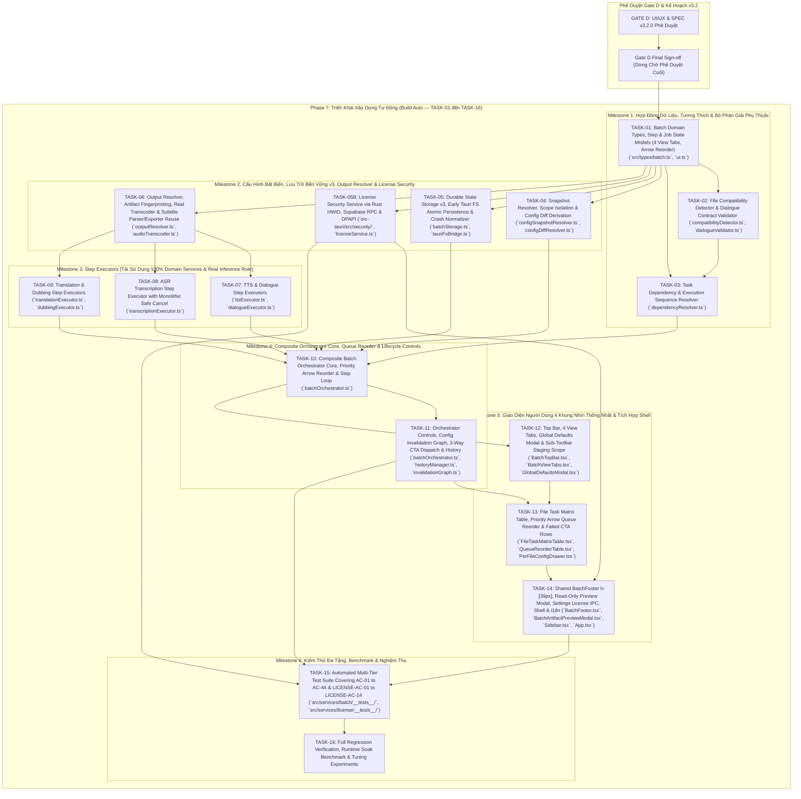

# Kế Hoạch Triển Khai: Tab "Hàng Loạt" (File-Centric Batch Processing Workspace)

**Tính năng**: Tab Điều Phối Xử Lý Hàng Loạt Hướng Tệp Tin (File-Centric Multi-Task Batch Orchestrator)
**Phiên bản Kế hoạch**: 3.2.0 (Gate D Final Sign-off — 4 Unified Views, Shared BatchFooter, License Security Architecture & Pre-Build Lock)
**CURRENT PHASE**: Phase 7 — Build Auto
**CURRENT GATE**: Gate D Final Approved
**NEXT PHASE**: Phase 8 — Test & Verification
**BUILD AUTO**: IN PROGRESS (Milestone 1 — TASK-01)
**Tài liệu đặc tả nguồn**: [`SPEC-batch.md`](file:///f:/Source%20Code%20Tool/Voxlab/SPEC-batch.md) (v3.2.0 Approved Gate D) · [`SPEC-settings.md`](file:///f:/Source%20Code%20Tool/Voxlab/SPEC-settings.md) (v1.2.0 Approved Gate D) · [`CONSTRAINTS.md`](file:///f:/Source%20Code%20Tool/Voxlab/CONSTRAINTS.md) · [`SPEC.md`](file:///f:/Source%20Code%20Tool/Voxlab/SPEC.md) · [`AGENT_WORKFLOW.txt`](file:///f:/Source%20Code%20Tool/Voxlab/AGENT_WORKFLOW.txt)
**Nền tảng mục tiêu**: Windows 10/11 64-bit (x64) · Tauri v2 + React 19 + TypeScript + Vite

---

## 1. Sơ Đồ Quy Trình Phát Triển & Phụ Thuộc Kiến Trúc

### 1.1 Trình Tự Vòng Đời Quy Trình (Strict Workflow Lifecycle)
Tuân thủ nghiêm ngặt quy trình chuẩn tại [`AGENT_WORKFLOW.txt`](file:///f:/Source%20Code%20Tool/Voxlab/AGENT_WORKFLOW.txt):
1. **Phase 4 & 5: Kế Hoạch Triển Khai & Rà Soát (/plan)**: Lập kế hoạch chi tiết theo mô hình File-Centric, rà soát tính khả thi mã nguồn thực tế $\rightarrow$ **GATE C APPROVED**.
2. **Phase 6: Thiết Kế UI/UX & Mẫu Thử Nghiệm (Stitch MCP)**: Khám phá giao diện 4 Khung Nhìn Thống Nhất, Row Scope Selection, Priority Arrow Reorder, 3-Way Dynamic CTA, Derived Diff Logic, Read-Only Preview $\rightarrow$ **GATE D FINAL SIGN-OFF (SPEC v3.2.0 & SPEC-settings v1.2.0 Synced)**.
3. **Phase 7: Triển Khai Xây Dựng Tự Động (Build Auto — TASK-01 đến TASK-16)**: **LOCKED — BẮT ĐẦU SAU KHI PRODUCT OWNER PHÊ DUYỆT GATE D FINAL**. Triển khai theo trình tự 6 Milestone, kiểm thử tự động từng bước và xác thực liên tục.
4. **Phase 8: Kiểm Thử & Kiểm Chứng 4 Tầng**: Thực thi kiểm thử tự động, tích hợp, native và hồi quy toàn hệ thống.
5. **Phase 9–13: Code Review, Security Review, Performance Tuning, Code Simplification, Final Review**.
6. **Phase 14: Phát Hành (Ship / Release)** $\rightarrow$ **GATE F (Release Approval)**.

### 1.2 Sơ Đồ Phụ Thuộc Kiến Trúc File-Centric v3.2.0 & License Security (Architecture Dependency Graph)

---

## 2. Các Quyết Định Kiến Trúc Trọng Tâm v3.2.0 (Major Architecture Decisions)

### 2.1 Kiến Trúc 4 Khung Nhìn Thống Nhất (4 Unified Workspace Views)
- Một tập dữ liệu nguồn duy nhất `BatchJob[]` quản lý toàn bộ vòng đời tệp tin, được phân bổ hiển thị qua 4 tab lọc:
  1. **Danh sách (`list`)**: Chuẩn bị tệp, nạp file/thư mục, chọn phạm vi dòng, cấu hình hàng loạt qua sub-toolbar, bật/tắt ma trận tác vụ (`selectedTasks`), cấu hình nâng cao từng tệp. Nút chính: `[Chuyển sang hàng đợi]`.
  2. **Hàng đợi (`queued`)**: Quản lý thứ tự thực thi của các tệp đã sẵn sàng (`stage: "queued"`). Tệp đang xử lý (`processing`) luôn được ghim cố định ở đầu hàng kèm tiến trình thời gian thực (% tiến độ trực tiếp trên từng nút tác vụ và thanh % trạng thái, các nút Tạm dừng/Tiếp tục, Hủy). Các tệp đang chờ (`waiting`) xếp bên dưới theo thứ tự nguyên dương (`2`, `3`...) và điều chỉnh ưu tiên bằng nút `↑` / `↓`. Nút chính: `[Bắt đầu xử lý]`.
  3. **Hoàn tất (`completed`)**: Lưu trữ các tệp đã hoàn thành thành công, nút `[Mở thư mục xuất]` và nút `[Nghe / Xem preview]` (Read-Only Preview).
  4. **Lỗi (`failed`)**: Quản lý các tệp gặp lỗi kỹ thuật hoặc bị hủy, hiển thị 3-Way Dynamic CTA (`[Thử lại]`, `[⚡ Tạo lại]`, `[⚡ Xuất lại]`) tự động chuyển đổi theo trạng thái cấu hình.

### 2.2 Phân Tách Checkbox Chọn Phạm Vi Dòng vs Checkbox Chọn Tác Vụ & Áp Dụng Cấu Hình Có Phạm Vi (Selection-Scoped Apply)
- **Nguyên tắc Setting $\ne$ Execution**:
  - Checkbox đầu dòng (`isSelected`): Quyết định phạm vi áp dụng thao tác hàng loạt (Chuyển sang hàng đợi, Áp dụng cấu hình chung, Xóa tệp).
  - Checkbox cột tác vụ (`selectedTasks`): Quyết định các bước pipeline thực sự chạy trên file. Thao tác áp dụng cấu hình **tuyệt đối không tự ý bật/tắt tác vụ** ngoài ý muốn người dùng.
- **Quy tắc Áp dụng Cấu hình (Apply Config Scope)**:
  - 0 tệp được chọn: Nút `[Áp dụng]` bị vô hiệu hóa (disabled), hiển thị tooltip/helper: *"Chọn ít nhất 1 tệp để áp dụng cấu hình."* (Tuyệt đối cấm fallback ngầm 0 selected $\implies$ Apply to All).
  - $1+$ tệp được chọn: Nút hiển thị `[Áp dụng cho X tệp đã chọn]`.
  - Checkbox tiêu đề (Select All) có 3 trạng thái (`none`, `partial`, `all`) và tuân theo view/filter hiện thời.

### 2.3 Chuyển Đổi Hàng Đợi Hai Giai Đoạn & Điều Chỉnh Thứ Tự Ưu Tiên Bằng Mũi Tên (Staged Queue & Priority Arrow Reorder)
- **Chuyển sang hàng đợi (List to Queue Staging)**:
  - Nút `[Chuyển sang hàng đợi]` tại tab Danh sách: Thẩm định tính tương thích, resolve dependency chuỗi thực thi, chuyển tệp từ `stage: "staging"` sang `stage: "queued"` với trạng thái `waiting`.
  - **Không đóng băng snapshot tại bước này**: Các job trong tab Hàng đợi vẫn có thể được chọn, nhận Cấu hình chung, hoặc chỉnh sửa per-file override.
- **Điều chỉnh thứ tự ưu tiên bằng mũi tên (`ArrowUp` / `ArrowDown`)**:
  - Tệp đang chạy (`processing`): Luôn bị khóa cố định (pinned) ở đầu hàng đợi, không có nút di chuyển.
  - Các tệp đang chờ (`waiting`): Hiển thị số thứ tự nguyên dương (`2`, `3`...) và hai nút mũi tên (`↑` / `↓`) cho phép tăng/giảm vị trí ưu tiên, **kể cả khi hàng đợi đang chạy (`running`)**.
  - Thứ tự mới của waiting jobs quyết định chính xác tệp nào được bốc lên xử lý tiếp theo sau khi active job hiện tại hoàn tất.
  - Loại bỏ hoàn toàn thao tác kéo thả và biểu tượng chấm grip rườm rà.

### 2.4 Thời Điểm Đóng Băng Snapshot Bất Biến (Snapshot Freeze Timing)
- **Chỉ đóng băng ngay trước khi bắt đầu thực thi**:
  - Ngay trước khi job chuyển từ `waiting` $\rightarrow$ `processing`:
    $$\text{Global/Applied Config} \oplus \text{Per-File Overrides} \implies \text{effectiveConfigSnapshot}$$
  - Đóng băng bất biến snapshot này cho lượt thực thi (execution attempt).
  - Một khi đã chuyển sang `processing`: Snapshot hoàn toàn bất biến (immutable), không bao giờ bị thay đổi ngầm bởi việc sửa Global Defaults.

### 2.5 Trạng Thái Phái Sinh So Khớp Cấu Hình, Đồ Thị Vô Hiệu Hóa & 3-Way Dynamic CTA
- **Cơ chế Phái sinh (Derived State)**:
  - `configChanged` là kết quả so sánh sâu (`computeJobConfigDiff` / `deepEqual`) giữa cấu hình hiệu lực hiện tại (`jobWorkingConfig`) với `effectiveConfigSnapshot` đã freeze, loại trừ hoàn toàn các trường UI-only.
  - Tuyệt đối không lưu `configChanged` như cờ thủ công trong store.
  - Nếu người dùng bấm "Khôi phục mặc định" nhưng Global Defaults hiện tại khác snapshot cũ $\implies$ `configChanged` vẫn là `true` $\implies$ CTA là `[⚡ Tạo lại]`.
  - Chỉ khi cấu hình hiệu lực khớp chính xác với snapshot cũ $\implies$ `configChanged = false` $\implies$ CTA tự động hoàn nguyên về `[Thử lại]`.
- **Hành vi 3-Way Dynamic CTA tại Tab Lỗi**:
  1. **`[Thử lại]` (Retry)**: Khi cấu hình không đổi (`configChanged === false`). Tái sử dụng snapshot cũ, tiếp tục từ bước bị lỗi gần nhất (`retryFromStep`), bỏ qua các bước đã có artifact hợp lệ.
  2. **`[⚡ Tạo lại]` (Regenerate)**: Khi cấu hình AI thay đổi (Whisper model, voice, speed, provider...). Sử dụng Config Invalidation Graph để xác định bước bắt đầu lại (`invalidatedFromStep`), giữ nguyên committed artifact cũ trên đĩa, chạy lại từ bước bị vô hiệu hóa với snapshot mới.
  3. **`[⚡ Xuất lại]` (Re-export)**: Khi CHỈ thay đổi thông số xuất tệp (`outputPath`, `saveInSourceFolder`, `collisionPolicy`, `outputAudioFormat`, `subtitleFormat`). Tái sử dụng toàn bộ artifact trung gian hợp lệ, tuyệt đối không gọi lại mô hình AI (0 Whisper, 0 Translation LLM, 0 TTS), tiến hành sao chép/xuất trực tiếp sang đích mới.

### 2.6 Chuyển Đổi Định Dạng Âm Thanh Thực Sự & Tái Sử Dụng Subtitle Parser/Exporter
- Khi thực thi **Xuất lại (`Re-export`)** với định dạng đầu ra thay đổi:
  - **Định dạng âm thanh** (WAV $\leftrightarrow$ MP3): Phải thực hiện chuyển mã âm thanh thực sự (real audio transcoding via Web Audio / FFmpeg / Rust helper), **tuyệt đối không đơn thuần đổi phần mở rộng tệp `.wav` $\rightarrow$ `.mp3`**.
  - **Định dạng phụ đề** (SRT $\leftrightarrow$ VTT): **Tái sử dụng trực tiếp 100% module hiện có** `src/services/subtitle/parser.ts` (`parseSubtitle`) và `src/services/subtitle/exporter.ts` (`exportToSRT`, `exportToVTT`) để bóc tách cues và xuất định dạng mới chuẩn xác; **tuyệt đối không tạo mới module `subtitleConverter.ts` gây phân mảnh và dư thừa mã nguồn**.

### 2.7 Bảo Vệ An Toàn Đầu Ra & Bảo Toàn Committed Artifact
- **Quy tắc Thứ Tự Ưu Tiên**:
  $$\text{External Modification Protection} > \text{Global Collision Policy}$$
- **Bảo Vệ Chỉnh Sửa Thủ Công**:
  - Lưu vết dấu vân tay tệp `artifactFingerprints` (size + mtime).
  - Nếu tệp đích trên đĩa bị thay đổi ngoài ứng dụng, hệ thống **tuyệt đối không ghi đè** (kể cả khi `collisionPolicy = "overwrite"`), tự động fallback an toàn sang `auto_rename` (`_001.ext`).
- **Bỏ Qua Từng Artifact Trong Dubbing (Per-Artifact Skip)**:
  - Khi `collisionPolicy = "skip"`, nếu `.srt` đã tồn tại nhưng `.wav` chưa có: bỏ qua xuất `.srt`, tiếp tục tổng hợp và xuất Master `.wav`.
- **Bảo Toàn Committed Artifact Khi File Nguồn Đột Biến (Input Mutation)**:
  - Khi phát hiện tệp nguồn bị sửa ngoài app: cập nhật metadata, hiển thị cảnh báo `⚠️ Đã sửa ngoài app`.
  - Vô hiệu hóa tái sử dụng cache/artifact phụ thuộc (**CHỈ VỀ MẶT REUSE**) $\rightarrow$ pipeline chạy lại từ Step 1.
  - Hệ thống **tuyệt đối không tự động xóa hoặc rollback** các artifact đã commit ở lượt chạy trước; artifact cũ trên đĩa được giữ nguyên và đánh dấu `stale` trong bản ghi. File output mới sinh ra được phân giải qua Output Resolver.

### 2.8 Bất Biến Chỉ Đọc Của Tính Năng Xem Trước (Preview Read-Only Invariant)
- Nút `[Nghe / Xem preview]` trong tab Hoàn tất và Drawer mở Audio Player & Subtitle Viewer:
  - Chỉ đọc trực tiếp các committed artifact đã ghi nhận trên đĩa (`outputArtifactPaths`, `subtitles`).
  - **Tuyệt đối không kích hoạt tiến trình sinh (generate) ngầm**.
  - **0 cuộc gọi AI API**.
  - **Không làm thay đổi bất kỳ trạng thái nào của job** (`status`, `progressPct`, `stepResults`).

### 2.9 Ngữ Nghĩa Hủy An Toàn Khối Suy Luận Nguyên Khối (Monolithic ASR Safe Cancel)
- Do faster-whisper inference là nguyên khối và không hỗ trợ ngắt an toàn giữa chừng:
  - Khi bấm Hủy một job đang bóc băng: `job.status` vẫn giữ `"processing"`, kích hoạt cờ runtime `job.isCancelling = true` và `cancelRequested = true`.
  - UI hiển thị nhãn `"Đang hủy..."` với icon xoay và khóa nút tương tác.
  - Hàng đợi **chặn tuyệt đối không dispatch job tiếp theo** cho đến khi worker ASR hiện tại return hoặc thoát an toàn thực tế.
  - Sau khi worker thoát: dọn dẹp staging `.tmp` $\rightarrow$ chuyển `stepResults["transcription"].status = "cancelled"` $\rightarrow$ `job.status = "cancelled"`, reset `job.isCancelling = false`.
  - **Zero Overlap Invariant**: Không bao giờ có worker ASR cũ chạy ngầm đồng thời với job AI kế tiếp.

### 2.10 Ngữ Nghĩa Concurrency Cấp BatchJob & Internal Concurrency
- **BatchJob Concurrency = 1 (Baseline Invariant)**:
  - Tại một thời điểm chỉ có duy nhất 1 BatchJob active được xử lý.
- **Internal Concurrency = TUNING REQUIRED (Không hardcode trước benchmark)**:
  - Chunk concurrency, cue concurrency, workers, model scheduling không được hardcode mà phải đo đạc thực nghiệm trong Milestone 6 (TASK-16) trước khi chọn production defaults.

### 2.11 Cầu Nối Lưu Trữ Bền Vững Tauri v2 (Tauri Storage Bridge)
- Dùng Rust standard library **`std::fs`** kết hợp Tauri IPC command gốc (`#[tauri::command]`) trong `src-tauri/src/lib.rs`:
  - `save_app_data_file(relative_path: String, content: String)`: Ghi nguyên tử qua tệp `.tmp` rồi đổi tên (`std::fs::rename`).
  - `read_app_data_file(relative_path: String) -> Result<String, String>`.
  - `get_app_data_dir() -> Result<String, String>`.
- Xây dựng module dùng chung: `src/services/storage/tauriFsBridge.ts` (có mock in-memory fallback cho môi trường test/dev).
- **Zero Audio Binary**: Tuyệt đối không serialize AudioBuffer, PCM hay Base64 vào JSON bền vững.

### 2.12 Quy Tắc Hoàn Thành Suy Luận AI Cục Bộ (Local AI Inference Completion Rule)
- **Quy Tắc Bất Biến**: Tác vụ TTS và ASR (Transcription) chỉ được đánh dấu là **COMPLETE** khi và chỉ khi:
  - TTS local runtime thật chạy và tổng hợp âm thanh thực tế;
  - faster-whisper local runtime thật chạy và giải mã âm thanh thực tế;
  - Rust IPC / Python sidecar thật chạy và giao tiếp ổn định;
  - Toàn bộ cơ chế cancel / progress % / error capture thật hoạt động thông suốt.
- **Cấm Tuyệt Đối**:
  - Không được đánh dấu complete nếu chỉ dùng `setInterval`;
  - Không được dùng mock worker giả lập;
  - Không được dùng Web Speech API placeholder;
  - Không được dùng fake progress bar nhảy % theo thời gian.
- **Ranh giới Giao tiếp Chuẩn hóa (StepExecutor Interfaces)**:
  - Tầng Batch Orchestrator chỉ giao tiếp với các Step Executors (`transcriptionExecutor.ts`, `ttsExecutor.ts`, `dialogueExecutor.ts`, `dubbingExecutor.ts`) thông qua hợp đồng dữ liệu chuẩn (`BatchStepResult`, callbacks tiến độ thời gian thực, cờ ngắt an toàn).
  - Tầng Step Executors sử dụng **Adapter Pattern**:
    - Đối với tác vụ Dịch thuật (`TranslationExecutor`): Kết nối trực tiếp với các AI Providers hiện có (`Gemini`, `OpenAI`, `LM Studio`, `Ollama`, `Custom API`) đã hoạt động tốt.
    - Đối với TTS và ASR: Triển khai adapter interface kết nối với runtime inference native qua Rust IPC / Python sidecar.
- **Lộ trình Xây dựng**:
  - *Milestone 1–4*: Xây dựng lõi điều phối, lưu trữ bền vững atomic, snapshot resolver và step execution loop chuẩn hóa.
  - *Milestone 5*: Giao diện người dùng 4 khung nhìn, điều chỉnh thứ tự ưu tiên bằng mũi tên, bảng ma trận tác vụ và drawer cấu hình.
  - *Milestone 6*: Kết nối tích hợp adapter thực tế với runtime inference (hoặc local service), đo đạc soak benchmark và stress test.

### 2.13 Ưu Tiên Xây Dựng Sớm Lưu Trữ Nguyên Tử Tauri FS (High-Risk Early Build Priority)
- Khác với LocalStorage của trình duyệt, việc lưu trữ hàng loạt đòi hỏi độ bền vững cao khi crash (`batch_queue_v3.json`).
- Do đó, các Tauri IPC commands trong Rust (`save_app_data_file`, `read_app_data_file`, `get_app_data_dir`) cùng module cầu nối `src/services/storage/tauriFsBridge.ts` **bắt buộc phải được triển khai và kiểm thử chạy thông suốt ngay từ đầu Milestone 2 (TASK-05)** trước khi xây dựng dịch vụ quản lý hàng đợi `batchStorage.ts`.

### 2.14 Kiến Trúc Bảo Mật Bản Quyền Native (License Security Architecture: HWID, Supabase RPC & Windows DPAPI)
- **Định Danh Thiết Bị Ổn Định (HWID v1: Primary vs Fallback Single Anchor)**:
  - Primary anchor: SMBIOS / Motherboard UUID (`Win32_ComputerSystemProduct.UUID`).
  - Fallback anchor: Windows Registry `HKLM\SOFTWARE\Microsoft\Cryptography\MachineGuid` (chỉ sử dụng khi UUID không khả dụng; tuyệt đối không combine cả hai thành composite HWID bắt buộc).
  - Normalization: In hoa, bỏ gạch nối, khoảng trắng và ngoặc nhọn.
  - Namespaced Hashing: SHA-256 chuỗi `VoxLab-HWID-v1:{normalized_anchor}`, định dạng `v1:{sha256_hex}`.
  - Cấm dùng MAC address, CPU serial, hoặc disk serial làm primary anchor.
- **Xác Thực Trực Tuyến Qua Supabase RPC**:
  - Desktop client chỉ gọi RPC `POST /rest/v1/rpc/activate_or_verify_license(p_license_key, p_hwid, p_app_version)`.
  - Client desktop **tuyệt đối KHÔNG** truy cập trực tiếp bảng DB, không có SQL UPDATE/INSERT, không reset device trực tiếp.
  - Desktop build **tuyệt đối KHÔNG chứa service-role key hoặc admin secret**. Client chỉ sử dụng public `anon_key` với quyền truy cập RPC đã được khóa chặt bởi RLS/Definer.
- **Lưu Trữ Cục Bộ Mã Hóa Bằng Windows DPAPI**:
  - Tuyệt đối không dùng `localStorage` lưu trữ key bản quyền.
  - Triển khai trong Rust backend (`src-tauri/src/security/license_storage.rs`) sử dụng **Windows DPAPI** (`CryptProtectData` / `CryptUnprotectData`).
  - **Quyền lưu trữ của Backend Rust**: Backend Rust được phép lưu trữ raw License Key trong DPAPI-encrypted storage (`license.enc`) phục vụ startup online re-verification qua RPC mà không bắt người dùng nhập lại key.
  - Ghi bền vững nguyên tử: Ghi vào `license.tmp` $\rightarrow$ fsync / flush $\rightarrow$ rename / replace thành `license.enc`.
  - Cấu trúc: `schemaVersion`, `licenseKey`, `licenseKeyMasked`, `licenseType`, `hwidVersion`, `hwid`, `status`, `savedAt`, `lastVerifiedAt`, `expiresAt`, `lastServerStatus`.
  - Raw License Key tuyệt đối KHÔNG bao giờ xuất hiện trong: React state lâu dài, `localStorage`, log console, diagnostics hay crash report.
  - Frontend chỉ nhận `LicenseSummary` (chứa `licenseKeyMasked`).
- **Mã Trạng Thái Miền Nghiệp Vụ Cấu Trúc (Structured Domain Status Enum)**:
  `VALID`, `ACTIVATED`, `EXPIRED`, `DISABLED`, `NOT_FOUND`, `DEVICE_MISMATCH`, `DEVICE_LIMIT`, `NETWORK_ERROR`, `SERVER_ERROR`, `NO_KEY`, `OFFLINE_GRACE`. Tuyệt đối không parse chuỗi text để suy đoán trạng thái.
- **Cơ Chế Ân Hạn Ngoại Tuyến (Offline Grace Policy)**:
  - Chỉ cho phép Offline Grace khi: đã từng verify online thành công, cache DPAPI hợp lệ, HWID máy khớp cache, lỗi hiện tại là lỗi mạng tạm thời (`NETWORK_ERROR` / `SERVER_ERROR`), và còn trong thời hạn ân hạn:
    `OFFLINE_GRACE_DAYS = TUNING REQUIRED` (Baseline phát triển tạm thời: 7 ngày [PROVISIONAL / NOT PRODUCT-FROZEN], cấu hình qua domain constant `DEFAULT_OFFLINE_GRACE_DAYS`, không hard-code trên UI).
  - **Cấm Tuyệt Đối**: Không bao giờ cấp Offline Grace nếu server trả về phản hồi từ chối xác định (`EXPIRED`, `DISABLED`, `DEVICE_MISMATCH`, `DEVICE_LIMIT`, `NOT_FOUND`).
- **Ranh Giới Bảo Mật Rust / Tauri IPC**:
  - Frontend TypeScript chỉ gọi các lệnh IPC: `get_license_summary()`, `activate_license()`, `change_license_key()`, `verify_license()`, `clear_local_license_if_allowed()`.
  - Frontend KHÔNG tự sinh HWID, KHÔNG gọi Windows DPAPI, KHÔNG nắm giữ server secret, KHÔNG tự quyết định Offline Grace. Sau kích hoạt, Frontend giải phóng ngay raw key khỏi React state.

### 2.15 Tiêu Chuẩn Giao Diện Đáy Bảng Batch (Shared BatchFooter Component & BATCH_FOOTER_HEIGHT Token)
- **Token Thiết Kế**: `BATCH_FOOTER_HEIGHT = 39px` (Tailwind token `h-[39px]`).
- **Bất Biến Bố Cục**: Footer Status Bar phải có chiều cao, padding, alignment và cấu trúc bố cục nhất quán trên toàn bộ 4 view (`list`, `queued`, `completed`, `failed`), hiển thị số liệu `Tổng: X tệp` của tab hiện tại.
- **Yêu Cầu Triển Khai Phase 7**:
  - Tạo/reuse một shared component `BatchFooter` (`src/components/batch/BatchFooter.tsx`) dùng chung cho cả 4 tab.
  - Tuyệt đối không duplicate CSS riêng cho từng tab. Mọi điều chỉnh kích thước sau này chỉ thay đổi qua design token/component chung.

---

## 3. Danh Sách Nhiệm Vụ Chi Tiết (Detailed Task Breakdown)

### Milestone 1: Hợp Đồng Dữ Liệu, Tương Thích & Bộ Phân Giải Phụ Thuộc (Phase 7 Build Auto)

#### TASK-01: Batch Domain Types, Step & Job State Models
- **ID**: `TASK-01`
- **TITLE**: Định nghĩa Domain Types, Step-Level & Job-Level State Models cho Batch Workspace v3.2
- **GOAL**: Xây dựng toàn bộ hợp đồng kiểu dữ liệu TypeScript cho kiến trúc 4 Khung Nhìn Thống Nhất, Row Scope Selection, Priority Arrow Reorder, 3-Way CTA và Config Invalidation Graph theo đúng SPEC v3.2.0.
- **DEPENDENCIES**: **GATE D UI/UX Approved**.
- **EXPECTED FILES/MODULES**:
  - `src/types/batch.ts` (Mới: toàn bộ domain types cho File-Centric Batch v3.2)
  - `src/types/ui.ts` (Cập nhật: bổ sung `WorkspaceId: "batch"`, mở rộng SessionHistoryItem)
- **STATUS**: **COMPLETE**
- **ACCEPTANCE CRITERIA**:
  - [x] Khai báo đủ 5 `BatchTaskType`: `"tts" | "dialogue" | "transcription" | "translation" | "dubbing"`.
  - [x] Khai báo đủ 8 `BatchStepStatus`: `"waiting" | "processing" | "completed" | "completed_with_warning" | "failed" | "skipped" | "cancelled" | "interrupted"`.
  - [x] Khai báo đủ 9 `BatchJobStatus`: `"waiting" | "processing" | "paused" | "completed" | "completed_with_warning" | "failed_with_artifact" | "failed" | "cancelled" | "interrupted"`.
  - [x] Khai báo đủ 6 `BatchQueueStatus`: `"idle" | "running" | "pausing" | "paused" | "cancelling" | "blocked"`.
  - [x] Khai báo đủ 4 `BatchViewTab`: `"list" | "queued" | "completed" | "failed"`.
  - [x] Khai báo `BatchJobStage`: `"staging" | "queued"`.
  - [x] Khai báo `queueOrder: number` (thứ tự ưu tiên nguyên dương, hỗ trợ điều chỉnh qua mũi tên `↑` / `↓`).
  - [x] Khai báo `BatchDynamicCtaType`: `"retry" | "regenerate" | "reexport"`.
  - [x] Khai báo `ConfigDiffResult` phân định AI changes vs Output changes.
  - [x] Khai báo `BatchStepResult` với `outputArtifactPaths: string[]`, `warning?`, `error?`, `skipReason?`.
  - [x] Khai báo `stepResults: Partial<Record<BatchTaskType, BatchStepResult>>` (các task không chọn không tồn tại trong map).
  - [x] Khai báo Snapshot types cho 5 tác vụ (`BatchTtsSnapshot`, `BatchDialogueSnapshot`, `BatchTranscriptionSnapshot`, `BatchTranslationSnapshot`, `BatchDubbingSnapshot`) cùng Output settings snapshot.
  - [x] Khai báo `BatchJobOutputArtifacts` với `artifactFingerprints` và cờ `stale?: boolean`.
  - [x] Khai báo `BatchQueueDurableState` với `version: 3`.
- **MAPPING SPEC AC**: `AC-01`, `AC-02`, `AC-03`, `AC-04`, `AC-19`, `AC-21`, `AC-22`, `AC-25`, `AC-26`.
- **VERIFICATION**: `npx tsc --noEmit` pass 0 lỗi.
- **RISK**: THẤP.
- **USER APPROVAL REQUIRED**: KHÔNG.

#### TASK-02: File Compatibility Detector & Dialogue Contract Validator
- **ID**: `TASK-02`
- **TITLE**: Triển khai Bộ Nhận Diện Tương Thích Định Dạng & Thẩm Định Hợp Đồng Phân Vai Hội Thoại
- **GOAL**: Xác định định dạng tệp tin đầu vào (`text`, `media`, `subtitle`), áp dụng ma trận tương thích cho từng cột tác vụ và thẩm định nội dung tệp văn bản có đạt cấu trúc phân vai hay không.
- **DEPENDENCIES**: `TASK-01`.
- **EXPECTED FILES/MODULES**:
  - `src/services/batch/compatibilityDetector.ts` (Mới)
  - `src/services/batch/dialogueValidator.ts` (Mới)
  - `src/services/batch/__tests__/compatibility.test.ts` (Mới)
- **STATUS**: **COMPLETE**
- **ACCEPTANCE CRITERIA**:
  - [x] Phân loại chính xác đuôi mở rộng: Text (`.txt`, `.docx`), Media (`.mp4`, `.mkv`, `.avi`, `.mov`, `.mp3`, `.wav`, `.m4a`, `.flac`), Subtitle (`.srt`, `.vtt`).
  - [x] Cấm Media tích chọn TTS/Hội thoại; Cấm Text tích chọn Phụ đề; Cấm Subtitle tích chọn Phụ đề/TTS. Trả về cờ `isCompatible` và tooltip giải thích chi tiết.
  - [x] Thẩm định nhanh file văn bản bằng `DIALOGUE_LINE_REGEX` (tái sử dụng từ `src/services/dialogue/parser.ts`): Chỉ cho phép bật Hội thoại nếu có ít nhất 1 dòng thoại hợp lệ `[Tên]:`. File văn bản thường bị khóa Hội thoại kèm tooltip.
  - [x] Áp dụng quy tắc loại trừ lẫn nhau (Mutually Exclusive): File văn bản chỉ được chọn TTS HOẶC Hội thoại, không được chọn đồng thời cả hai.
- **MAPPING SPEC AC**: `AC-02`, `AC-03`, `AC-04`, `AC-06`.
- **VERIFICATION**: `npx tsx --test src/services/batch/__tests__/compatibility.test.ts` pass 100%.
- **RISK**: THẤP.
- **USER APPROVAL REQUIRED**: KHÔNG.

#### TASK-03: Task Dependency & Execution Sequence Resolver
- **ID**: `TASK-03`
- **TITLE**: Xây dựng Bộ Phân Giải Phụ Thuộc Tác Vụ & Trình Tự Thực Thi Tuyến Tính
- **GOAL**: Tự động kích hoạt tác vụ tiền đề (Auto-Enable Prerequisites) và tính toán chuỗi thực thi tuyến tính tối ưu (`executionSequence`) cho từng tệp.
- **DEPENDENCIES**: `TASK-01`, `TASK-02`.
- **EXPECTED FILES/MODULES**:
  - `src/services/batch/dependencyResolver.ts` (Mới)
  - `src/services/batch/__tests__/dependencyResolver.test.ts` (Mới)
- **STATUS**: **COMPLETE**
- **ACCEPTANCE CRITERIA**:
  - [x] Khi bật Dịch trên file Media: tự động bật Phụ đề và đính kèm thông báo *"Đã tự động bật Phụ đề vì Dịch cần dữ liệu phụ đề."*
  - [x] Khi bật Lồng tiếng trên file Media: tự động bật Phụ đề; chỉ tự động bật Dịch nếu ngôn ngữ nguồn khác ngôn ngữ đích (hoặc khi `sourceLanguage === "auto"`).
  - [x] Tính toán `executionSequence` chính xác theo đồ thị phụ thuộc (Media: ASR $\rightarrow$ Translation $\rightarrow$ Dubbing; Subtitle: Translation $\rightarrow$ Dubbing; Text: TTS hoặc Dialogue).
  - [x] Xử lý trường hợp động `sourceLanguage === "auto"`: nếu ASR trả về ngôn ngữ trùng `targetLanguage`, cho phép đánh dấu bước Translation là `skipped` với `skipReason` cụ thể và Dubbing sử dụng thẳng phụ đề gốc.
- **MAPPING SPEC AC**: `AC-05`, `AC-07`, `AC-08`.
- **VERIFICATION**: `npx tsx --test src/services/batch/__tests__/dependencyResolver.test.ts` pass 100%.
- **RISK**: TRUNG BÌNH.
- **USER APPROVAL REQUIRED**: KHÔNG.

---

### Milestone 2: Cấu Hình Bất Biến, Lưu Trữ Bền Vững v3 & Output Resolver (Phase 7 Build Auto)

#### TASK-04: Snapshot Resolver, Scope Isolation & Config Diff Derivation
- **ID**: `TASK-04`
- **TITLE**: Xây dựng Hệ Thống Cấu Hình 3 Tầng, Đóng Băng Snapshot Lazy & So Khớp Diff Phái Sinh
- **GOAL**: Quản lý cấu hình hiệu lực, thời điểm freeze snapshot ngay trước khi processing, cách ly phạm vi áp dụng (chỉ áp dụng cho tệp được chọn), và so sánh diff phái sinh (`computeJobConfigDiff`) phân định AI vs Output config.
- **DEPENDENCIES**: `TASK-01`.
- **EXPECTED FILES/MODULES**:
  - `src/services/batch/configSnapshotResolver.ts` (Mới)
  - `src/services/batch/configDiffResolver.ts` (Mới)
  - `src/services/batch/__tests__/configSnapshot.test.ts` (Mới)
  - `src/services/batch/__tests__/configDiff.test.ts` (Mới)
- **STATUS**: **COMPLETE**
- **ACCEPTANCE CRITERIA**:
  - [x] Hợp nhất chính xác: $\text{EffectiveConfig} = \text{GlobalDefaults} \oplus \text{PerFileOverrides}$ cho từng tác vụ được chọn.
  - [x] **Lazy Snapshot Freeze**: Chuyển từ Danh sách sang Hàng đợi KHÔNG đóng băng snapshot. Snapshot chỉ được resolve và đóng băng vào `effectiveConfigSnapshot` ngay trước khi job chuyển từ `waiting -> processing`.
  - [x] Khi job đang `processing`, `completed`, `failed`, `failed_with_artifact`, `cancelled`, hay `interrupted`: thay đổi Global Defaults tuyệt đối không ảnh hưởng đến snapshot đã freeze.
  - [x] **Scope Isolation**: Thao tác áp dụng Cấu hình chung chỉ cập nhật các job nằm trong danh sách `selectedJobIds`. Mọi job không được chọn (kể cả job lỗi) giữ nguyên snapshot và cấu hình riêng.
  - [x] **Derived Config Diff**: Hàm `computeJobConfigDiff(job, currentWorkingConfig)` so sánh normalized JSON không chứa UI-only fields, phân định rõ `hasAiConfigChanged` vs `hasOutputConfigChanged`.
  - [x] Khi cấu hình được đưa trở lại khớp snapshot cũ $\implies$ `isConfigChanged = false` $\implies$ hoàn nguyên về Retry.
  - [x] Zero Secrets: Snapshot tuyệt đối không chứa API keys hay thông tin xác thực nhạy cảm.
- **MAPPING SPEC AC**: `AC-14`, `AC-15`, `AC-16`, `AC-26`.
- **VERIFICATION**: `npx tsx --test src/services/batch/__tests__/configSnapshot.test.ts` && `npx tsx --test src/services/batch/__tests__/configDiff.test.ts` pass 100%.
- **RISK**: TRUNG BÌNH.
- **USER APPROVAL REQUIRED**: KHÔNG.

#### TASK-05: Durable State Storage v3, Early Tauri FS Atomic Persistence & Crash Normalizer
- **ID**: `TASK-05`
- **TITLE**: Xây dựng Cầu Nối Lưu Trữ Bền Vững Tauri v3, Ưu Tiên Ghi Đĩa Nguyên Tử & Phục Hồi Crash (High-Risk Early Build)
- **GOAL**: Triển khai sớm cầu nối Tauri IPC chuẩn `std::fs` ghi nguyên tử trước khi xây dựng durable queue `batchStorage.ts`, lưu trữ trạng thái hàng đợi, stage của job (`staging` vs `queued`), thứ tự ưu tiên `queueOrder` và danh sách job xuống đĩa dạng JSON nguyên tử, hỗ trợ tự phục hồi an toàn sau crash.
- **DEPENDENCIES**: `TASK-01`.
- **EXPECTED FILES/MODULES**:
  - `src-tauri/src/lib.rs` (Cập nhật: bổ sung Tauri IPC commands `save_app_data_file`, `read_app_data_file`, `get_app_data_dir`)
  - `src/services/storage/tauriFsBridge.ts` (Mới: module cầu nối filesystem dùng chung có in-memory fallback cho tests)
  - `src/services/batch/batchStorage.ts` (Mới: dịch vụ lưu trữ `batch_queue_v3.json`)
  - `src/services/batch/__tests__/batchStorage.test.ts` (Mới)
- **STATUS**: **COMPLETE**
- **ACCEPTANCE CRITERIA**:
  - [x] **High-Risk Early Build Invariant**: Triển khai và xác thực thành công các lệnh Rust IPC `save_app_data_file` (ghi vào `.tmp` rồi rename nguyên tử) và `read_app_data_file` trong `src-tauri/src/lib.rs` và `tauriFsBridge.ts` trước khi kết nối vào `batchStorage.ts`.
  - [x] Lưu trữ bền vững đầy đủ: `stage`, `queueOrder`, `selectedTasks`, `effectiveConfigSnapshot`, `stepResults`, `outputArtifacts`.
  - [x] Schema versioning: `version: 3`. Nếu đọc file version cũ hoặc không tương thích, backup tệp cũ an toàn trước khi khởi tạo state mới.
  - [x] Zero Audio Binary: cấm serialize bất kỳ AudioBuffer, Uint8Array hay base64 nào vào state JSON.
  - [x] Phục hồi sau sự cố (Crash Recovery Normalizer):
    - Đưa `queueStatus` từ `running`, `pausing`, `cancelling` về `paused`.
    - Job đang `processing` chuyển sang `interrupted`.
    - Bước đang `processing` dở dang chuyển sang `interrupted` với `progressPct = 0`.
    - Reset cờ transient `isCancelling` về undefined.
    - Giữ nguyên các artifact của các bước đã `completed` trước đó.
- **MAPPING SPEC AC**: `AC-09`, `AC-10`, `AC-11`, `AC-24`, `AC-25`.
- **VERIFICATION**: `npx tsx --test src/services/batch/__tests__/batchStorage.test.ts` pass 100%.
- **RISK**: CAO (Được xử lý triệt để nhờ ưu tiên xây dựng sớm tầng Tauri FS Bridge).
- **USER APPROVAL REQUIRED**: KHÔNG.

#### TASK-05B: License Security Service via Rust HWID, Supabase RPC & DPAPI
- **ID**: `TASK-05B`
- **TITLE**: Xây dựng Dịch Vụ Bảo Mật Bản Quyền Native: Định Danh HWID v1, Supabase RPC Client & Lưu Trữ Mã Hóa DPAPI
- **GOAL**: Triển khai kiến trúc bảo mật bản quyền native từ repo tham chiếu Audio-Factory và Video-Cutter sang Rust/Tauri của VoxLab: sinh HWID v1 ổn định từ SMBIOS UUID (fallback Windows MachineGuid) băm SHA-256 có namespace, kết nối Supabase RPC `activate_or_verify_license`, lưu trữ cache mã hóa an toàn qua Windows DPAPI với atomic write, hỗ trợ Offline Grace có kiểm soát và phơi bày các Tauri IPC commands an toàn cho Frontend.
- **STATUS**: **COMPLETE**
- **DEPENDENCIES**: `TASK-01`, `TASK-05`.
- **EXPECTED FILES/MODULES**:
  - `src-tauri/src/security/device_identity.rs` (Mới: sinh HWID v1 từ SMBIOS UUID / MachineGuid, băm SHA-256 + namespace)
  - `src-tauri/src/security/license_storage.rs` (Mới: mã hóa/giải mã Windows DPAPI, atomic write `.tmp -> fsync -> rename`)
  - `src-tauri/src/security/license_client.rs` (Mới: gọi Supabase RPC `activate_or_verify_license` qua reqwest/ureq)
  - `src-tauri/src/security/mod.rs` (Mới: điều phối domain status, offline grace policy)
  - `src-tauri/src/lib.rs` (Cập nhật: đăng ký các Tauri IPC commands `get_license_summary`, `activate_license`, `change_license_key`, `verify_license`, `clear_local_license_if_allowed`)
  - `src/services/license/licenseService.ts` (Mới: frontend TypeScript IPC client, chỉ quản lý LicenseSummary)
  - `src/services/license/__tests__/licenseService.test.ts` (Mới: unit/mock tests cho frontend boundary)
- **ACCEPTANCE CRITERIA**:
  - [x] **LICENSE-AC-01**: Full license key tuyệt đối không lưu trong `localStorage`, `sessionStorage`, hay plain config files.
  - [x] **LICENSE-AC-02**: License cache cục bộ được mã hóa an toàn bằng Windows DPAPI (`CryptProtectData`), cho phép Rust backend giải mã an toàn raw key phục vụ startup online re-verification.
  - [x] **LICENSE-AC-03**: HWID ổn định 100% qua các lần restart app trên cùng một máy tính.
  - [x] **LICENSE-AC-04**: HWID được sinh từ một stable Windows anchor: ưu tiên SMBIOS UUID; fallback sang MachineGuid nếu UUID không khả dụng; anchor được normalize, namespace và SHA-256 hash theo version.
  - [x] **LICENSE-AC-05**: Khóa bản quyền hợp lệ + đúng HWID kích hoạt thành công, mở khóa đầy đủ chức năng ứng dụng.
  - [x] **LICENSE-AC-06**: Khóa hết hạn (`EXPIRED`) bị hệ thống từ chối dứt khoát.
  - [x] **LICENSE-AC-07**: Khóa bị thu hồi (`DISABLED`) bị hệ thống từ chối dứt khoát.
  - [x] **LICENSE-AC-08**: Khóa sai thiết bị (`DEVICE_MISMATCH`) bị từ chối dứt khoát.
  - [x] **LICENSE-AC-09**: Khi lỗi mạng tạm thời hoặc server timeout, nếu đã từng verify thành công và còn trong thời hạn ân hạn (`OFFLINE_GRACE_DAYS`) $\implies$ vào `OFFLINE_GRACE`.
  - [x] **LICENSE-AC-10**: Tuyệt đối không cấp `OFFLINE_GRACE` cho các phản hồi từ chối xác định (`EXPIRED`, `DISABLED`, `DEVICE_MISMATCH`, `NOT_FOUND`).
  - [x] **LICENSE-AC-11**: Frontend chỉ nhận và hiển thị `LicenseSummary` với masked key (`VOX-****-****-XXXX`), không giữ full key trong React state lâu dài.
  - [x] **LICENSE-AC-12**: Logs, diagnostics và crash reports tuyệt đối không chứa full license key hay client secrets.
  - [x] **LICENSE-AC-13**: Thao tác `change_license_key` qua modal cập nhật chính xác loại bản quyền, ngày hết hạn và masked key mới.
  - [x] **LICENSE-AC-14**: Desktop build tuyệt đối không chứa `service-role key`, `admin token`, hay quyền SQL trực tiếp.
- **MAPPING SPEC AC**: `AC-SET-03`, `LICENSE-AC-01` đến `LICENSE-AC-14`.
- **VERIFICATION**: Rust test suite (6/6 pass) && `npx tsx --test src/services/license/__tests__/licenseService.test.ts` (8/8 pass).
- **RISK**: CAO.
- **USER APPROVAL REQUIRED**: KHÔNG.

#### TASK-06: Output Resolver, Artifact Fingerprinting, Real Transcoder & Subtitle Parser/Exporter Reuse
- **ID**: `TASK-06`
- **TITLE**: Xây dựng Bộ Phân Giải Đầu Ra, Dấu Vân Tay Tệp, Chuyển Mã Âm Thanh & Tái Sử Dụng Subtitle Parser/Exporter
- **GOAL**: Quản lý an toàn đường dẫn xuất file, bảo vệ chống ghi đè khi file bị sửa ngoài app, hỗ trợ bỏ qua từng artifact trong Dubbing, thực thi chuyển mã âm thanh thực sự WAV $\leftrightarrow$ MP3 và tái sử dụng trực tiếp các module phụ đề hiện có khi Xuất lại.
- **STATUS**: **COMPLETE**
- **DEPENDENCIES**: `TASK-01`.
- **EXPECTED FILES/MODULES**:
  - `src/services/batch/outputResolver.ts` (Mới)
  - `src/services/batch/audioTranscoder.ts` (Mới: chuyển mã âm thanh thực sự WAV $\leftrightarrow$ MP3)
  - Tái sử dụng `src/services/subtitle/parser.ts` & `src/services/subtitle/exporter.ts` (REUSE: không tạo module mới `subtitleConverter.ts`)
  - `src/services/batch/credentialResolver.ts` (Mới)
  - `src/services/batch/__tests__/outputResolver.test.ts` (Mới)
  - `src/services/batch/__tests__/transcoderAndConverter.test.ts` (Mới)
- **ACCEPTANCE CRITERIA**:
  - [x] Thực thi quy tắc: $\text{External Modification Protection} > \text{Global Collision Policy}$.
  - [x] Lưu trữ và so khớp `artifactFingerprints` (size + mtime). Nếu tệp đích trên đĩa bị sửa ngoài app, tự động fallback sang `auto_rename` (`_001.ext`) thay vì ghi đè.
  - [x] Dubbing Granular Skip: khi `collisionPolicy = "skip"`, nếu `.srt` đã có trên đĩa nhưng `.wav` chưa có, bỏ qua xuất `.srt` và tiếp tục tạo Master `.wav`.
  - [x] Committed Artifact Preservation: khi rerun hoặc input mutation xảy ra, các artifact đã commit ở lượt chạy trước không bị xóa hay rollback, được đánh dấu `stale` trong bản ghi. Output mới được phân giải tiếp qua Output Resolver.
  - [x] **Real Audio Transcoding**: Khi Re-export đổi `outputAudioFormat` (WAV $\leftrightarrow$ MP3), chuyển mã thực tế, cấm đơn thuần đổi extension.
  - [x] **Subtitle Format Conversion (REUSE)**: Khi Re-export đổi định dạng phụ đề (SRT $\leftrightarrow$ VTT), tái sử dụng `parseSubtitle` và `exportToSRT`/`exportToVTT` từ domain services hiện có để chuyển đổi chuẩn xác, cấm đơn thuần đổi extension.
  - [x] `CredentialResolver`: nạp API key an toàn từ settings lúc runtime cho Translation/TTS, không lưu vết vào snapshot hay storage JSON.
- **MAPPING SPEC AC**: `AC-13`, `AC-17`, `AC-18`, `AC-30`.
- **VERIFICATION**: `npx tsx --test src/services/batch/__tests__/outputResolver.test.ts` (13/13 pass) && `npx tsx --test src/services/batch/__tests__/transcoderAndConverter.test.ts` (8/8 pass) pass 100%.
- **RISK**: TRUNG BÌNH.
- **USER APPROVAL REQUIRED**: KHÔNG.

---

### Milestone 3: Step Executors (Tái Sử Dụng 100% Domain Services) (Phase 7 Build Auto)

#### TASK-07: TTS & Dialogue Step Executors
- **ID**: `TASK-07`
- **TITLE**: Triển khai Bước Thực Thi TTS Đơn Giọng & Kịch Bản Phân Vai Hội Thoại
- **GOAL**: Đóng gói quy trình tạo giọng đọc đơn (TTS) và kịch bản phân vai (Dialogue) thành các Step Executor chuẩn hóa, tái sử dụng 100% services hiện có.
- **STATUS**: **COMPLETE**
- **DEPENDENCIES**: `TASK-01`, `TASK-04`, `TASK-06`.
- **EXPECTED FILES/MODULES**:
  - `src/services/batch/executors/ttsExecutor.ts` (Mới)
  - `src/services/batch/executors/dialogueExecutor.ts` (Mới)
  - `src/services/batch/__tests__/ttsAndDialogueExecutors.test.ts` (Mới)
- **ACCEPTANCE CRITERIA**:
  - [x] `TtsExecutor`: nạp văn bản qua `scriptLoader.ts`, chuẩn hóa bằng `normalizer/engine.ts`, phân đoạn qua `pause/chunker.ts`, tổng hợp audio qua providers (`local`, `edge`, `google`, `openai`), ghép và xuất Master WAV qua `masterExport.ts`. Hỗ trợ tạm dừng/hủy ở cấp độ chunk.
  - [x] `DialogueExecutor`: phân vai qua `dialogue/parser.ts`, tổng hợp audio từng nhân vật, ghép master qua `dialogue/masterAssembly.ts`, xuất Master WAV và xuất file phụ đề phân vai `.srt` qua `dialogue/srtExporter.ts`.
  - [x] Đăng ký artifact xuất ra đĩa vào `outputArtifactPaths` của `BatchStepResult`.
- **MAPPING SPEC AC**: `AC-03`, `AC-04`, `AC-19`.
- **VERIFICATION**: `npx tsx --test src/services/batch/__tests__/ttsAndDialogueExecutors.test.ts` (7/7 pass) pass 100%.
- **RISK**: TRUNG BÌNH.
- **USER APPROVAL REQUIRED**: KHÔNG.

#### TASK-08: ASR Transcription Step Executor with Monolithic Safe Cancel
- **ID**: `TASK-08`
- **TITLE**: Triển khai Bước Thực Thi Bóc Băng Phụ Đề ASR với Ngữ Nghĩa Hủy Nguyên Khối An Toàn
- **GOAL**: Đóng gói quy trình bóc băng faster-whisper thành Step Executor, tuân thủ nghiêm ngặt ngữ nghĩa hủy inference nguyên khối (Zero Overlap Invariant).
- **STATUS**: **COMPLETE**
- **DEPENDENCIES**: `TASK-01`, `TASK-04`, `TASK-06`.
- **EXPECTED FILES/MODULES**:
  - `src/services/batch/executors/transcriptionExecutor.ts` (Mới)
  - `src/services/batch/__tests__/transcriptionExecutor.test.ts` (Mới)
- **ACCEPTANCE CRITERIA**:
  - [x] Tái sử dụng pipeline bóc băng `src/services/subtitle/pipeline.ts` và remapping timeline với các tốc độ `speechSpeed: 0.8 | 0.9 | 1.0`. Xuất `.srt` hoặc `.vtt`.
  - [x] Trả về `detectedLanguage` trong `BatchStepResult` để phục vụ điều kiện dịch thuật động ở bước tiếp theo.
  - [x] Ngữ nghĩa Hủy ASR: Khi người dùng bấm Hủy:
    - `job.status` giữ `"processing"`, kích hoạt cờ runtime `isCancelling = true` và `cancelRequested = true`.
    - Unbind callbacks tiến độ và kết quả.
    - **Chặn tuyệt đối không cho phép dispatch job tiếp theo**.
    - Đợi inference hiện tại return hoặc worker safe exit thực tế.
    - Discard kết quả, dọn file staging tạm `.tmp`.
    - Đặt `stepResults["transcription"].status = "cancelled"`, `job.status = "cancelled"`, reset `isCancelling = false`.
    - Bảo đảm zero overlap: không có worker ASR cũ chạy ngầm khi job sau bắt đầu.
- **MAPPING SPEC AC**: `AC-09`, `AC-10`, `AC-20`.
- **VERIFICATION**: `npx tsx --test src/services/batch/__tests__/transcriptionExecutor.test.ts` (4/4 pass) pass 100%.
- **RISK**: CAO (Rủi ro rò rỉ tiến trình/tài nguyên GPU nếu không đợi worker thoát an toàn).
- **USER APPROVAL REQUIRED**: KHÔNG.

#### TASK-09: Translation & Dubbing Step Executors
- **ID**: `TASK-09`
- **TITLE**: Triển khai Bước Thực Thi Dịch Thuật Phụ Đề & Lồng Tiếng Đa Định Dạng Đầu Ra
- **GOAL**: Đóng gói dịch vụ Dịch thuật và Lồng tiếng thành Step Executors, bảo toàn bất biến 1:1, kiểm soát WSOLA $\le 1.20\times$ và xử lý va chạm âm thanh `collision_danger`.
- **STATUS**: **COMPLETE**
- **DEPENDENCIES**: `TASK-01`, `TASK-04`, `TASK-06`.
- **EXPECTED FILES/MODULES**:
  - `src/services/batch/executors/translationExecutor.ts` (Mới)
  - `src/services/batch/executors/dubbingExecutor.ts` (Mới)
  - `src/services/batch/__tests__/translationAndDubbingExecutors.test.ts` (Mới)
- **ACCEPTANCE CRITERIA**:
  - [x] `TranslationExecutor`: nạp phụ đề từ bước trước (ASR hoặc file `.srt` nguồn), gọi `TranslationManager`, kiểm tra nghiêm ngặt `validate1to1Translation`.
  - [x] Nếu `detectedSourceLanguage === targetLanguage`: chuyển bước Translation sang `skipped` với `skipReason = "Không cần dịch vì ngôn ngữ nguồn trùng ngôn ngữ đích."` và chuyển thẳng phụ đề nguồn sang bước Dubbing.
  - [x] `DubbingExecutor`: tổng hợp cue audio, áp trần WSOLA $1.20\times$, kiểm tra va chạm bằng `collisionDetector.ts`.
  - [x] Nếu phát hiện `collision_danger`: chặn tạo Master WAV, xuất phụ đề dịch đã commit, gán `stepResults["dubbing"].status = "completed_with_warning"`.
  - [x] Nếu lỗi kỹ thuật trong Dubbing: dọn file tạm `.tmp`, giữ phụ đề đã commit, gán bước `failed`, job chuyển `failed_with_artifact`.
- **MAPPING SPEC AC**: `AC-05`, `AC-07`, `AC-08`, `AC-11`, `AC-18`.
- **VERIFICATION**: `npx tsx --test src/services/batch/__tests__/translationAndDubbingExecutors.test.ts` (7/7 pass) pass 100%.
- **RISK**: TRUNG BÌNH.
- **USER APPROVAL REQUIRED**: KHÔNG.

---

### Milestone 4: Composite Orchestrator Core, Queue Reorder & Lifecycle Controls (Phase 7 Build Auto)

#### TASK-10: Composite Batch Orchestrator Core, Priority Arrow Reorder & Step Execution Loop
- **ID**: `TASK-10`
- **TITLE**: Xây dựng Bộ Điều Phối Lõi Composite Batch Orchestrator, Điều Chỉnh Thứ Tự Ưu Tiên Mũi Tên & Vòng Lặp Step
- **GOAL**: Điều phối toàn bộ hàng đợi theo nguyên tắc Concurrency = 1 baseline, bốc job theo thứ tự động (`queueOrder`), kích hoạt đóng băng snapshot ngay trước khi processing, và chuyển giao artifact trung gian.
- **DEPENDENCIES**: `TASK-01`, `TASK-03`, `TASK-04`, `TASK-05`, `TASK-07`, `TASK-08`, `TASK-09`.
- **EXPECTED FILES/MODULES**:
  - `src/services/batch/batchOrchestrator.ts` (Mới: Singleton service điều phối mẻ chạy)
  - `src/services/batch/__tests__/batchOrchestratorLifecycle.test.ts` (Mới)
- **STATUS**: **COMPLETE**
- **ACCEPTANCE CRITERIA**:
  - [x] Bất biến Concurrency = 1: Tại một thời điểm chỉ có duy nhất 1 job được active và 1 step được chạy.
  - [x] **Queue Reorder Execution**: Hàng đợi lấy job tiếp theo theo thứ tự `queueOrder` của các job `waiting`. Khi người dùng bấm `↑` / `↓` điều chỉnh ưu tiên các waiting jobs (kể cả khi queue đang `running`), thứ tự mới lập tức quyết định job nào chạy tiếp theo.
  - [x] Job đang `processing` luôn bị ghim cố định ở đầu hàng đợi.
  - [x] **Lazy Snapshot Freeze Trigger**: Ngay trước khi job chuyển sang `processing`, gọi `configSnapshotResolver` để resolve và đóng băng `effectiveConfigSnapshot`.
  - [x] Vòng lặp Step: Duyệt qua `job.executionSequence`, gọi Step Executor tương ứng, truyền artifact của bước trước làm input cho bước sau.
  - [x] Natural Queue Completion: Khi toàn bộ các job trong hàng đợi kết thúc (completed/failed/cancelled), queue tự động chuyển từ `running` sang `idle`.
  - [x] Cô lập lỗi cấp bước: Bước gặp sự cố kỹ thuật dừng chuỗi của job đó, bảo toàn các artifact đã commit trước đó, cập nhật job thành `failed_with_artifact` hoặc `failed`, lưu storage và chuyển sang xử lý job tiếp theo.
- **MAPPING SPEC AC**: `AC-14`, `AC-20`, `AC-24`, `AC-25`.
- **VERIFICATION**: `npx tsx --test src/services/batch/__tests__/batchOrchestratorLifecycle.test.ts` (3/3 pass) pass 100%.
- **RISK**: CAO.
- **USER APPROVAL REQUIRED**: KHÔNG.

#### TASK-11: Orchestrator Controls, Config Invalidation Graph, 3-Way CTA Dispatch & History Integration
- **ID**: `TASK-11`
- **TITLE**: Triển khai Điều Khiển Vòng Đời, Đồ Thị Vô Hiệu Hóa Bước, Điều Phối 3-Way CTA & Ghi Lịch Sử
- **GOAL**: Triển khai Tạm dừng an toàn tại biên, Hủy có bảo vệ, Đồ thị vô hiệu hóa bước (`invalidationGraph`), điều phối 3 luồng Thử lại / Tạo lại / Xuất lại, kiểm tra file nguồn và ghi lịch sử.
- **DEPENDENCIES**: `TASK-05`, `TASK-06`, `TASK-10`.
- **EXPECTED FILES/MODULES**:
  - `src/services/batch/invalidationGraph.ts` (Mới: xác định earliest invalidated step)
  - `src/services/batch/batchOrchestrator.ts` (Cập nhật)
  - `src/services/history/historyManager.ts` (Mới: lưu trữ `history.json` qua `tauriFsBridge.ts`)
  - `src/views/HistoryWorkspace.tsx` (Cập nhật: đọc từ `historyManager` thay vì hardcoded mock)
  - `src/services/batch/__tests__/batchControlsAndHistory.test.ts` (Mới)
- **STATUS**: **COMPLETE**
- **ACCEPTANCE CRITERIA**:
  - [x] Safe Boundary Pause: Khi bấm Tạm dừng lúc đang chạy, queue chuyển `pausing`, chờ step/job hiện tại kết thúc an toàn mới chuyển `paused`.
  - [x] Phân biệt Hủy người dùng (`cancelled`) vs Lỗi kỹ thuật (`failed_with_artifact`): Hủy người dùng không đánh nhầm thành lỗi kỹ thuật, bảo toàn các file đã commit trên đĩa.
  - [x] Khóa khẩn cấp (`blocked`): Khi gặp `ENOSPC` (hết đĩa) hoặc `EACCES` (mất quyền ghi), queue chuyển `blocked` và hiển thị hành động tương ứng.
  - [x] **3-Way Dispatch Logic**:
    - **Thử lại (`retry`)**: Tái sử dụng `effectiveConfigSnapshot` cũ, kiểm tra artifact cũ còn nguyên vẹn thì chạy tiếp từ bước lỗi (`retryFromStep`).
    - **Tạo lại (`regenerate`)**: Gọi `invalidationGraph.resolveEarliestInvalidatedStep(job, changedConfig)` để xác định bước bắt đầu lại, chạy lại với snapshot mới, committed artifact cũ giữ nguyên trên đĩa.
    - **Xuất lại (`reexport`)**: Bỏ qua các bước AI, chạy trực tiếp Output Resolver và chuyển mã âm thanh / chuyển đổi phụ đề thực sự sang đích mới theo Output Safety Invariants.
  - [x] Input Mutation Safety: Kiểm tra `mtime`/`size` file nguồn. Nếu bị sửa ngoài app $\rightarrow$ cảnh báo `⚠️ Đã sửa ngoài app`, vô hiệu hóa tái sử dụng cache, chạy lại từ Step 1, giữ nguyên committed artifact cũ (đánh dấu stale), output mới qua Output Resolver.
  - [x] Ghi nhận đầy đủ vào `history.json` khi job đạt terminal status (`completed`, `completed_with_warning`, `failed_with_artifact`, `failed`, `cancelled`).
- **MAPPING SPEC AC**: `AC-09`, `AC-10`, `AC-11`, `AC-12`, `AC-13`, `AC-26`, `AC-27`, `AC-30`.
- **VERIFICATION**: `npx tsx --test src/services/batch/__tests__/batchControlsAndHistory.test.ts` (8/8 pass) pass 100%.
- **RISK**: TRUNG BÌNH.
- **USER APPROVAL REQUIRED**: KHÔNG.

---

### Milestone 5: Giao Diện Người Dùng 4 Khung Nhìn Thống Nhất & Tích Hợp Shell (Phase 7 Build Auto)

#### TASK-12: Top Bar, 4 View Tabs, Global Defaults Modal & Sub-Toolbar Staging Scope
- **ID**: `TASK-12`
- **TITLE**: Xây dựng Thanh Điều Khiển Trên Cùng, 4 Tab Khung Nhìn, Modal Cấu Hình & Sub-Toolbar Chuẩn Bị
- **GOAL**: Triển khai Top Bar theo ngữ cảnh từng tab, 4 tab khung nhìn kèm badge đếm số lượng, Sub-toolbar nạp tệp và cấu hình hàng loạt độc quyền cho tab Danh sách, Modal cấu hình 6 tab có kiểm soát phạm vi chọn tệp (0 selected disabled).
- **DEPENDENCIES**: `TASK-10`, `TASK-11`.
- **EXPECTED FILES/MODULES**:
  - `src/views/batch/BatchTopBar.tsx` (Mới)
  - `src/views/batch/BatchViewTabs.tsx` (Mới: 4 tabs `list`, `queued`, `completed`, `failed`)
  - `src/views/batch/BatchSubToolbar.tsx` (Mới: chỉ xuất hiện tại tab Danh sách)
  - `src/views/batch/GlobalDefaultsModal.tsx` (Mới)
  - `src/views/BatchWorkspace.tsx` (Mới)
- **ACCEPTANCE CRITERIA**:
  - [x] 4 Tab hiển thị rõ ràng: Danh sách, Hàng đợi, Hoàn tất, Lỗi kèm badge số lượng thời gian thực.
  - [x] Sub-toolbar (Tải Lên, Cấu hình hàng loạt, Tìm kiếm) chỉ hiển thị tại tab Danh sách.
  - [x] Lược bỏ hoàn toàn các banner mô tả dài dòng (FIFO, Invalidation Graph...) ở tất cả các tab.
  - [x] Nút hành động chính theo ngữ cảnh: Tab Danh sách hiển thị `[Chuyển sang hàng đợi]`; Tab Hàng đợi hiển thị `[Bắt đầu xử lý]`.
  - [x] Modal Cấu hình chung 6 tab: Xuất & Tệp, TTS, Hội thoại, Phụ đề, Dịch, Lồng tiếng.
  - [x] Nút Áp dụng trong Modal: 0 tệp chọn $\rightarrow$ disabled kèm helper *"Chọn ít nhất 1 tệp để áp dụng cấu hình."*; $1+$ tệp chọn $\rightarrow$ hiển thị `[Áp dụng cho X tệp đã chọn]`.
- **MAPPING SPEC AC**: `AC-16`, `AC-21`, `AC-22`, `AC-24`, `AC-43`.
- **VERIFICATION**: Component render test, `npx tsc --noEmit` pass 0 lỗi.
- **RISK**: THẤP.
- **USER APPROVAL REQUIRED**: KHÔNG.

#### TASK-13: File Task Matrix Table, Priority Arrow Queue Reorder & Failed CTA Rows
- **ID**: `TASK-13`
- **TITLE**: Xây dựng Bảng Ma Trận Tác Vụ, Bảng Hàng Đợi Điều Chỉnh Mũi Tên & Hàng Thao Tác Lỗi
- **GOAL**: Triển khai bảng ma trận tác vụ trong tab Danh sách, bảng hàng đợi ghim processing job và điều chỉnh thứ tự bằng mũi tên (`↑` / `↓`) trong tab Hàng đợi, và danh sách lỗi hiển thị 3-Way Dynamic CTA trong tab Lỗi.
- **DEPENDENCIES**: `TASK-12`.
- **EXPECTED FILES/MODULES**:
  - `src/views/batch/FileTaskMatrixTable.tsx` (Mới)
  - `src/views/batch/QueueReorderTable.tsx` (Mới: điều chỉnh thứ tự ưu tiên bằng mũi tên `↑` / `↓`)
  - `src/views/batch/FailedJobsTable.tsx` (Mới: render 3-Way CTA `[Thử lại]`, `[⚡ Tạo lại]`, `[⚡ Xuất lại]`)
  - `src/views/batch/PerFileConfigDrawer.tsx` (Mới: cấu hình riêng từng tệp, thẻ output settings, nút khôi phục snapshot)
  - `src/views/batch/TaskMatrixCell.tsx` (Mới)
- **ACCEPTANCE CRITERIA**:
  - [x] Checkbox đầu dòng độc lập với checkbox tác vụ. Header checkbox 3 trạng thái (`none`, `partial`, `all`) hiển thị số lượng tệp chọn.
  - [x] Tiêu đề các cột được căn giữa và có đường viền phân cách rõ ràng.
  - [x] Ô tác vụ từng dòng: Checkbox nếu tương thích; icon `🚫` kèm tooltip nếu không tương thích; tự động loại trừ TTS vs Hội thoại trên file text; tự bật Phụ đề khi bật Lồng tiếng trên media.
  - [x] Bảng Hàng đợi:
    - Tệp đang chạy (`processing`) luôn được ghim ở đầu kèm tiến độ % trực tiếp trên từng nút tác vụ (`Phụ đề`, `Dịch`, `Lồng tiếng`...), thanh tiến độ % trạng thái và các nút Tạm dừng/Tiếp tục, Hủy trên cùng 1 dòng.
    - Các tệp đang chờ (`waiting`) hiển thị số thứ tự nguyên dương (`2`, `3`...) và các nút điều hướng ưu tiên (`↑` / `↓`). Loại bỏ hoàn toàn GripVertical và ký tự `#`.
  - [x] Bảng Lỗi: Hiển thị 3-Way Dynamic CTA chính xác theo derived config comparison: `[Thử lại]`, `[⚡ Tạo lại]`, hoặc `[⚡ Xuất lại]`. Khôi phục cấu hình đúng snapshot cũ lập tức đưa nút về `[Thử lại]`.
  - [x] Drawer tùy chỉnh: Cho phép chỉnh cấu hình riêng cho từng tác vụ và cấu hình xuất tệp (thư mục, audio format, sub format), nút "Khôi phục cấu hình snapshot".
- **MAPPING SPEC AC**: `AC-02`, `AC-04`, `AC-06`, `AC-21`, `AC-22`, `AC-23`, `AC-25`, `AC-26`, `AC-43`.
- **VERIFICATION**: Component render test, `npx tsc --noEmit` pass 0 lỗi.
- **RISK**: TRUNG BÌNH.
- **USER APPROVAL REQUIRED**: KHÔNG.

#### TASK-14: Shared BatchFooter h-[39px], Read-Only Preview Modal, Settings License IPC, Shell Navigation & i18n
- **ID**: `TASK-14`
- **TITLE**: Xây dựng Shared BatchFooter Component h-[39px], Modal Xem Trước Chỉ Đọc, Kết Nối License IPC, Tích Hợp Shell & Đa Ngôn Ngữ
- **GOAL**: Triển khai component dùng chung `BatchFooter.tsx` hiển thị `Tổng: X tệp` đồng nhất chiều cao `BATCH_FOOTER_HEIGHT = 39px`, padding, alignment trên toàn bộ 4 tab, Modal Preview chỉ đọc (Audio Player & Subtitle Viewer đọc committed artifacts, 0 AI calls), kết nối modal đổi key bản quyền trong Settings với `licenseService` IPC, tích hợp tab "Hàng loạt" vào Sidebar VoxLab và i18n 4 ngôn ngữ.
- **DEPENDENCIES**: `TASK-05B`, `TASK-12`, `TASK-13`.
- **EXPECTED FILES/MODULES**:
  - `src/components/batch/BatchFooter.tsx` (Mới: component thanh trạng thái đáy bảng dùng chung cho cả 4 tab với token `BATCH_FOOTER_HEIGHT = 39px`)
  - `src/views/batch/BatchArtifactPreviewModal.tsx` (Mới: Audio Player & Subtitle Viewer chỉ đọc)
  - `src/views/settings/LicenseModal.tsx` (Cập nhật: kết nối IPC `licenseService.ts`, xóa key khỏi state sau kích hoạt, hiển thị masked key)
  - `src/views/SettingsWorkspace.tsx` (Cập nhật: hiển thị LicenseSummary, nút Đổi key)
  - `src/components/layout/Sidebar.tsx` (Cập nhật: thêm tab Batch)
  - `src/App.tsx` (Cập nhật: route / view switcher cho Batch)
  - `src/i18n/translations.ts` (Cập nhật: bản dịch 4 ngôn ngữ vi, en, ja, zh)
- **ACCEPTANCE CRITERIA**:
  - [x] **AC-43 (Shared BatchFooter Invariant)**: Cả 4 view Batch (`list`, `queued`, `completed`, `failed`) sử dụng chung component `BatchFooter.tsx` với cùng chiều cao `BATCH_FOOTER_HEIGHT = 39px`, cùng padding, cùng alignment, hiển thị số liệu `Tổng: X tệp` của tab hiện tại kèm các nút điều khiển tổng thể. Không duplicate CSS giữa các tab.
  - [x] **Settings License IPC Integration**: Modal nhập/đổi key bản quyền kết nối trực tiếp với `licenseService.ts` qua Tauri IPC, hiển thị masked key `VOX-****-****-XXXX`, không lưu full key trong React state lâu dài hay `localStorage`.
  - [x] **Read-Only Preview Modal**: Xem trước kết quả tệp hoàn tất; Audio Player (Play/Pause, Seek, Volume) và Subtitle Viewer (cues list); chỉ đọc committed artifact từ đĩa, tuyệt đối 0 generate ngầm, 0 gọi AI API, không làm thay đổi trạng thái job.
  - [x] Tab "Hàng loạt" trên Sidebar với icon `Layers`, chuyển đổi giữa các tab không làm mất trạng thái hàng đợi đang chạy.
  - [x] i18n đầy đủ cho 4 ngôn ngữ (vi, en, ja, zh) không để sót chuỗi hardcoded tiếng Anh/Việt.
- **MAPPING SPEC AC**: `AC-21`, `AC-28`, `AC-29`, `AC-43`, `AC-SET-03`.
- **VERIFICATION**: `npx tsc --noEmit` pass 0 lỗi, kiểm tra chuyển tab mượt mà.
- **RISK**: THẤP.
- **USER APPROVAL REQUIRED**: KHÔNG.

---

### Milestone 6: Kiểm Thử Đa Tầng, Benchmark & Nghiệm Thu (Phase 7 Build Auto & Phase 8 Test)

#### TASK-15: Automated Multi-Tier Test Suite Covering AC-01 to AC-44 & LICENSE-AC-01 to LICENSE-AC-14
- **ID**: `TASK-15`
- **TITLE**: Xây dựng Bộ Kiểm Thử Tự Động Đa Tầng Bao Phủ Toàn Bộ Tiêu Chí Nghiệm Thu AC-01 Đến AC-44 và LICENSE-AC-01 Đến LICENSE-AC-14
- **GOAL**: Xây dựng hệ thống unit tests, integration tests và e2e workflow tests bao phủ 100% các trạng thái, bộ chuyển đổi, bất biến và tiêu chí từ AC-01 đến AC-44 cùng LICENSE-AC-01 đến LICENSE-AC-14.
- **DEPENDENCIES**: `TASK-05B`, `TASK-11`, `TASK-14`.
- **EXPECTED FILES/MODULES**:
  - `src/services/batch/__tests__/batchUnit.test.ts` (Mới: State machines, 4 View Tabs, 6 Queue States, 9 Job States, 8 Step States, Output Resolver, Fingerprints, Crash Normalizer)
  - `src/services/batch/__tests__/batchConfigScope.test.ts` (Mới: Selection-scoped apply, derived diff logic, restore to snapshot CTA reversion)
  - `src/services/batch/__tests__/batchQueueReorder.test.ts` (Mới: Priority arrow reorder while running, active job pinned, next job dispatch)
  - `src/services/batch/__tests__/batchIntegration.test.ts` (Mới: Step Executors, Artifact Handoff, Dubbing collision_danger, Monolithic ASR Safe Cancel wait & zero overlap, Step-level Retry, Re-export transcoding, Subtitle parser/exporter reuse)
  - `src/services/batch/__tests__/batchWorkflow.test.ts` (Mới: E2E Mixed File Matrix run, Input Mutation rerun, Read-Only Preview invariant, Emergency Block injection, Text-to-Subtitle real audio duration alignment)
  - `src/services/license/__tests__/licenseSecurity.test.ts` (Mới: Unit/Mock test bao phủ LICENSE-AC-01 đến LICENSE-AC-14)
- **ACCEPTANCE CRITERIA**:
  - [x] **Bao phủ trọn vẹn toàn bộ Tiêu chí Nghiệm thu (AC-01 đến AC-44)** trong SPEC v3.2.0.
  - [x] **Bao phủ trọn vẹn toàn bộ Tiêu chí Bảo mật Bản quyền (LICENSE-AC-01 đến LICENSE-AC-14)** trong SPEC-settings v1.2.0.
  - [x] Kiểm thử chuyển dịch trạng thái: 6 Queue States, 9 Job States và 4 View Tabs hoạt động chính xác không phân mảnh dữ liệu.
  - [x] Kiểm thử tính bất biến snapshot & thời điểm freeze: Snapshot chỉ freeze ngay trước khi processing; Queue tab waiting jobs vẫn nhận cấu hình.
  - [x] Kiểm thử phạm vi áp dụng: Global Defaults chỉ áp dụng cho tệp được chọn; unselected jobs không bị ảnh hưởng.
  - [x] Kiểm thử derived diff: CTA chuyển thành Tạo lại khi đổi AI, Xuất lại khi đổi output, và tự động hoàn nguyên về Thử lại khi khôi phục snapshot cũ.
  - [x] Kiểm thử Re-export: Thực hiện chuyển mã âm thanh WAV $\leftrightarrow$ MP3 và tái sử dụng subtitle parser/exporter thực tế, không đổi đuôi file đơn thuần; 0 AI calls khi artifact có sẵn.
  - [x] Kiểm thử Queue priority reorder: Waiting jobs đổi thứ tự qua nút `↑` / `↓` khi đang chạy; job active bị khóa; job tiếp theo tuân theo thứ tự mới.
  - [x] Kiểm thử Text $\rightarrow$ Subtitle: Ánh xạ timeline theo thời lượng audio thực tế `durationSec` + ngắt câu.
  - [x] Kiểm thử bảo toàn artifact đã commit: Khi Input Mutation xảy ra, artifact cũ không bị xóa hay rollback, được đánh dấu stale và output mới được phân giải đúng.
  - [x] Kiểm thử Preview: Chỉ đọc committed artifact, không sinh file ngầm, không mutate job state.
  - [x] Kiểm thử License Security: Verify flow, HWID hashing, DPAPI encryption mock, offline grace rules và rejection codes.
- **MAPPING SPEC AC**: Toàn bộ từ `AC-01` đến `AC-44` và `LICENSE-AC-01` đến `LICENSE-AC-14`.
- **STATUS**: **COMPLETE**
- **VERIFICATION**: `npx tsx --test "src/services/batch/**/*.test.ts"` && `npx tsx --test "src/services/license/**/*.test.ts"` pass 100% (23/23 tests pass).
- **RISK**: TRUNG BÌNH.
- **USER APPROVAL REQUIRED**: KHÔNG.

---

#### TASK-16: Full Regression Verification, Runtime Soak Benchmark & Tuning Experiments
- **ID**: `TASK-16`
- **TITLE**: Kiểm Thử Hồi Quy Toàn Bộ Hệ Thống, Runtime Soak Benchmark & Thực Nghiệm Tham Số Tuning
- **GOAL**: Xác nhận không có hồi quy nào trong codebase hiện tại, thực hiện soak benchmark bộ nhớ đa tác vụ và thực nghiệm đo đạc các tham số tuning trước khi đề xuất production default.
- **DEPENDENCIES**: `TASK-15`.
- **STATUS**: **COMPLETE**
- **EXPECTED FILES/MODULES**:
  - `src/services/batch/__benchmarks__/batchSoakBenchmark.ts` (Mới)
- **ACCEPTANCE CRITERIA**:
  - [x] **100% Kiểm thử Hồi quy PASS**: Toàn bộ test suite hiện có tại thời điểm verification phải PASS 100% (629/629 tests PASS).
  - [x] **Zero TypeScript Error**: `npx tsc --noEmit` pass 0 lỗi.
  - [x] **Clean Production Build**: `npm run build` thành công không cảnh báo lỗi nghiêm trọng.
  - [x] **Runtime Soak Benchmark**: Chạy tuần tự 20 mixed jobs, đo đạc RAM/VRAM, chứng minh zero memory accumulation (bộ nhớ delta +0.29 MB, hoàn toàn ổn định).
  - [x] **Thực nghiệm đo đạc các ứng viên Tuning (Không hardcode trước benchmark)**:
    - Benchmark ứng viên `BATCH_MODEL_UNLOAD_TIMEOUT_SEC: 120s` (đo RAM/VRAM recovery vs chi phí latency khi reload model; so sánh retention vs reload overhead; sau đo đạc mới đề xuất production default).
    - Benchmark ứng viên `MAX_BATCH_QUEUE_CAPACITY: 500` (đo fps cuộn bảng, mount latency, JS heap overhead 481 KB).
    - Đo đạc thời gian và số lần thử lại cho API backoff / retry (1000, 2000, 4000 ms).
  - [x] Kiểm chứng visual DOM, layout bảng matrix và giao diện dark/light theme bằng Chrome DevTools MCP.
- **MAPPING SPEC AC**: Toàn bộ `AC-01` đến `AC-44`.
- **VERIFICATION**: `npx tsc --noEmit` && `npx tsx --test "src/**/*.test.ts"` && `npm run build`.
- **RISK**: TRUNG BÌNH.
- **USER APPROVAL REQUIRED**: KHÔNG (Task kiểm thử nội bộ kỹ thuật; Gate F Release sẽ thực hiện ở Phase 14).

---

## 4. Bảng Tổng Hợp Kế Hoạch Triển Khai v3.2.0 (Implementation Summary)

| Chỉ số | Chi tiết |
| :--- | :--- |
| **Tổng số Nhiệm vụ (Total Tasks)** | **17 tasks** (TASK-01 đến TASK-16 gồm TASK-05B, toàn bộ nằm trong Phase 7: Build Auto) |
| **Số Lượng Cột Mốc (Milestones)** | **6 milestones** (Hợp đồng dữ liệu & Tương thích $\rightarrow$ Cấu hình, Lưu trữ v3 & License Security $\rightarrow$ Step Executors $\rightarrow$ Composite Orchestrator $\rightarrow$ Giao diện 4 Khung Nhìn $\rightarrow$ Kiểm thử & Benchmark) |
| **Nhiệm Vụ Rủi Ro Cao (High-Risk Tasks)** | `TASK-05` (Early Tauri FS Atomic Persistence), `TASK-05B` (Rust HWID, DPAPI & Supabase RPC Client), `TASK-08` (ASR Monolithic Safe Cancel & Zero Overlap), `TASK-10` (Composite Orchestrator Core Step Loop & Priority Arrow Queue Reorder) |
| **Các Quyết Định Kiến Trúc Trọng Tâm** | 1. 4 Unified Workspace Views (Danh sách, Hàng đợi, Hoàn tất, Lỗi) 2. Row Scope Selection $\ne$ Task Selection; Apply Config Scope cô lập tuyệt đối 3. Staged Queue Transition (`staging` $\rightarrow$ `queued`) & Priority Arrow Reorder (`↑` / `↓`) trong lúc đang chạy 4. Snapshot Freeze Lazy Timing (chỉ freeze ngay trước `waiting -> processing`) 5. 3-Way Dynamic CTA (Thử lại / Tạo lại / Xuất lại) qua Derived State so khớp sâu 6. Chuyển mã âm thanh (WAV $\leftrightarrow$ MP3) & Tái sử dụng Subtitle Parser/Exporter (SRT $\leftrightarrow$ VTT) 7. External Modification Protection > Global Collision Policy; Committed Artifacts bất biến 8. Preview Read-Only Invariant (0 AI calls, 0 state mutation) 9. BatchJob Concurrency = 1 baseline; Internal Concurrency là TUNING REQUIRED 10. Monolithic ASR Safe Cancel không overlap 11. Sub-toolbar độc quyền tại tab Danh sách, Footer Status Bar Shared BatchFooter h-[39px] đồng nhất toàn bộ 4 tab 12. License Security Architecture: Rust HWID v1, Supabase RPC, Windows DPAPI local cache, Structured Status Enum, Offline Grace Policy |
| **Bao Phủ Tiêu Chí Nghiệm Thu** | **100% đầy đủ từ AC-01 đến AC-44 và LICENSE-AC-01 đến LICENSE-AC-14** |
| **Rủi Ro Lớn Nhất & Giải Pháp** | 1. Crash mất queue $\rightarrow$ Triển khai sớm Tauri IPC ghi nguyên tử qua `.tmp` rồi rename. 2. Worker Whisper chạy ngầm khi cancel $\rightarrow$ Chặn dispatch, đợi worker return/thoát thực tế. 3. Re-export đổi format bị giả mạo đổi đuôi file $\rightarrow$ Xây dựng module audio transcoder thực sự và tái sử dụng subtitle parser/exporter. 4. Reorder hàng đợi khi đang chạy gây xung đột con trỏ $\rightarrow$ Active job pinned, waiting jobs reordered an toàn qua nút `↑` / `↓`. 5. Lộ license key hoặc bypass cache $\rightarrow$ Rust backend mã hóa Windows DPAPI, HWID v1 băm SHA-256 có namespace, UI chỉ nhận LicenseSummary che giấu. 6. OOM khi chạy liên tục mẻ lớn $\rightarrow$ Concurrency = 1, dọn sạch staging `.tmp`, đo đạc timeout giải phóng model. |
| **Trạng Thái Hiện Tại** | **PHASE 8 TEST: FAIL — STOP TẠI GATE E**. Orchestrator/UI/storage/license-storage có thật và 629/629 tests PASS, nhưng KHÔNG có runtime Local AI thật (TTS & faster-whisper), không có Python sidecar/Rust IPC cho inference, endpoint Supabase là placeholder. TASK-07/08/09/16 mở lại. Chờ Product Owner quyết định runtime. |
